# Ubuntu Server 24.04 LTS base per a Serveis en Xarxa

Guia pràctica per crear, instal·lar, configurar i verificar una màquina virtual amb Ubuntu Server 24.04 LTS que servirà com a base per a les pràctiques del mòdul MP07 Serveis de Xarxa de 2n de SMX.

El procediment segueix la presentació `GUIA UBUNTU SERVER` i incorpora els aclariments i correccions de la guia docent associada. L'objectiu no és únicament aconseguir que Ubuntu arrenqui, sinó deixar una màquina identificable, actualitzada, administrable, connectada correctament i preparada per desplegar-hi serveis de xarxa.

> [!IMPORTANT]
> No copiïs cegament noms d'interfície, fitxers de Netplan o adreces IP de les captures. Valida sempre quins valors existeixen realment a la teva màquina.

## Índex

> Els números que apareixen a continuació coincideixen amb els números reals dels apartats al document. Els punts sense número corresponen a seccions introductòries, transversals o d'annex.

- [Resultat final](#resultat-final)
- [Convencions de la guia](#convencions-de-la-guia)
- [Requisits previs](#requisits-previs)
- **1.** [Crear la màquina virtual](#1-crear-la-màquina-virtual)
- **2.** [Instal·lar Ubuntu Server](#2-instal·lar-ubuntu-server)
- **3.** [Fer les primeres comprovacions](#3-fer-les-primeres-comprovacions)
- **4.** [Actualitzar el sistema](#4-actualitzar-el-sistema)
- **5.** [Configurar el nom del servidor](#5-configurar-el-nom-del-servidor)
- **6.** [Comprovar OpenSSH](#6-comprovar-openssh)
- **7.** [Gestionar els permisos administratius](#7-gestionar-els-permisos-administratius)
- **8.** [Configurar el teclat](#8-configurar-el-teclat)
- **9.** [Configurar la data i l'hora](#9-configurar-la-data-i-lhora)
- **10.** [Entendre i afegir una segona interfície](#10-entendre-i-afegir-una-segona-interfície)
  - 10.1 [Distingir les peces de la xarxa](#101-distingir-les-peces-de-la-xarxa)
  - 10.2 [Conèixer els modes de xarxa de VirtualBox](#102-conèixer-els-modes-de-xarxa-de-virtualbox)
  - 10.3 [Planificar els dos adaptadors](#103-planificar-els-dos-adaptadors)
  - 10.4 [Apagar correctament el servidor](#104-apagar-correctament-el-servidor)
  - 10.5 [Configurar VirtualBox](#105-configurar-virtualbox)
  - 10.6 [Identificar les interfícies i les MAC a Ubuntu](#106-identificar-les-interfícies-i-les-mac-a-ubuntu)
  - 10.7 [Entendre què aporta la MAC](#107-entendre-què-aporta-la-mac)
- **11.** [Configurar Netplan](#11-configurar-netplan)
  - 11.1 [Registrar l'estat abans del canvi](#111-registrar-lestat-abans-del-canvi)
  - 11.2 [Identificar el fitxer existent](#112-identificar-el-fitxer-existent)
    - 11.2.1 [Quan Nano mostra `[ New File ]`](#1121-quan-nano-mostra--new-file)
  - 11.3 [Fer una còpia de seguretat](#113-fer-una-còpia-de-seguretat)
  - 11.4 [Editar el fitxer real](#114-editar-el-fitxer-real)
  - 11.5 [Validar la sintaxi](#115-validar-la-sintaxi)
  - 11.6 [Provar la configuració](#116-provar-la-configuració)
  - 11.7 [Comprovar les adreces i l'estat de Netplan](#117-comprovar-les-adreces-i-lestat-de-netplan)
  - 11.8 [Comprovar les rutes](#118-comprovar-les-rutes)
  - 11.9 [Comprovar el DNS](#119-comprovar-el-dns)
  - 11.10 [Fer proves de connectivitat per capes](#1110-fer-proves-de-connectivitat-per-capes)
  - 11.11 [Recuperar-se des de la consola](#1111-recuperar-se-des-de-la-consola)
  - [Errors habituals de Netplan](#errors-habituals-de-netplan)
- **12.** [Validar la màquina base](#12-validar-la-màquina-base)
- **13.** [Crear una instantània](#13-crear-una-instantània)
- [Protocol general de diagnosi](#protocol-general-de-diagnosi)
- [Errors freqüents](#errors-freqüents)
- **14.** [Preparar l'escenari servidor-client](#14-preparar-lescenari-servidor-client)
- **15.** [Crear i validar l'OVA de la màquina base](#15-crear-i-validar-lova-de-la-màquina-base)
- [Estructura proposada del repositori](#estructura-proposada-del-repositori)
- [Fonts tècniques de suport](#fonts-tècniques-de-suport)
- [Autoria i ús docent](#autoria-i-ús-docent)

## Resultat final

En completar la guia tindrem:

- [ ] Ubuntu Server 24.04 LTS instal·lat sense entorn gràfic.
- [ ] 4 GB de RAM i 25 GB de disc virtual.
- [ ] Sistema actualitzat.
- [ ] Servidor identificat com a `srv-smx01`.
- [ ] Usuari ordinari amb permisos administratius mitjançant `sudo`.
- [ ] OpenSSH instal·lat i comprovat.
- [ ] Fus horari `Europe/Madrid`.
- [ ] Sincronització de l'hora activada.
- [ ] Una interfície NAT amb DHCP per a Internet.
- [ ] Una interfície de xarxa interna amb IP estàtica per al laboratori.
- [ ] Relació documentada entre adaptadors de VirtualBox, interfícies d'Ubuntu i adreces MAC.
- [ ] Configuració persistent després de reiniciar.
- [ ] Instantània d'una base funcional abans d'instal·lar altres serveis.
- [ ] Fitxer OVA de la base exportat i comprovat mitjançant una importació de prova.
- [ ] Disseny preparat per connectar el servidor amb un client Zorin OS a `SMX-LAB`.

La configuració de xarxa final proposada és:

| Adaptador | Mode a VirtualBox | Configuració a Ubuntu | Funció |
|---|---|---|---|
| Adaptador 1 | NAT | DHCP | Accés a Internet, actualitzacions i descàrrega de paquets |
| Adaptador 2 | Xarxa interna `SMX-LAB` | `192.168.50.10/24` | Comunicació amb clients i servidors del laboratori |

La guia original menciona mDNS a l'índex, però no en desenvolupa la configuració. Per tant, no s'instal·larà en aquesta preparació inicial.

## Convencions de la guia

Durant el document trobaràs comentaris HTML amb el format següent:

```html
<!-- IMATGE IMPRESCINDIBLE: descripció de la captura. Fitxer recomanat: imatges/nom-fitxer.png -->
```

Aquests comentaris són visibles quan edites el fitxer a Visual Studio Code, però no apareixen en la previsualització del Markdown ni al README publicat. Substitueix cada comentari per la imatge corresponent quan disposis de la captura.

Els valors següents s'utilitzen com a proposta comuna:

| Element | Valor proposat |
|---|---|
| Nom de la màquina a VirtualBox | `UbuntuServer24.04_BASE` |
| Nom intern del servidor | `srv-smx01` |
| Nom complet local | `srv-smx01.aula.test` |
| Nom de la xarxa interna | `SMX-LAB` |
| Xarxa interna del laboratori | `192.168.50.0/24` |
| IP del servidor a la xarxa interna | `192.168.50.10/24` |
| IP proposada per al client Zorin | `192.168.50.20/24` |
| Fus horari | `Europe/Madrid` |

Cal distingir tres noms diferents:

- `UbuntuServer24.04_BASE` identifica la màquina dins de VirtualBox.
- `srv-smx01` és el nom intern o `hostname` d'Ubuntu.
- El nom de l'usuari identifica el compte amb què s'inicia sessió.

## Requisits previs

Abans de començar, cal disposar de:

- Oracle VirtualBox instal·lat.
- ISO d'Ubuntu Server 24.04 LTS Live Server compatible amb l'arquitectura de l'equip.
- Com a mínim 25 GB lliures al disc físic.
- Connexió a Internet.
- Virtualització activada a la BIOS o UEFI.
- Capacitat per assignar 4 GB de RAM a la màquina virtual sense deixar l'amfitrió sense recursos.

La ISO es troba a l'ordinador físic. VirtualBox la presenta a la màquina virtual com un suport òptic d'instal·lació.

---

## 1. Crear la màquina virtual

### 1.1 Crear una màquina nova

Obre VirtualBox i selecciona **Màquina > Nova**. A la primera pantalla de l'assistent indica el nom de la VM, la carpeta on es desarà i la ISO d'Ubuntu Server. VirtualBox detecta el sistema operatiu convidat a partir de la ISO seleccionada.

<!-- CAPTURA VIRTUALBOX: pantalla "Virtual machine name and operating system" amb el nom, la carpeta i la ISO seleccionats -->
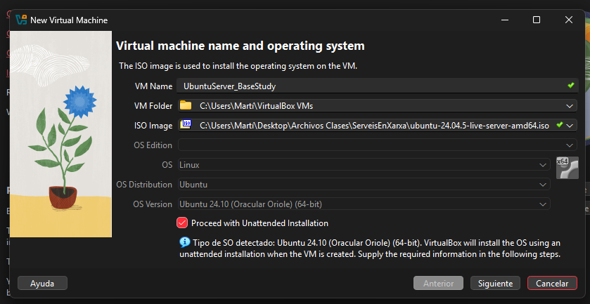

> [!NOTE]
> La captura mostra un exemple amb el nom `UbuntuServer_BaseStudy` i Ubuntu 24.10 detectat automàticament. Per a aquesta guia utilitza el nom acordat `UbuntuServer24.04_BASE` i comprova que la ISO correspongui a Ubuntu Server **24.04 LTS**.

Configura els valors següents:

| Paràmetre | Valor |
|---|---|
| Nom | `UbuntuServer24.04_BASE` |
| Tipus | Linux |
| Versió | Ubuntu 64-bit |
| Memòria RAM | 4096 MB |
| Disc virtual | 25 GB |
| Tipus de disc | VDI |
| Reserva del disc | Dinàmica |
| Xarxa inicial | NAT |

> [!NOTE]
> La presentació original mostra un disc de 10 GB. Per preparar una base útil per a actualitzacions i pràctiques posteriors, la guia docent recomana 25 GB.

### 1.2 Assistent d'instal·lació desatesa

L'assistent de VirtualBox 7.x ofereix l'opció **Proceed with Unattended Installation**. Si la deixes activada, la pantalla següent et demanarà l'usuari, la contrasenya i el nom del servidor perquè VirtualBox els injecti automàticament durant la instal·lació.

<!-- CAPTURA VIRTUALBOX: pantalla "Set up unattended guest OS installation" amb el nom d'usuari, la contrasenya i el Host Name -->
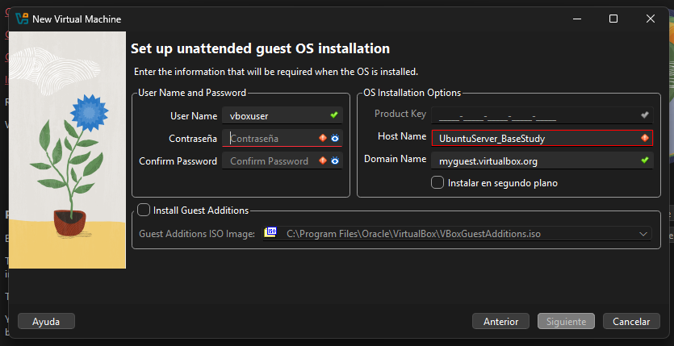

> [!IMPORTANT]
> Aquesta guia segueix manualment totes les pantalles de l'instal·lador perquè es puguin comprendre les decisions adoptades (secció 2). Si vols seguir-la pas a pas tal com està escrita, desactiva **Proceed with Unattended Installation** a l'assistent. Si la deixes activada, VirtualBox completarà per tu els passos d'idioma, usuari i xarxa descrits a la secció 2 i podràs saltar directament a la secció 3.

A continuació, l'assistent demana la memòria RAM, el nombre de processadors i la mida del disc.

<!-- CAPTURA VIRTUALBOX: pantalla "Specify virtual hardware" amb la memòria base, el nombre de CPU i la mida del disc -->
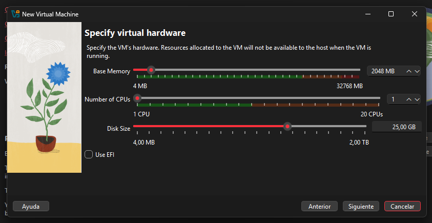

Ajusta la memòria base a **4096 MB** i la mida del disc a **25 GB**, tal com indica la taula anterior.

Abans de crear la VM, l'assistent mostra un resum de tots els valors escollits.

<!-- CAPTURA VIRTUALBOX: pantalla "Resumen" amb el nom, la carpeta, la ISO, el tipus de SO, la memòria i la mida del disc -->
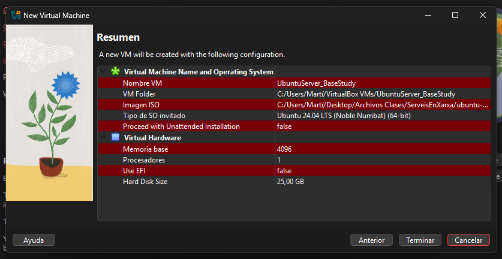

Revisa'l abans de prémer **Terminar/Finish** i corregeix qualsevol valor que no coincideixi amb la taula de l'apartat 1.1.

### 1.3 Revisar la configuració

Amb la màquina apagada, entra a **Configuració** i comprova:

- [ ] RAM configurada a 4096 MB.
- [ ] Disc virtual de 25 GB connectat.
- [ ] Adaptador 1 activat en mode NAT.
- [ ] Opció de cable connectat activada.
- [ ] ISO d'Ubuntu Server muntada a la unitat òptica virtual.

Encara no afegeixis la segona interfície. Primer instal·larem i comprovarem el sistema amb una única connexió NAT.

<!-- CAPTURA PDF (pàgina 5) / VIRTUALBOX: vista de Detalls de la VM amb el resum General/Sistema/Pantalla/Almacenamiento/Red -->
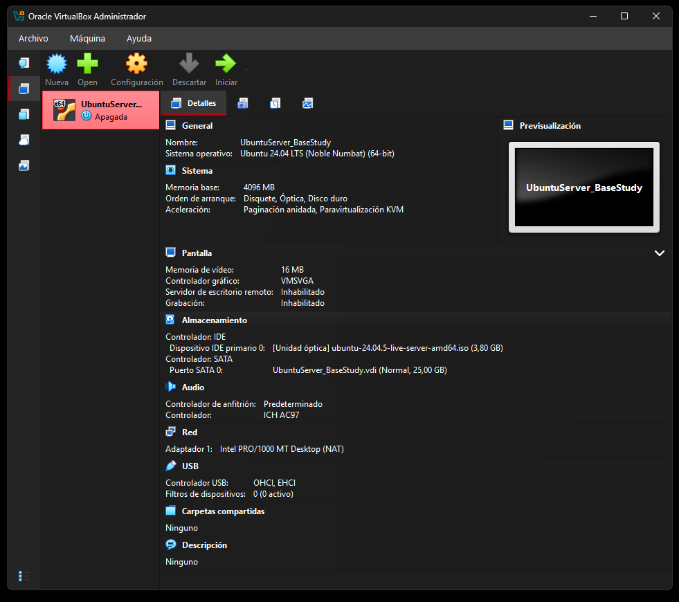

### Problemes habituals

- **No apareix cap dispositiu d'arrencada:** comprova que la ISO estigui muntada i revisa l'ordre d'arrencada.
- **No apareix cap disc durant la instal·lació:** verifica que el disc virtual existeixi i estigui connectat al controlador.
- **La VM no arrenca:** comprova l'arquitectura de la ISO i que la virtualització estigui activada.
- **L'ordinador va molt lent:** revisa la RAM disponible a l'amfitrió i tanca altres màquines virtuals.

---

## 2. Instal·lar Ubuntu Server

### 2.1 Arrencar l'instal·lador

Inicia la màquina virtual i selecciona:

```text
Try or Install Ubuntu Server
```

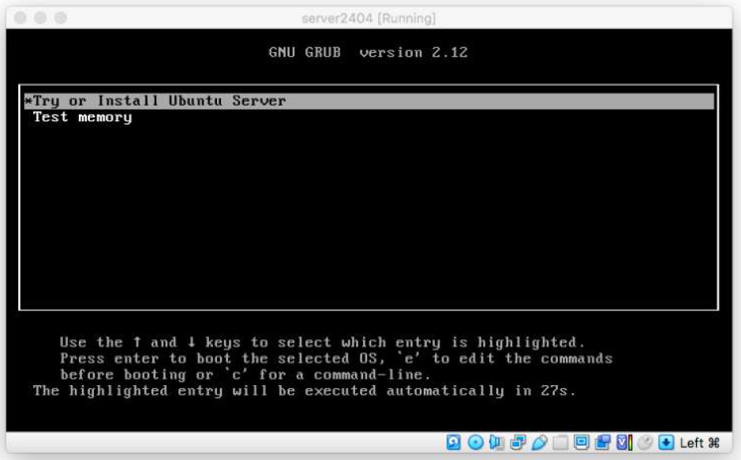
<!-- Imatge extreta d'altres guies -->

Encara no estem utilitzant el sistema definitiu. Hem arrencat l'entorn que instal·larà Ubuntu al disc virtual.

Si les tecles no responen:

1. Fes clic dins la finestra de VirtualBox.
2. Comprova que la finestra tingui el focus.
3. Utilitza la tecla d'amfitrió configurada a VirtualBox per alliberar el teclat quan calgui.

### 2.2 Seleccionar l'idioma

Tria l'idioma acordat per a la instal·lació.

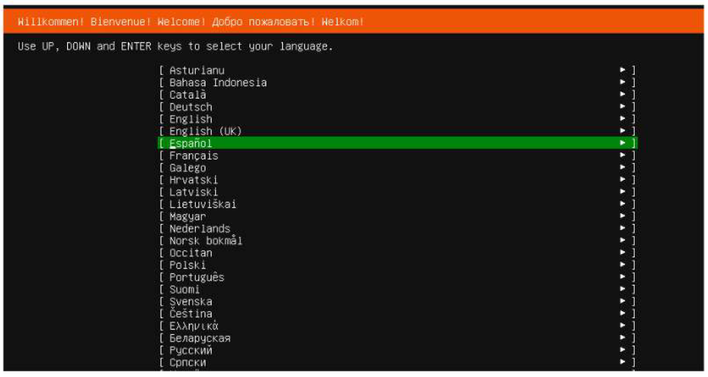
<!-- Imatge extreta d'altres guies -->

Per navegar per l'assistent pots utilitzar:

- Fletxes de direcció.
- Tabulador.
- Barra espaiadora.
- Enter.

L'idioma dels menús i la distribució del teclat són configuracions independents.

### 2.3 Configurar el teclat

Selecciona la distribució corresponent al teclat físic. Habitualment:

```text
Layout: Spanish
Variant: Spanish
```

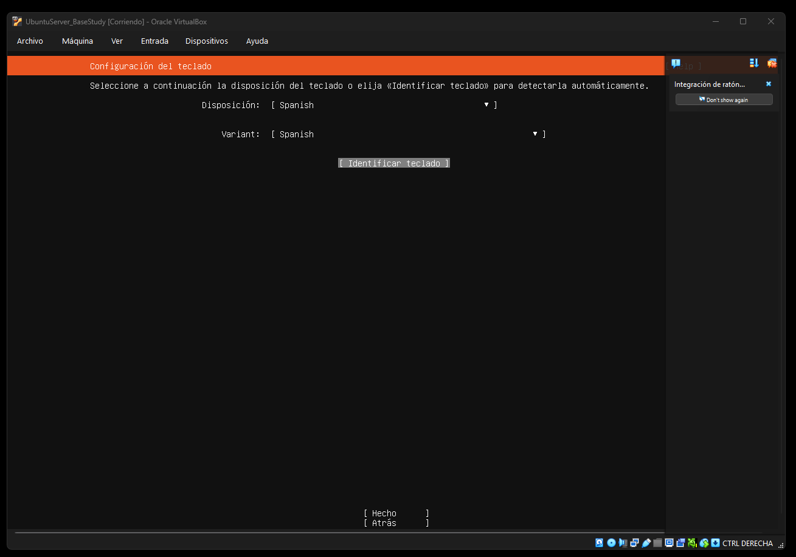
<!-- Captura pròpia de la pràctica (VirtualBox/Ubuntu Server): Configuració de la distribució i variant del teclat -->

Comprova que pots escriure correctament símbols com:

```text
/ : @ - _
```

No facis aquesta prova escrivint una contrasenya real en un camp visible.

### 2.4 Escollir la modalitat d'instal·lació

Selecciona la instal·lació normal:

```text
Ubuntu Server
```

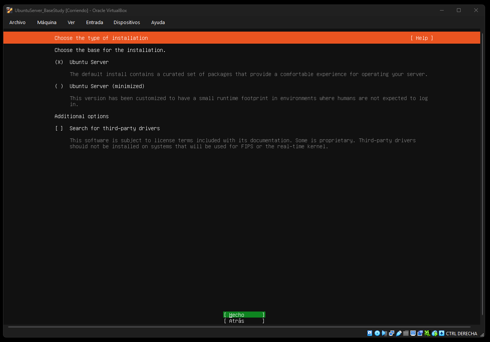
<!-- Captura pròpia de la pràctica (VirtualBox/Ubuntu Server): Modalitat d'instal·lació: Ubuntu Server normal -->

No seleccionis `Ubuntu Server (minimized)` per a aquesta màquina base. Una instal·lació reduïda és vàlida, però pot no incloure eines que utilitzarem per aprendre i diagnosticar.

### 2.5 Comprovar la xarxa durant la instal·lació

L'instal·lador mostrarà una interfície semblant a `enp0s3`. El nom pot ser diferent.

Com que VirtualBox està configurat en NAT, el seu servei DHCP proporcionarà automàticament:

- Adreça IP.
- Màscara.
- Passarel·la.
- Servidors DNS.

És habitual veure una IP semblant a:

```text
10.0.2.15/24
```

No la copiïs ni la configuris manualment. És només un exemple habitual del NAT de VirtualBox.

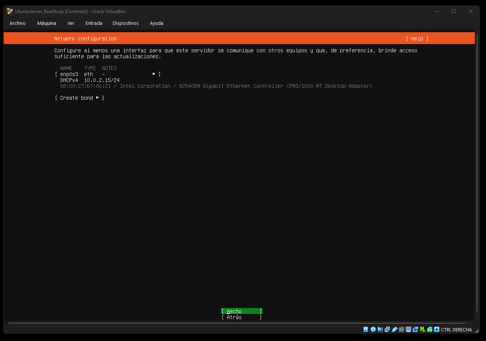
<!-- Captura pròpia de la pràctica (VirtualBox/Ubuntu Server): Configuració de xarxa durant la instal·lació amb DHCP -->

Abans de continuar, comprova que:

- [ ] Hi ha una interfície detectada.
- [ ] La interfície apareix connectada.
- [ ] Ha rebut una adreça IP.

### 2.6 Configurar el proxy

Deixa el camp del proxy buit, tret que la xarxa real on treballis proporcioni explícitament una adreça de proxy.

No hi introdueixis la passarel·la, el DNS ni la IP del router.

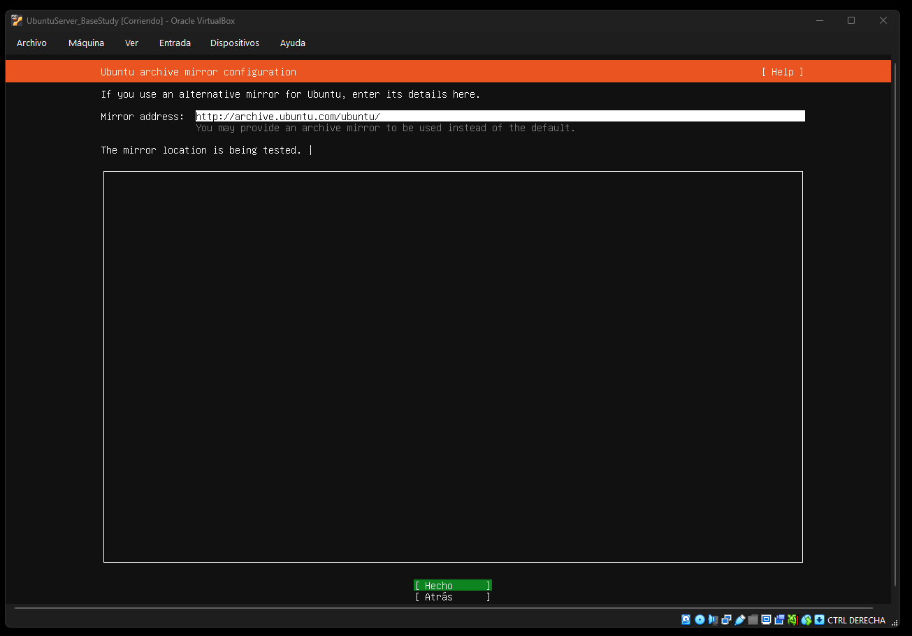
<!-- Captura pròpia de la pràctica (VirtualBox/Ubuntu Server): Configuració del proxy amb el camp buit -->

### 2.7 Seleccionar el servidor de paquets

Mantén el mirall oficial proposat per l'instal·lador, per exemple:

```text
es.archive.ubuntu.com
```

Espera que l'instal·lador comprovi que pot contactar-hi.

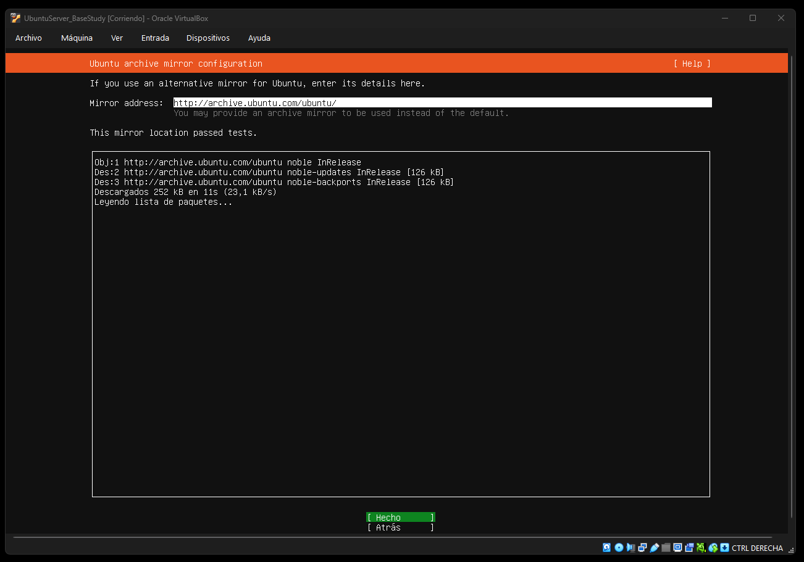
<!-- Captura pròpia de la pràctica (VirtualBox/Ubuntu Server): Mirall de paquets validat correctament -->

Si falla, revisa abans de canviar el mirall:

1. Adaptador activat a VirtualBox.
2. Mode NAT.
3. Cable virtual connectat.
4. Connexió de l'amfitrió.
5. Configuració DNS.

Disposar d'una IP no demostra que funcionin la ruta, el DNS i l'accés exterior.

### 2.8 Configurar l'emmagatzematge

Selecciona:

- Utilitzar el disc complet.
- El disc virtual de 25 GB.
- LVM desactivat per seguir la configuració senzilla del material.

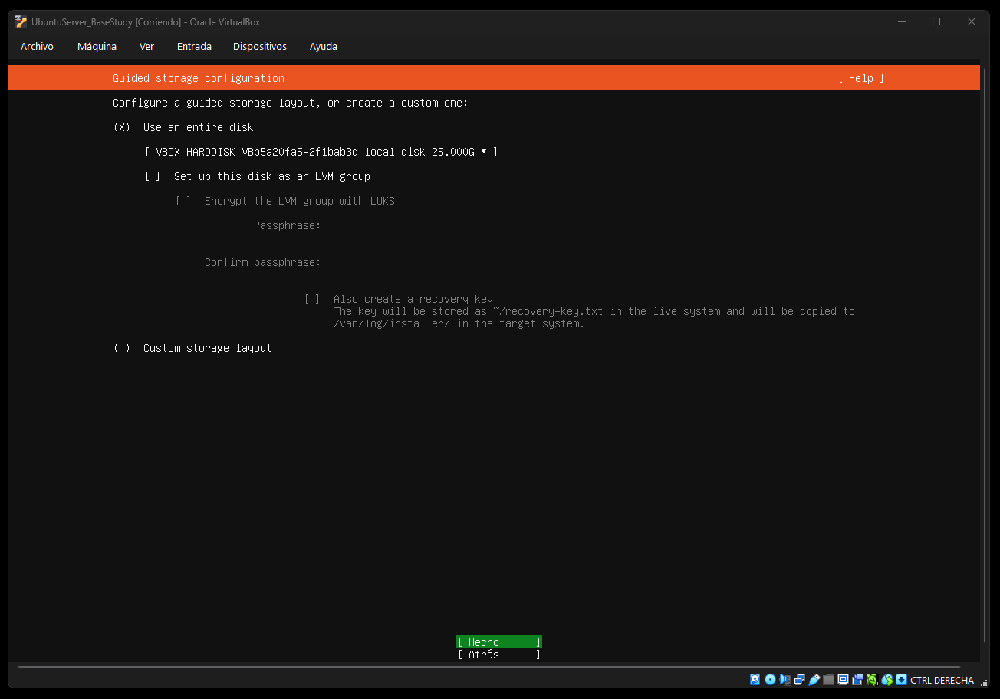
<!-- Captura pròpia de la pràctica (VirtualBox/Ubuntu Server): Configuració guiada de l'emmagatzematge amb ús del disc complet -->

Abans de confirmar, revisa:

- Nom del disc.
- Mida aproximada de 25 GB.
- Resum de particions.

> [!WARNING]
> La confirmació del particionament és un punt destructiu. En aquesta pràctica només s'ha de modificar el disc virtual creat expressament per a Ubuntu Server.

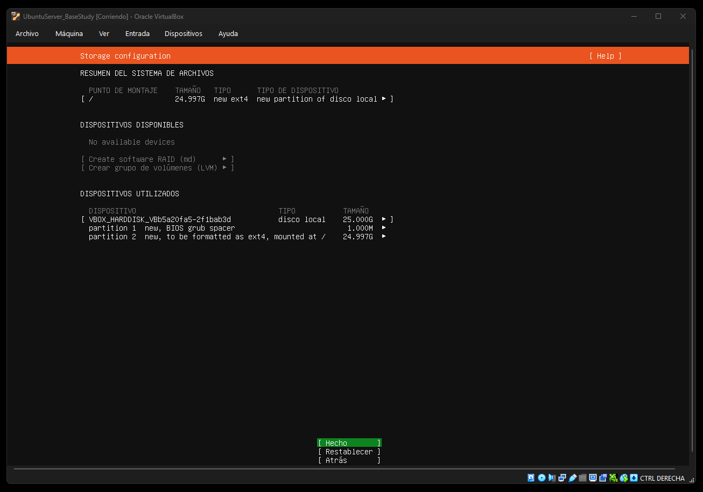
<!-- Captura pròpia de la pràctica (VirtualBox/Ubuntu Server): Resum de particions abans de confirmar -->

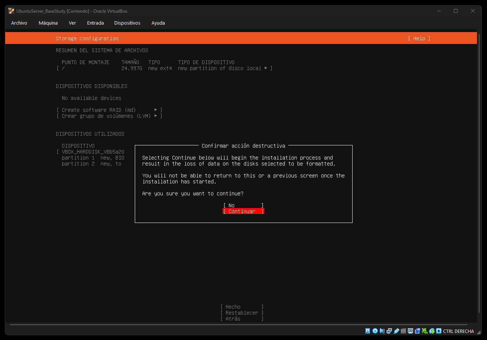
<!-- Captura pròpia de la pràctica (VirtualBox/Ubuntu Server): Confirmació de l'acció destructiva de particionament -->

### 2.9 Crear el perfil

Omple els camps de perfil. La configuració ha d'incloure:

| Camp | Valor |
|---|---|
| Nom personal | El teu nom |
| Nom del servidor | `srv-smx01` |
| Nom d'usuari | Un compte identificable |
| Contrasenya | Una contrasenya segura i recordable |

No utilitzis la contrasenya feble que pugui aparèixer a les captures del material.

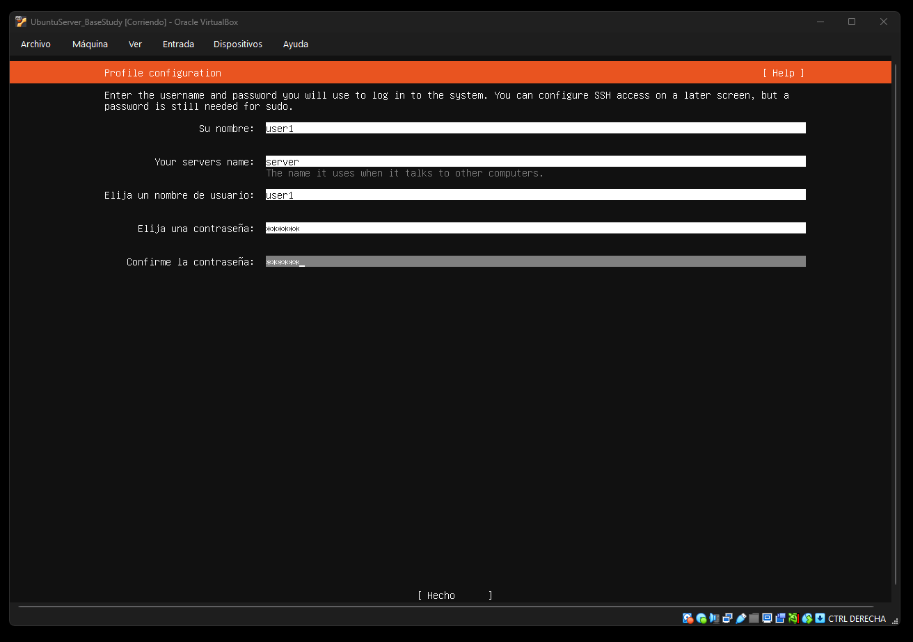
<!-- Captura pròpia de la pràctica (VirtualBox/Ubuntu Server): Pantalla de creació del perfil de l'usuari i el nom del servidor -->

### 2.10 Ometre Ubuntu Pro

Selecciona l'opció d'ometre Ubuntu Pro.

No és necessari per instal·lar el sistema, actualitzar-lo ni completar les pràctiques del mòdul.

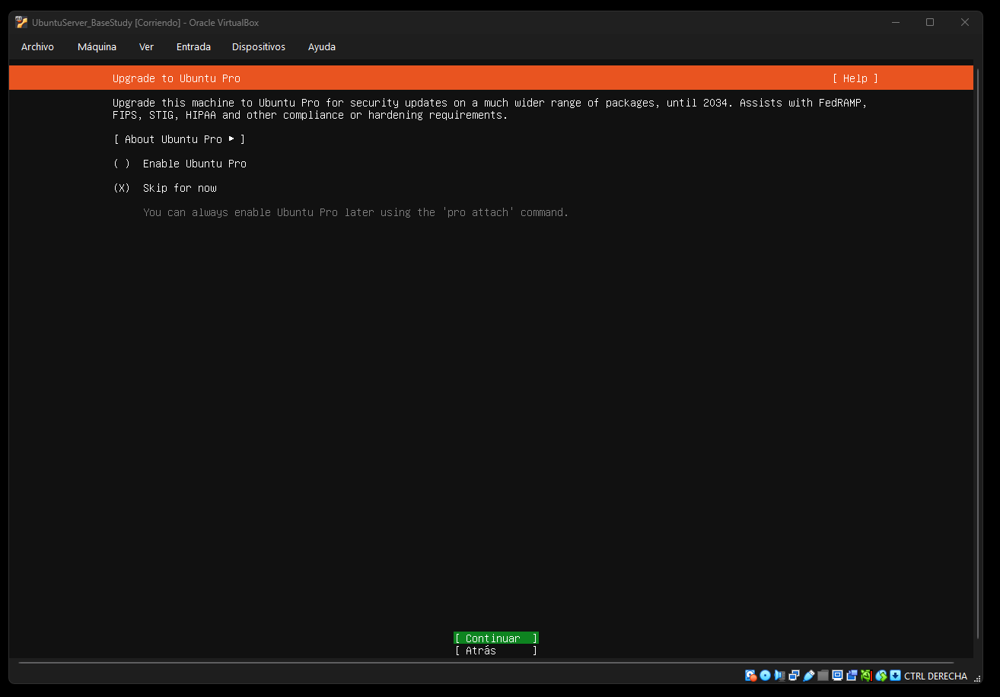
<!-- Captura pròpia de la pràctica (VirtualBox/Ubuntu Server): Pantalla d'Ubuntu Pro amb Skip for now seleccionat -->

### 2.11 Instal·lar OpenSSH

Marca:

```text
Install OpenSSH server
```

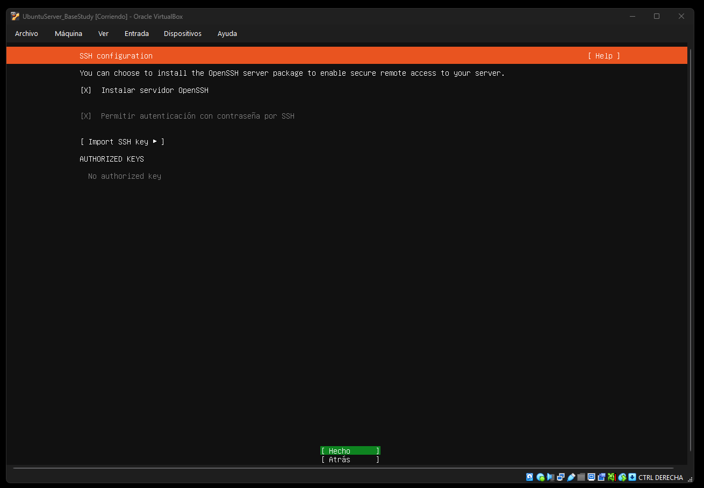
<!-- Captura pròpia de la pràctica (VirtualBox/Ubuntu Server): Pantalla SSH configuration amb Instalar servidor OpenSSH marcat -->

No importis claus de GitHub o Launchpad en aquesta primera preparació, tret que vulguis treballar explícitament amb autenticació per claus.

### 2.12 No instal·lar serveis opcionals

No seleccionis serveis addicionals de la llista de snaps.

Volem mantenir una base comuna i instal·lar cada servei quan en treballem la funció, la configuració i la diagnosi.

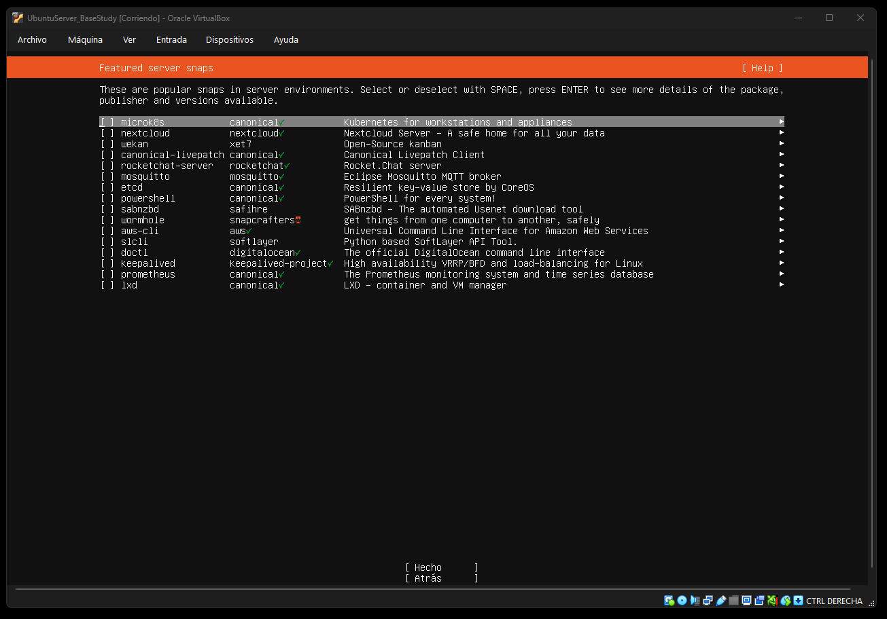
<!-- Captura pròpia de la pràctica (VirtualBox/Ubuntu Server): Pantalla Featured server snaps sense cap servei seleccionat -->

### 2.13 Finalitzar i reiniciar

Espera que acabi la instal·lació i selecciona:

```text
Reboot Now
```

El procés passa per aquestes pantalles, en aquest ordre:

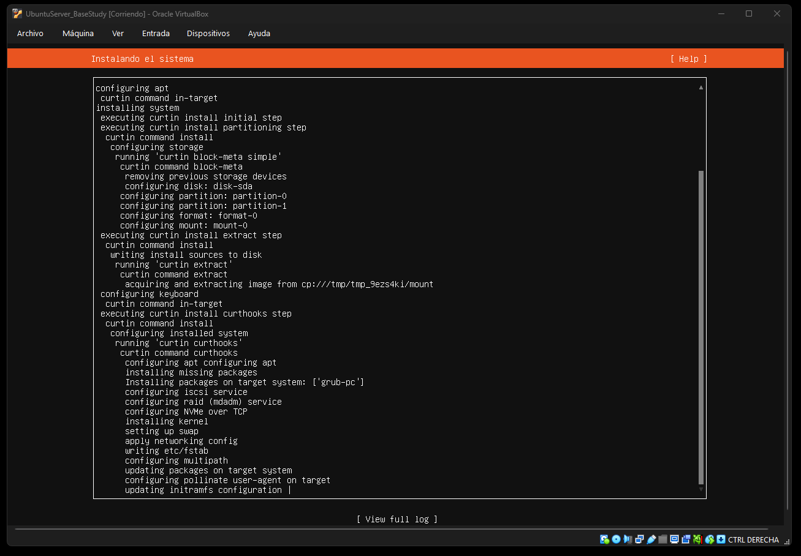
<!-- Captura pròpia de la pràctica (VirtualBox/Ubuntu Server): Progrés de la instal·lació del sistema -->

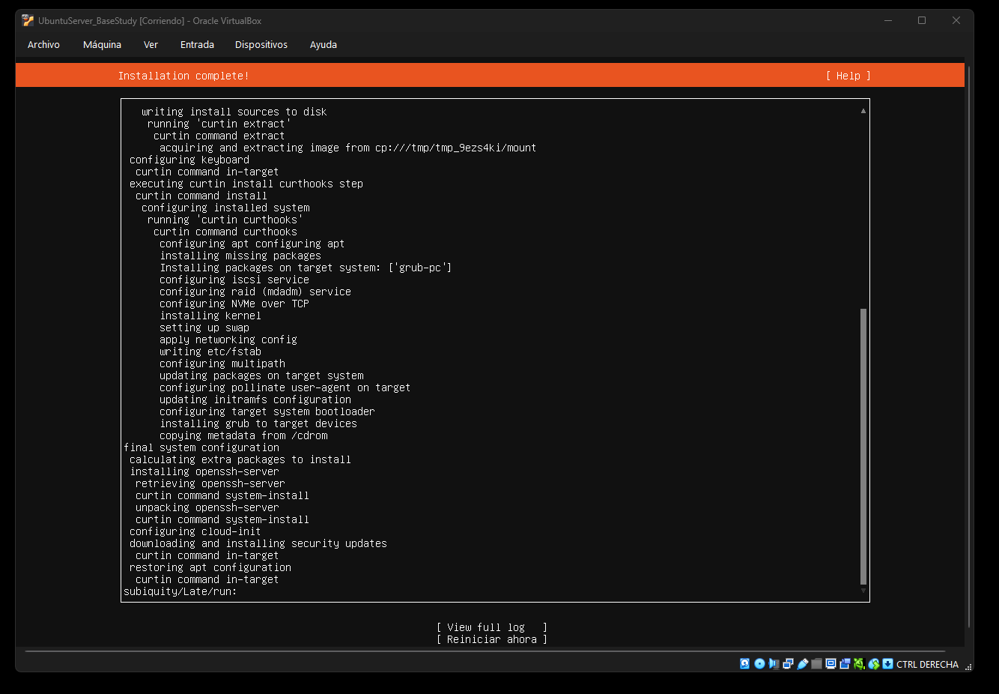
<!-- Captura pròpia de la pràctica (VirtualBox/Ubuntu Server): Instal·lació completa, abans de seleccionar Reiniciar ahora -->

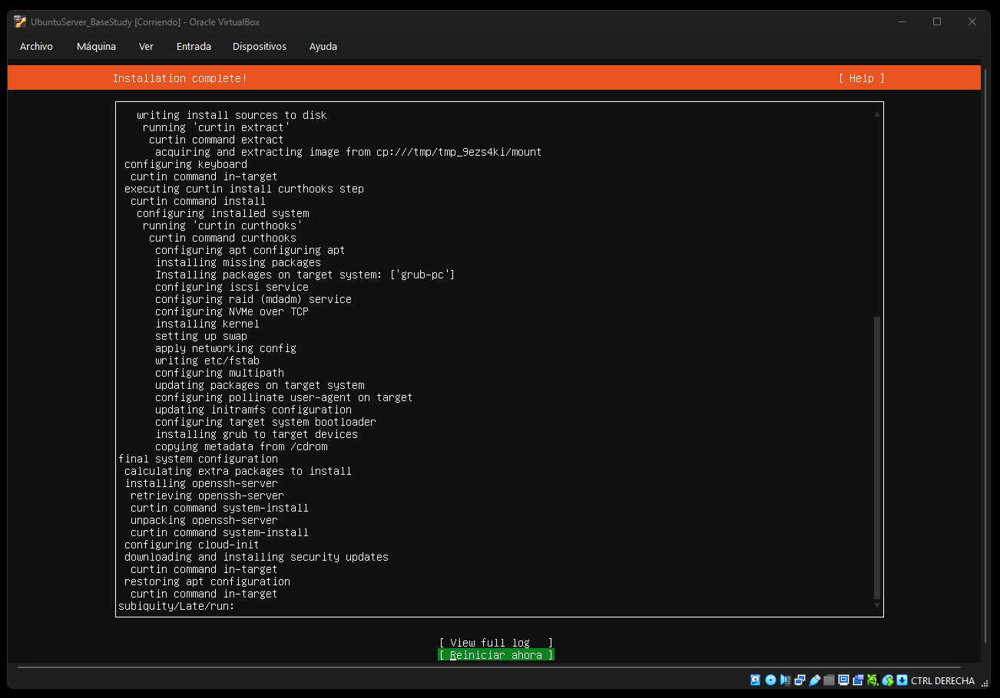
<!-- Captura pròpia de la pràctica (VirtualBox/Ubuntu Server): Instal·lació completa amb Reiniciar ahora seleccionat -->

Quan ho demani:

1. Retira la ISO de la unitat virtual.
2. Prem Enter.
3. Espera que arrenqui el sistema instal·lat.

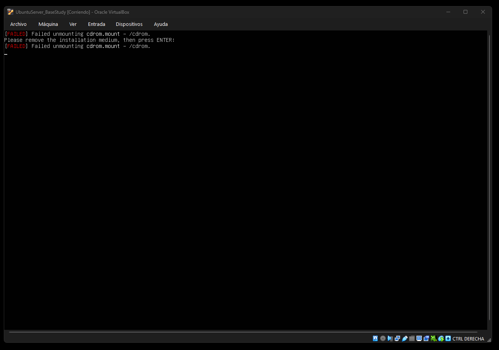
<!-- Captura pròpia de la pràctica (VirtualBox/Ubuntu Server): Avís per retirar el suport d'instal·lació abans de reiniciar -->

Si prement Enter la ISO no s'expulsa sola, pots retirar-la manualment des de **Dispositivos > Unidades ópticas** i seleccionar **Remove Disk From Virtual Drive**.

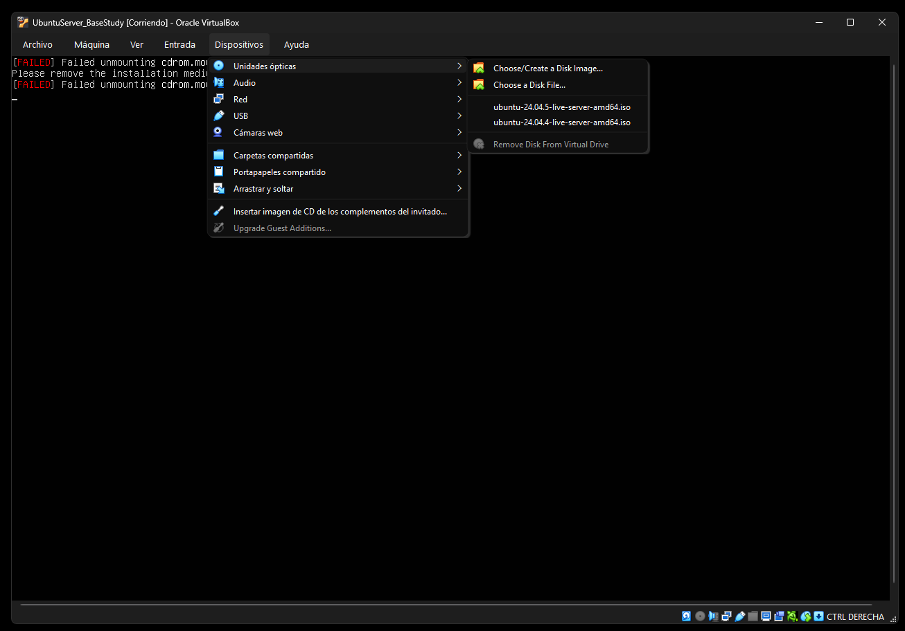
<!-- Captura pròpia de la pràctica (VirtualBox/Ubuntu Server): Menú Dispositivos > Unidades ópticas de VirtualBox per treure la ISO manualment -->

> [!NOTE]
> Si l'opció de treure el disc apareix desactivada i cap ISO està marcada, el disc virtual ja s'ha expulsat automàticament. Tanca el menú, prem Enter i espera que es reiniciï; si es queda encallat, selecciona **Máquina > Reiniciar**. No seleccionis cap ISO del menú, perquè les tornaries a inserir.

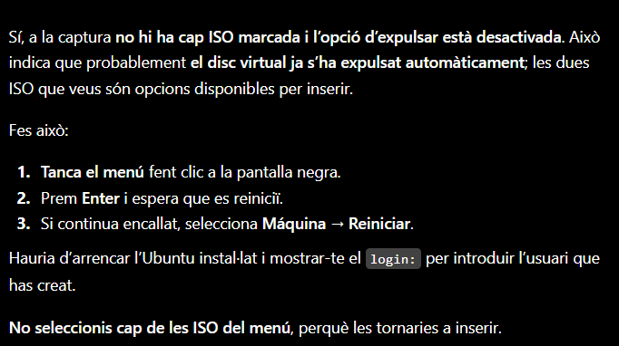
<!-- Nota/esquema de suport elaborat per al curs: Nota amb els passos a seguir quan el disc ja s'ha expulsat automàticament -->

La instal·lació haurà acabat correctament quan arribis a la petició d'inici de sessió sense tornar a passar per l'assistent.

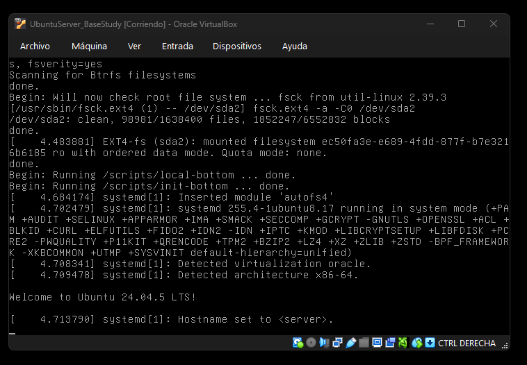
<!-- Captura pròpia de la pràctica (VirtualBox/Ubuntu Server): Arrencada del sistema instal·lat després del reinici -->

Si torna a aparèixer l'instal·lador, apaga la VM, desmunta la ISO i revisa l'ordre d'arrencada.

---

## 3. Fer les primeres comprovacions

### 3.1 Iniciar sessió

Introdueix el nom d'usuari i la contrasenya creats durant la instal·lació.

Quan escriguis la contrasenya no apareixeran lletres ni asteriscs. És el comportament normal del terminal.

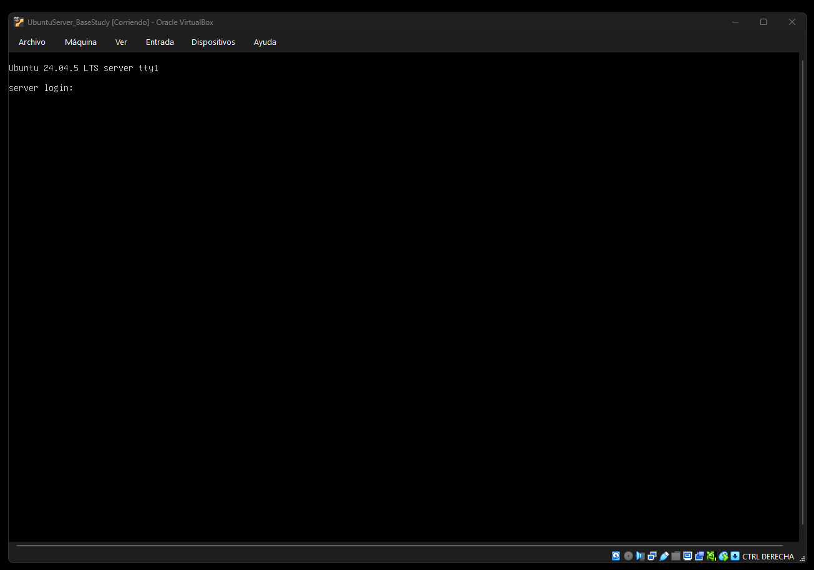
<!-- Captura pròpia de la pràctica (VirtualBox/Ubuntu Server): Prompt de login del servidor -->

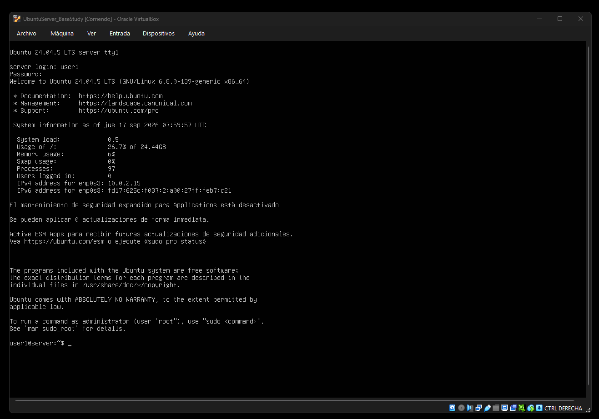
<!-- Captura pròpia de la pràctica (VirtualBox/Ubuntu Server): Sessió iniciada amb el missatge de benvinguda i la informació del sistema -->

Comprova l'usuari:

```bash
whoami
```

El resultat ha de ser el nom del compte amb què has iniciat sessió.

### 3.2 Consultar l'estat inicial

Executa les ordres per separat:

```bash
whoami
hostname
pwd
ip -br a
ip route
df -h
```

Aquestes ordres permeten identificar:

- L'usuari actiu.
- El nom del servidor.
- El directori actual.
- Les interfícies i les adreces IP.
- La ruta per defecte.
- L'espai ocupat i disponible.

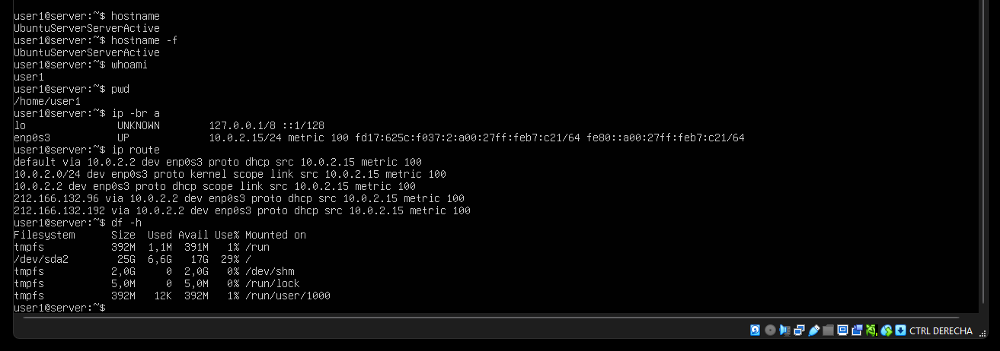
<!-- Captura pròpia de la pràctica (VirtualBox/Ubuntu Server): Sortida de whoami, hostname, pwd, ip -br a, ip route i df -h -->

No és necessari que totes les dades coincideixin amb les captures. Cal interpretar si corresponen a la configuració real de la màquina.

---

## 4. Actualitzar el sistema

### 4.1 Actualitzar el catàleg de paquets

```bash
sudo apt update
```

Aquesta ordre actualitza la informació dels paquets disponibles, però no instal·la per si sola totes les actualitzacions.

### 4.2 Instal·lar les actualitzacions

```bash
sudo apt upgrade
```

Al terminal veuràs una seqüència semblant a aquesta:

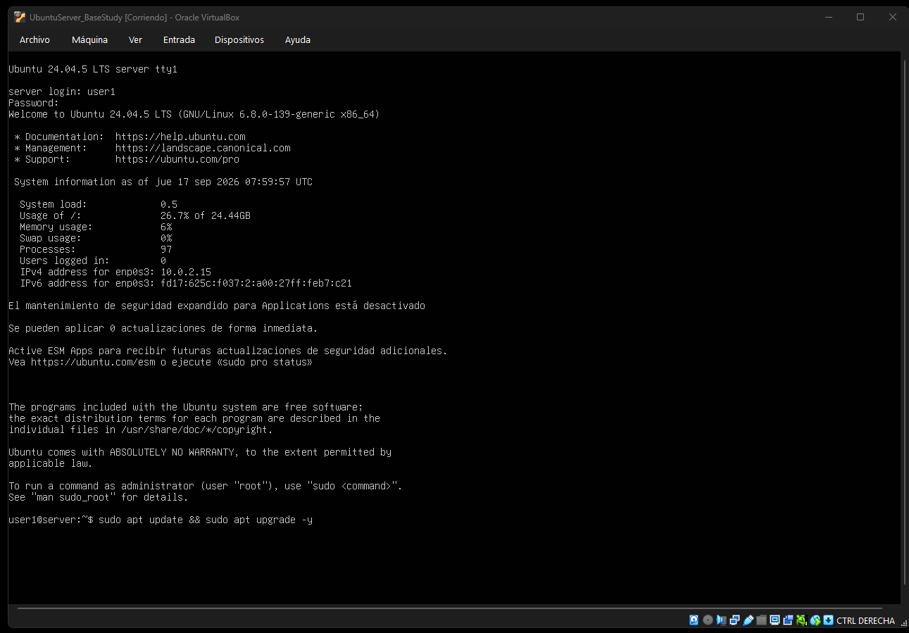
<!-- Aquesta captura utilitza la forma combinada amb && que s'explica més avall -->

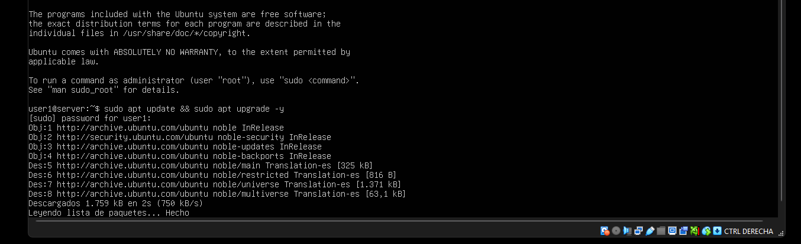
<!-- Captura pròpia de la pràctica (VirtualBox/Ubuntu Server): Llistat de paquets descarregats durant sudo apt update -->

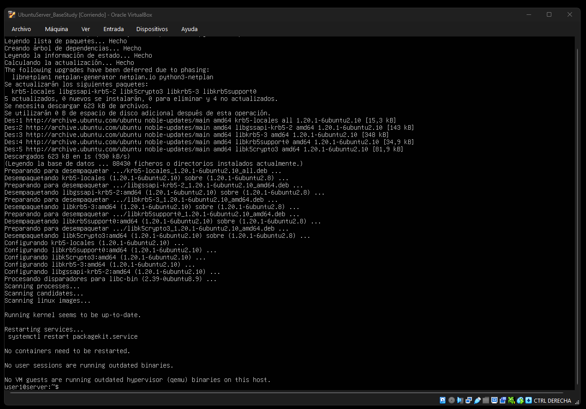
<!-- Captura pròpia de la pràctica (VirtualBox/Ubuntu Server): Actualització completada sense errors pendents -->

Llegeix el resum i confirma l'operació quan ho demani.

La presentació mostra una versió combinada:

```bash
sudo apt update && sudo apt upgrade -y
```

En aquesta primera execució és preferible separar les ordres:

- `&&` executa la segona ordre només si la primera finalitza correctament.
- `-y` accepta automàticament les confirmacions.

### 4.3 Reiniciar després de les actualitzacions

```bash
sudo reboot
```

Després del reinici, torna a iniciar sessió i comprova:

```bash
whoami
hostname
ip -br a
```

### Errors habituals d'APT

- **Error de resolució o descàrrega:** comprova la xarxa i el DNS abans de repetir l'ordre.
- **Bloqueig d'APT:** espera si hi ha un altre gestor o una actualització automàtica treballant. No esborris fitxers de bloqueig a cegues.
- **Disc ple:** consulta `df -h` i identifica quin sistema de fitxers està afectat.
- **Configuració interrompuda:** si no hi ha cap altre gestor actiu i el diagnòstic ho indica, executa `sudo dpkg --configure -a`.

És habitual que una segona execució d'`apt upgrade` no trobi res per instal·lar de seguida:

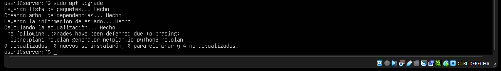
<!-- Captura pròpia de la pràctica (VirtualBox/Ubuntu Server): Missatge "The following upgrades have been deferred due to phasing" en un segon sudo apt upgrade -->

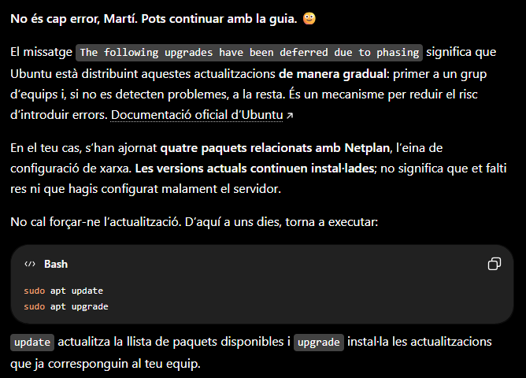
<!-- Nota generada per aclarir el missatge, no forma part de la guia original -->

---

## 5. Configurar el nom del servidor

### 5.1 Establir el hostname

```bash
sudo hostnamectl set-hostname srv-smx01
```

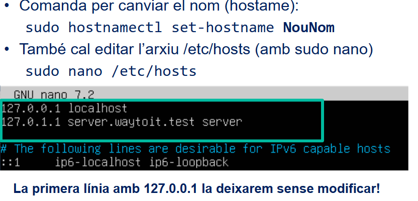
<!-- Imatge extreta d'altres guies -->

### 5.2 Configurar la resolució local

Obre el fitxer:

```bash
sudo nano /etc/hosts
```

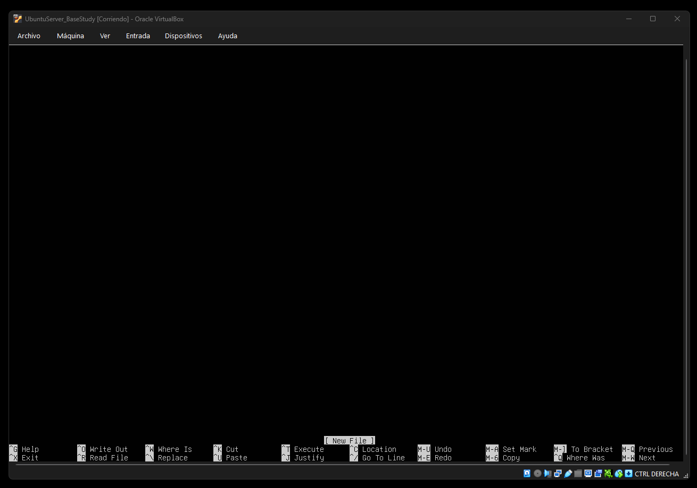
<!-- Captura pròpia de la pràctica (VirtualBox/Ubuntu Server): Editor nano acabat d'obrir abans d'editar /etc/hosts -->

Conserva l'entrada de `localhost`:

```text
127.0.0.1 localhost
```

Afegeix o adapta l'entrada del servidor:

```text
127.0.1.1 srv-smx01.aula.test srv-smx01
```

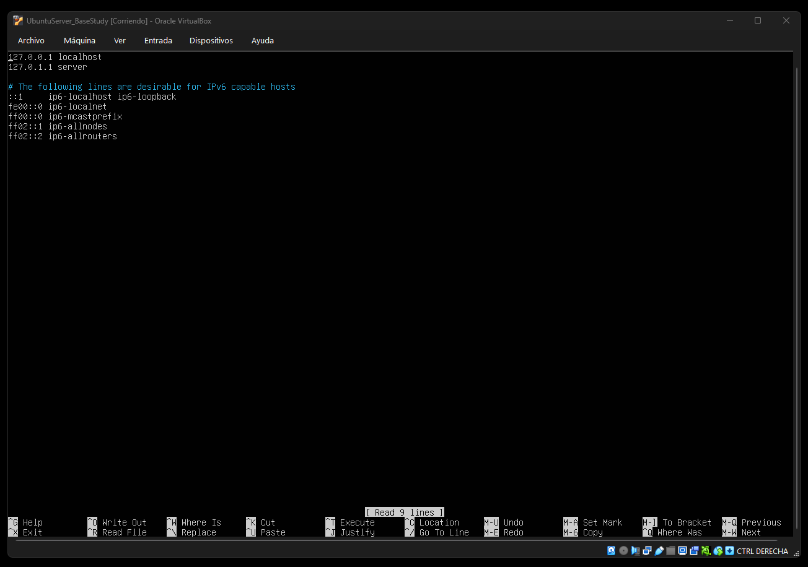
<!-- Captura pròpia de la pràctica (VirtualBox/Ubuntu Server): Fitxer /etc/hosts editat amb l'entrada del servidor i les línies IPv6 -->

No eliminis les entrades necessàries d'IPv6.

Per desar amb Nano:

```text
Ctrl + O
Enter
Ctrl + X
```

### 5.3 Comprovar el resultat

Obre una sessió nova o torna a iniciar sessió. Després executa:

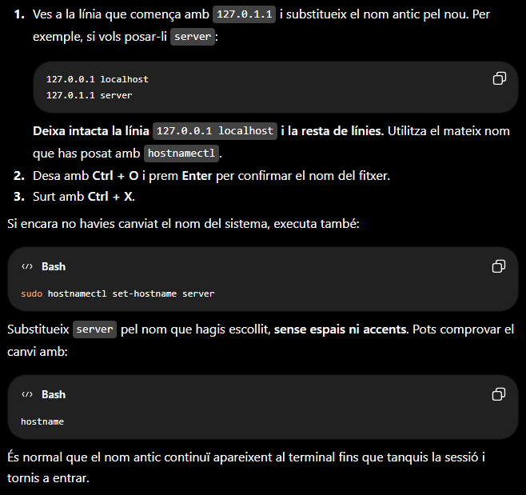
<!-- Nota/esquema de suport elaborat per al curs: Nota amb els passos per editar /etc/hosts i tornar a comprovar amb hostnamectl -->

```bash
hostname
hostname -f
```

Resultat esperat:

```text
srv-smx01
srv-smx01.aula.test
```

Si el teu servidor encara mostra el hostname per defecte, revisa aquesta seqüència completa. Mostra un exemple real: edició de `/etc/hosts`, comprovació amb `hostname` i persistència del nom després de reiniciar la màquina.

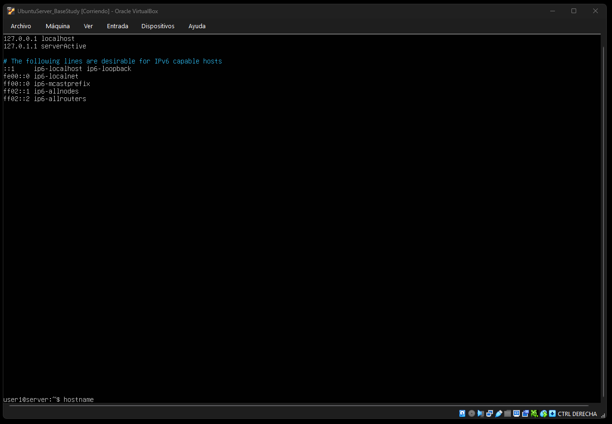
<!-- Captura pròpia de la pràctica (VirtualBox/Ubuntu Server): Fitxer /etc/hosts amb el nom actualitzat i la comanda hostname escrita -->

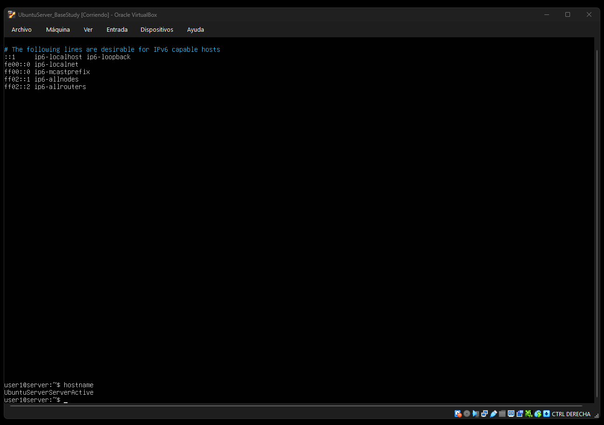
<!-- Captura pròpia de la pràctica (VirtualBox/Ubuntu Server): Resultat de la comanda hostname després del canvi -->

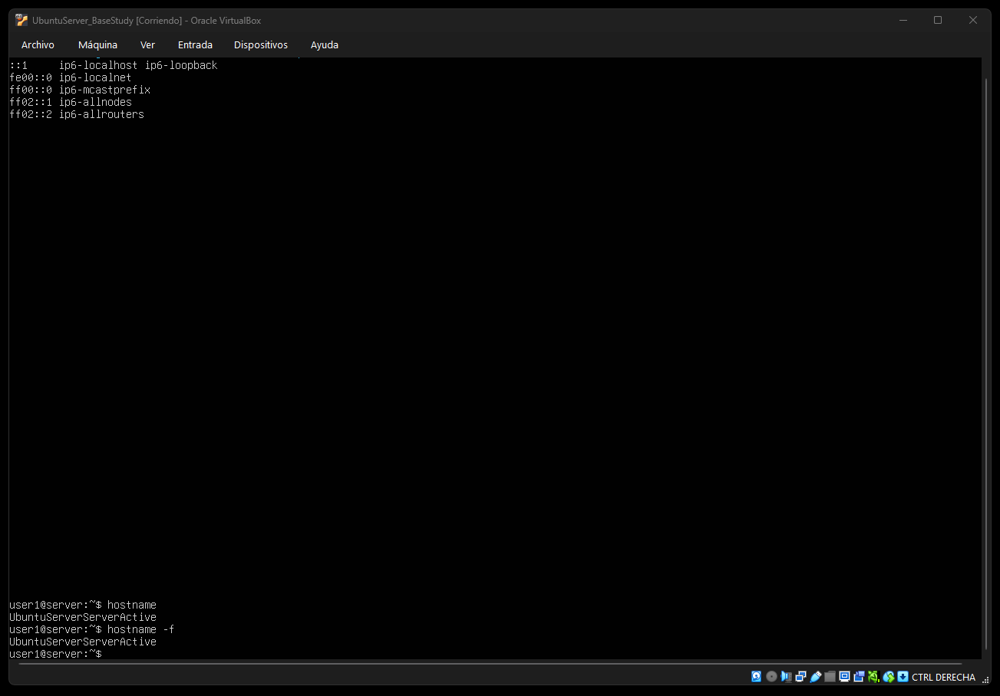
<!-- Captura pròpia de la pràctica (VirtualBox/Ubuntu Server): Resultat de hostname i hostname -f coincidint -->

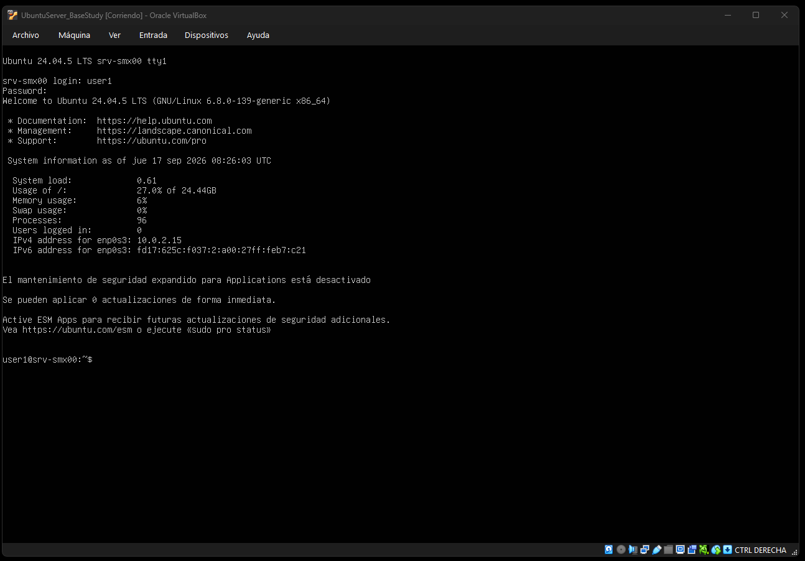
<!-- Captura pròpia de la pràctica (VirtualBox/Ubuntu Server): Nou inici de sessió després de reiniciar mostrant el hostname actualitzat de forma persistent -->

Editar `/etc/hosts` només crea una associació local al servidor. No configura el DNS del centre ni permet automàticament que altres equips resolguin aquest nom.

---

## 6. Comprovar OpenSSH

Consulta el servei i el socket:

```bash
systemctl status ssh.service ssh.socket --no-pager
```

Consulta els ports TCP en escolta:

```bash
sudo ss -ltnp
```

Hauries de trobar el port TCP 22 associat a SSH.

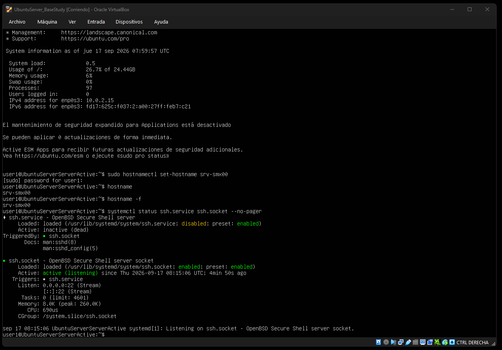
<!-- Captura pròpia de la pràctica (VirtualBox/Ubuntu Server): Comprovació de hostnamectl, hostname i systemctl status ssh.service ssh.socket -->

Ubuntu 24.04 pot activar SSH mitjançant un socket. Per això, veure únicament `ssh.service` inactiu no és suficient per concloure que SSH no funciona. Cal revisar també `ssh.socket` i els ports en escolta.

Amb NAT individual, una connexió entrant des de fora de la VM pot requerir reenviament de ports. La segona interfície interna que configurarem permetrà comunicar el servidor amb altres VM del laboratori.

### Interpretació d'errors SSH

- **Temps d'espera esgotat:** comprova IP, ruta, adaptadors i possibles filtres.
- **Connexió refusada:** comprova que hi hagi un servei escoltant al destí i port previstos.
- **Error d'autenticació:** revisa l'usuari, la contrasenya i els mètodes d'autenticació permesos.

---

## 7. Gestionar els permisos administratius

### 7.1 Comprovar sudo

```bash
whoami
sudo whoami
```

La segona ordre ha de retornar:

```text
root
```

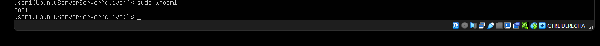
<!-- Captura pròpia de la pràctica (VirtualBox/Ubuntu Server): Comanda sudo whoami retornant root -->

La contrasenya que demana `sudo` és habitualment la del compte que executa l'ordre.

No és necessari habilitar una contrasenya directa per a root.

Si necessites temporalment una shell administrativa:

```bash
sudo -i
```

Per sortir-ne:

```bash
exit
```

### 7.2 Crear un segon administrador opcional

Crea el compte:

```bash
sudo adduser usuari2
```

Afegeix-lo al grup `sudo`:

```bash
sudo usermod -aG sudo usuari2
```

Comprova els grups:

```bash
id usuari2
```

<!-- CAPTURA PDF (pàgina 34): terminal amb "sudo usermod -aG sudo usuari2" i "id usuari2" mostrant groups=...,27(sudo) -->

El resultat ha d'incloure `sudo`.

Inicia una sessió nova amb `usuari2` i comprova:

```bash
sudo whoami
```

> [!WARNING]
> Utilitza `-aG`. Fer servir `-G` sense `-a` pot substituir els altres grups suplementaris de l'usuari.

---

## 8. Configurar el teclat

Si la distribució de la consola és incorrecta:

```bash
sudo dpkg-reconfigure keyboard-configuration
```

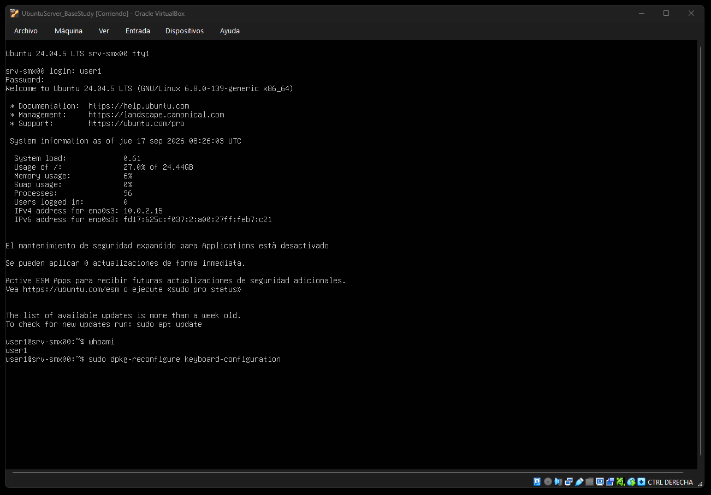
<!-- Captura pròpia de la pràctica (VirtualBox/Ubuntu Server): Terminal amb l'ordre dpkg-reconfigure keyboard-configuration a punt d'executar-se -->

En demanar privilegis, introdueix la contrasenya de l'usuari:


<!-- Captura pròpia de la pràctica (VirtualBox/Ubuntu Server): Sol·licitud de contrasenya de sudo per a dpkg-reconfigure -->

Selecciona el model, la distribució i la variant corresponents a l'equip.

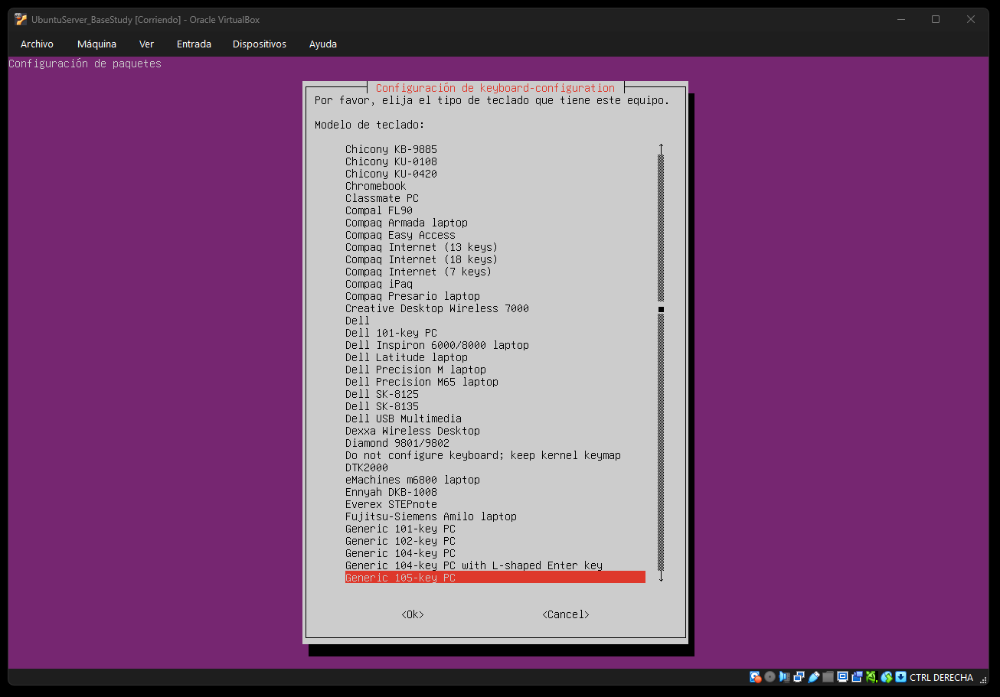
<!-- Captura pròpia de la pràctica (VirtualBox/Ubuntu Server): Assistent de keyboard-configuration amb el llistat de models de teclat -->

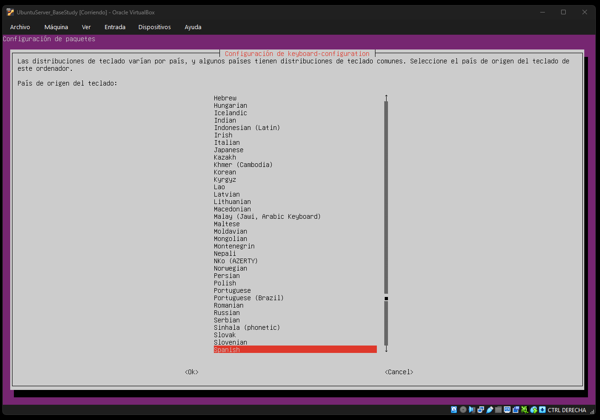
<!-- Captura pròpia de la pràctica (VirtualBox/Ubuntu Server): Selecció del país d'origen del teclat (Spanish ressaltat) -->

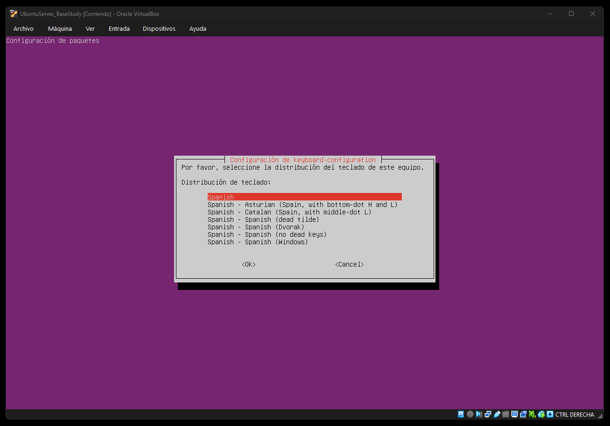
<!-- Captura pròpia de la pràctica (VirtualBox/Ubuntu Server): Selecció de la distribució del teclat (Spanish ressaltat) -->

L'assistent també demana la tecla que farà de modificador `AltGr` i, si escau, una tecla modificadora addicional. Si no hi ha cap necessitat especial, deixa els valors per defecte:

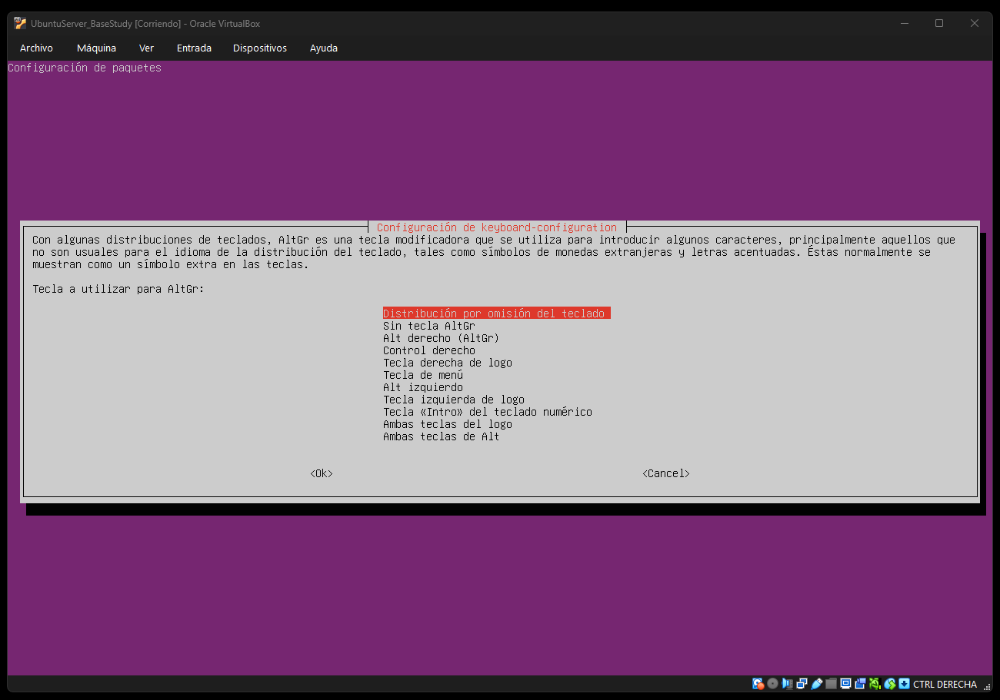
<!-- Captura pròpia de la pràctica (VirtualBox/Ubuntu Server): Selecció de la tecla a utilitzar per a AltGr -->

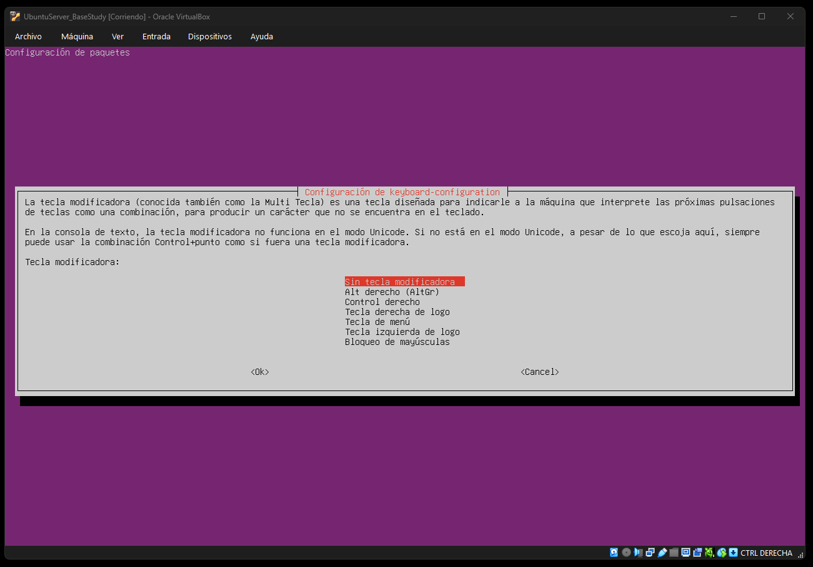
<!-- Captura pròpia de la pràctica (VirtualBox/Ubuntu Server): Selecció de la tecla modificadora -->

En finalitzar, el sistema regenera la configuració de la consola:

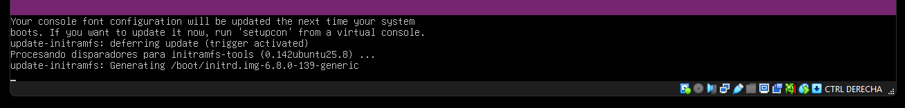
<!-- Captura pròpia de la pràctica (VirtualBox/Ubuntu Server): Missatge de confirmació en actualitzar la configuració de la consola i el initramfs -->

Comprova caràcters habituals a les ordres:

```text
/ - _ : @
```

Si l'error només apareix durant una connexió SSH, revisa també el teclat i el terminal de l'equip client. Canviar el teclat de consola del servidor no corregeix necessàriament un problema originat al client.

---

## 9. Configurar la data i l'hora

### 9.1 Consultar l'estat

```bash
timedatectl
```

Interpreta especialment:

- `Local time`
- `Universal time`
- `Time zone`
- `System clock synchronized`
- `NTP service`

Veure UTC no significa automàticament que el rellotge sigui incorrecte.

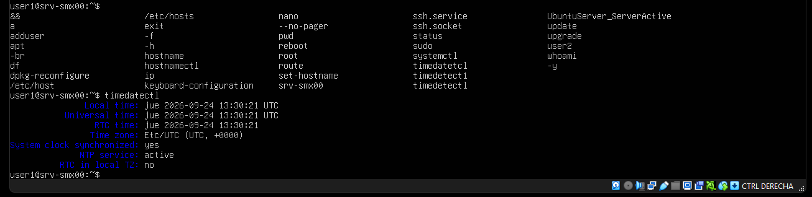
<!-- Captura pròpia de la pràctica (VirtualBox/Ubuntu Server): Sortida inicial de timedatectl amb hora UTC i estat de sincronització -->

### 9.2 Configurar el fus horari

```bash
sudo timedatectl set-timezone Europe/Madrid
timedatectl
```

Ha d'aparèixer:

```text
Time zone: Europe/Madrid
```

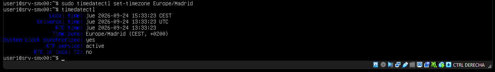
<!-- Captura pròpia de la pràctica (VirtualBox/Ubuntu Server): Sortida de timedatectl després de configurar Europe/Madrid -->

No ajustis manualment una hora més o menys per compensar l'horari d'estiu. La zona `Europe/Madrid` ja incorpora les regles estacionals.

### 9.3 Activar la sincronització

```bash
sudo timedatectl set-ntp true
timedatectl
```

Si el sistema utilitza `systemd-timesyncd`, amplia la comprovació amb:

```bash
systemctl status systemd-timesyncd --no-pager
timedatectl timesync-status
journalctl -u systemd-timesyncd -b --no-pager -n 30
```

Activar NTP no demostra que la sincronització sigui immediata. Cal verificar l'estat final.

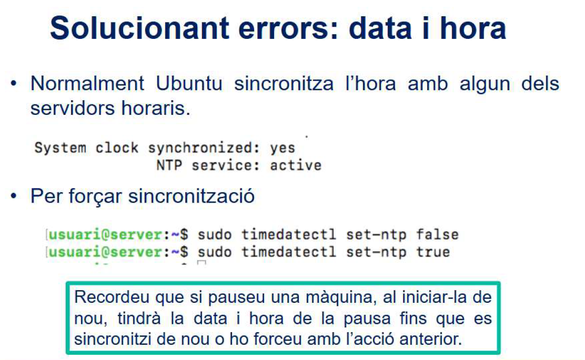
<!-- Nota/esquema de suport elaborat per al curs: Nota amb els passos per forçar la sincronització de l'hora amb set-ntp false/true -->

---

## 10. Entendre i afegir una segona interfície

A partir d'aquest punt, la xarxa és una part central de la pràctica. No n'hi ha prou amb copiar una IP: cal saber quin adaptador virtual, quina interfície d'Ubuntu i quina adreça MAC intervenen en cada connexió.

La segona interfície separarà dues funcions:

- **Sortida exterior:** actualitzacions i descàrregues a través de NAT.
- **Xarxa de laboratori:** comunicació controlada amb clients i altres servidors a través de `SMX-LAB`.

### 10.1 Distingir les peces de la xarxa

| Element | On existeix | Què representa |
|---|---|---|
| Targeta de xarxa física | Equip amfitrió | Maquinari real que connecta l'ordinador per Ethernet o Wi-Fi. |
| Adaptador de xarxa virtual | VirtualBox | Dispositiu simulat que VirtualBox presenta a la VM. |
| Mode de connexió | VirtualBox | Indica a quina xarxa s'enganxa l'adaptador virtual. |
| Interfície de xarxa | Ubuntu Server | Nom amb què el sistema operatiu veu l'adaptador, per exemple `enp0s3`. |
| Adreça MAC | Adaptador/interfície | Identificador de capa 2 de 48 bits, escrit habitualment amb sis parelles hexadecimals. |
| Adreça IP i prefix | Ubuntu Server | Identificador lògic dins d'una xarxa, per exemple `192.168.50.10/24`. |
| Passarel·la per defecte | Taula de rutes | Destí utilitzat per arribar a xarxes no connectades directament. |
| DNS | Sistema operatiu | Servei que tradueix noms, com `ubuntu.com`, a adreces IP. |

La relació habitual és:

```text
Adaptador de VirtualBox -> adreça MAC -> interfície d'Ubuntu -> configuració IP
```

No pressuposis que l'Adaptador 1 sempre serà `enp0s3`. La forma fiable de relacionar-los és comparar les adreces MAC.

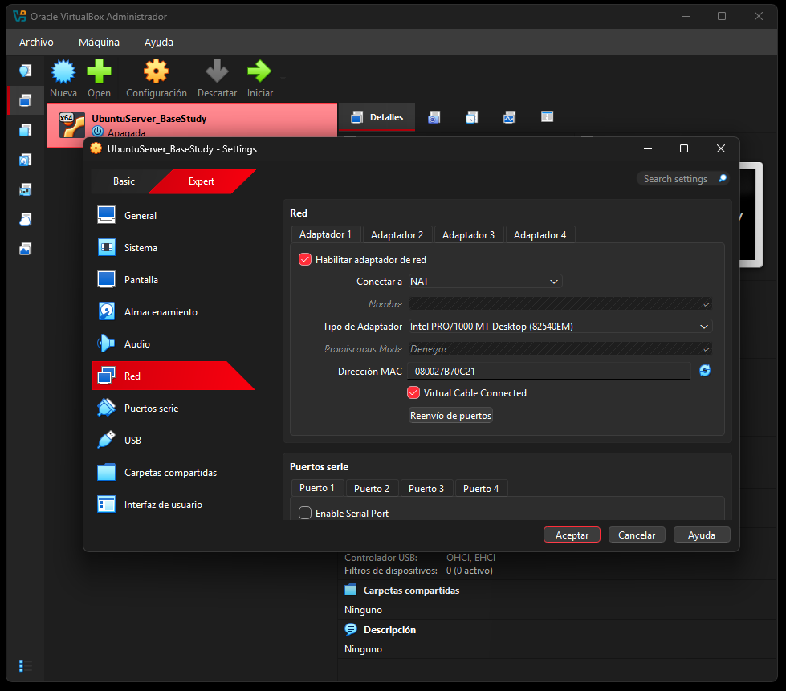
<!-- Captura pròpia de la pràctica (VirtualBox/Ubuntu Server): Configuració avançada de l'Adaptador 1 amb el mode NAT, el tipus d'adaptador i l'adreça MAC visibles -->

### 10.2 Conèixer els modes de xarxa de VirtualBox

| Mode | Comunicació principal | Internet per defecte | Ús habitual al laboratori |
|---|---|---:|---|
| NAT | VM cap a l'exterior | Sí | Instal·lar paquets i actualitzar una VM de manera senzilla. |
| Xarxa NAT | VM amb altres VM de la mateixa xarxa NAT i amb l'exterior | Sí | Diverses VM que s'han de veure i també sortir a Internet. |
| Adaptador pont | VM connectada a la mateixa xarxa física que l'amfitrió | Depèn de la xarxa real | Integrar la VM a una LAN real; requereix permís i control de la xarxa. |
| Xarxa interna | Només VM amb el mateix nom de xarxa interna | No | Laboratori aïllat servidor-client. |
| Adaptador només amfitrió | VM i equip amfitrió dins d'una xarxa privada | No, tret que es configuri encaminament | Administrar VM des de l'amfitrió sense exposar-les a la LAN. |
| No connectat | Cap xarxa | No | Simular un cable desconnectat o diagnosticar fallades. |

> [!IMPORTANT]
> **NAT** i **Xarxa NAT** no són el mateix. Amb el NAT individual, dues VM poden rebre la mateixa IP virtual i, tot i això, estar en xarxes NAT separades. Per a les pràctiques servidor-client utilitzarem una xarxa interna comuna anomenada `SMX-LAB`.

<!-- IMATGE IMPRESCINDIBLE: desplegable de VirtualBox amb els modes de connexió disponibles i el mode Xarxa interna seleccionat per a l'Adaptador 2. Fitxer recomanat: imatges/26b-modes-xarxa-virtualbox.png -->

### 10.3 Planificar els dos adaptadors

| Adaptador | Mode | Configuració prevista | Passarel·la | Funció |
|---|---|---|---|---|
| 1 | NAT | DHCP | La proporciona el NAT | Sortida a Internet. |
| 2 | Xarxa interna `SMX-LAB` | `192.168.50.10/24` | Cap | Comunicació amb el laboratori. |

Només l'Adaptador 1 ha d'aportar la ruta per defecte. Si també s'afegeix una passarel·la a la xarxa interna, el servidor pot tenir dues sortides candidates i prendre decisions de ruta no desitjades.

### 10.4 Apagar correctament el servidor

```bash
sudo poweroff
```

Espera que VirtualBox indiqui que la màquina està **apagada**, no només pausada ni amb l'estat desat.

### 10.5 Configurar VirtualBox

Amb la VM apagada:

1. Entra a **Configuració > Xarxa**.
2. Mantén l'Adaptador 1 activat en mode **NAT**.
3. Obre **Avançat**, comprova **Cable connectat** i anota la seva adreça MAC.
4. Activa l'Adaptador 2.
5. Selecciona **Xarxa interna**.
6. Escriu exactament `SMX-LAB` com a nom de xarxa.
7. Obre **Avançat**, comprova **Cable connectat** i anota la MAC de l'Adaptador 2.
8. Confirma que les dues MAC siguin diferents.
9. Torna a iniciar la màquina.

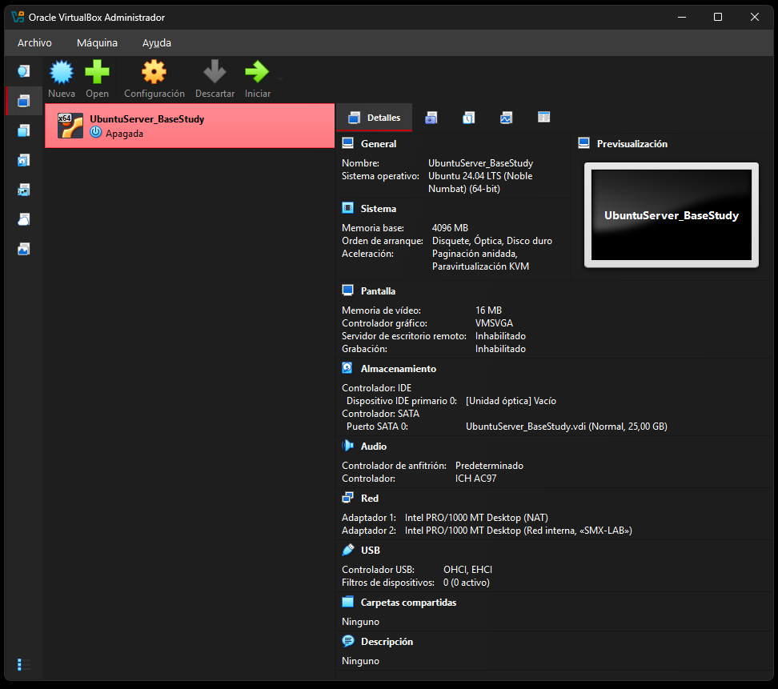
<!-- Captura pròpia de la pràctica (VirtualBox/Ubuntu Server): Resum de la VM amb l'Adaptador 1 en NAT i l'Adaptador 2 a la xarxa interna SMX-LAB -->

Totes les VM que s'hagin de comunicar dins del laboratori han d'utilitzar exactament el mateix nom de xarxa interna. `SMX-LAB`, `smx-lab` i `SMX_LAB` no s'han de considerar noms intercanviables.

### 10.6 Identificar les interfícies i les MAC a Ubuntu

Executa:

```bash
ip -br link
ip -br a
ip link show
```

És habitual trobar noms com `enp0s3` i `enp0s8`, però poden ser diferents. `ip -br link` mostra l'estat de l'enllaç i `ip -br a` afegeix les adreces IP assignades.

Per consultar només la MAC d'una interfície concreta, substitueix el nom de l'exemple pel nom real:

```bash
cat /sys/class/net/enp0s3/address
cat /sys/class/net/enp0s8/address
```

VirtualBox pot mostrar la MAC sense separadors i amb majúscules. Ubuntu acostuma a mostrar-la amb dos punts i minúscules. Per exemple, `080027A1B2C3` i `08:00:27:a1:b2:c3` representen la mateixa adreça.

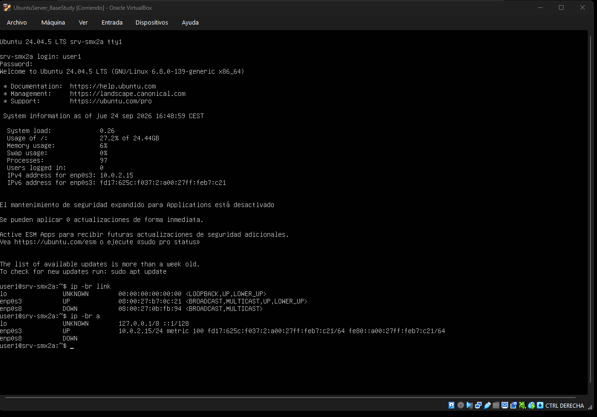
<!-- Captura pròpia de la pràctica (VirtualBox/Ubuntu Server): Sortida de ip -br link i ip -br a després de reiniciar, amb enp0s3 amunt i enp0s8 encara avall perquè Netplan no li ha assignat cap adreça -->

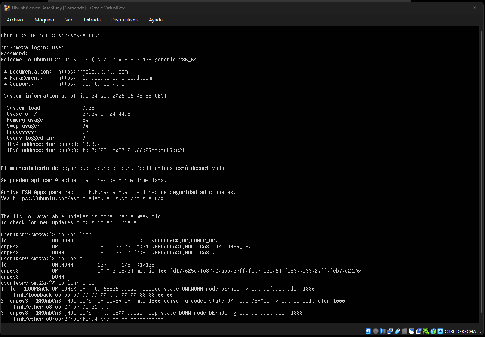
<!-- Captura pròpia de la pràctica (VirtualBox/Ubuntu Server): Sortida de ip link show amb les adreces MAC de les dues interfícies, comparables amb les MAC anotades a VirtualBox -->

> [!NOTE]
> En aquest exemple, l'Adaptador 1 de VirtualBox mostra la MAC `080027B70C21`, que coincideix amb `08:00:27:b7:0c:21` a `enp0s3`. És normal que `enp0s8` aparegui com a `DOWN`: la interfície ja existeix, però encara no té cap configuració de Netplan aplicada.

Completa aquest inventari amb els valors reals de la teva VM:

| Adaptador de VirtualBox | Mode | MAC a VirtualBox | Interfície a Ubuntu | IP prevista |
|---|---|---|---|---|
| Adaptador 1 | NAT | `_________________` | `_________________` | DHCP |
| Adaptador 2 | Xarxa interna `SMX-LAB` | `_________________` | `_________________` | `192.168.50.10/24` |

### 10.7 Entendre què aporta la MAC

- Cada adaptador virtual activat té la seva pròpia MAC.
- La MAC identifica la interfície dins del mateix segment de capa 2; no substitueix l'adreça IP.
- Els equips aprenen quina MAC correspon a una IP veïna mitjançant ARP. La informació apresa es pot consultar amb `ip neigh`.
- Dues màquines amb la mateixa MAC a la mateixa xarxa poden provocar comunicacions intermitents o entrades de veïns incorrectes.
- En clonar o importar una OVA per crear diverses VM, s'han de generar MAC noves.
- Una MAC no és una contrasenya ni una dada secreta, però continua sent una dada tècnica que cal documentar correctament.

Després que hi hagi un altre equip actiu a `SMX-LAB`, podràs comprovar la taula de veïns amb:

```bash
ip neigh
```

Si encara no has enviat trànsit a cap altre equip de la xarxa interna, és normal que no hi aparegui cap veí d'aquesta xarxa.

Tenir dues interfícies no converteix automàticament Ubuntu en un encaminador i tampoc activa NAT dins del servidor. En aquesta guia cada interfície només farà la funció definida a la taula anterior.

---

## 11. Configurar Netplan

Netplan descriu la configuració persistent de xarxa en fitxers YAML i genera la configuració que aplicarà el gestor de xarxa del sistema. El procés segur és sempre el mateix: observar, fer còpia, editar, validar, provar, aplicar i tornar a comprovar.

### 11.1 Registrar l'estat abans del canvi

Abans de modificar res, desa o captura l'estat actual:

```bash
ip -br link
ip -br a
ip route
resolvectl status
```

Anota quin nom i quina MAC corresponen a cada adaptador. Aquesta evidència permet comparar l'abans i el després i recuperar-se d'una configuració incorrecta.

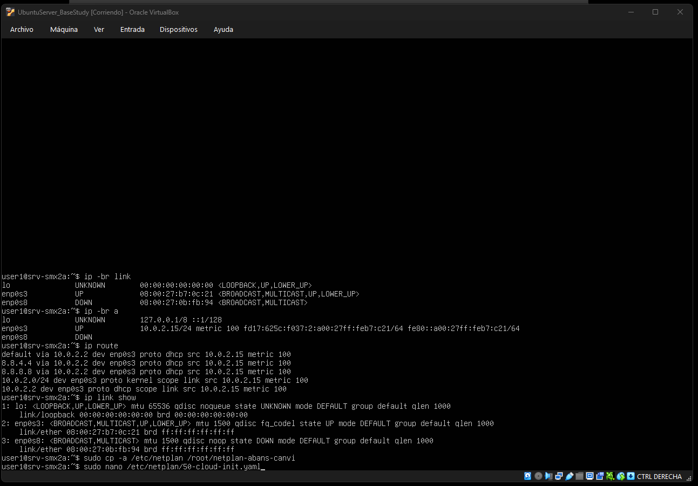
<!-- Captura pròpia de la pràctica (VirtualBox/Ubuntu Server): Sortida de ip -br link, ip -br a, ip route i ip link show abans de tocar cap fitxer de Netplan -->

### 11.2 Identificar el fitxer existent

```bash
ls -l /etc/netplan
sudo netplan get
```

El fitxer pot tenir noms com:

```text
00-installer-config.yaml
50-cloud-init.yaml
```

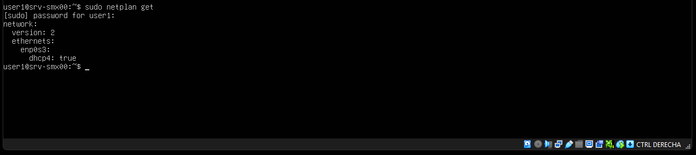
<!-- Captura pròpia de la pràctica (VirtualBox/Ubuntu Server): Sortida de sudo netplan get mostrant la configuració real aplicada, amb enp0s3 en dhcp4: true -->

No obris amb Nano un nom copiat sense haver comprovat que existeix. Si el nom no existeix, podries crear un YAML buit i afegir una configuració conflictiva.

Netplan pot combinar diversos fitxers YAML. Cal inspeccionar-los si la configuració aplicada no coincideix amb el fitxer editat.

#### 11.2.1 Quan Nano mostra `[ New File ]`

Aquest error és habitual: escriure un nom de fitxer o de directori que no existeix.

```bash
sudo nano /etc/netplan/00-instaaller-config.yaml
```

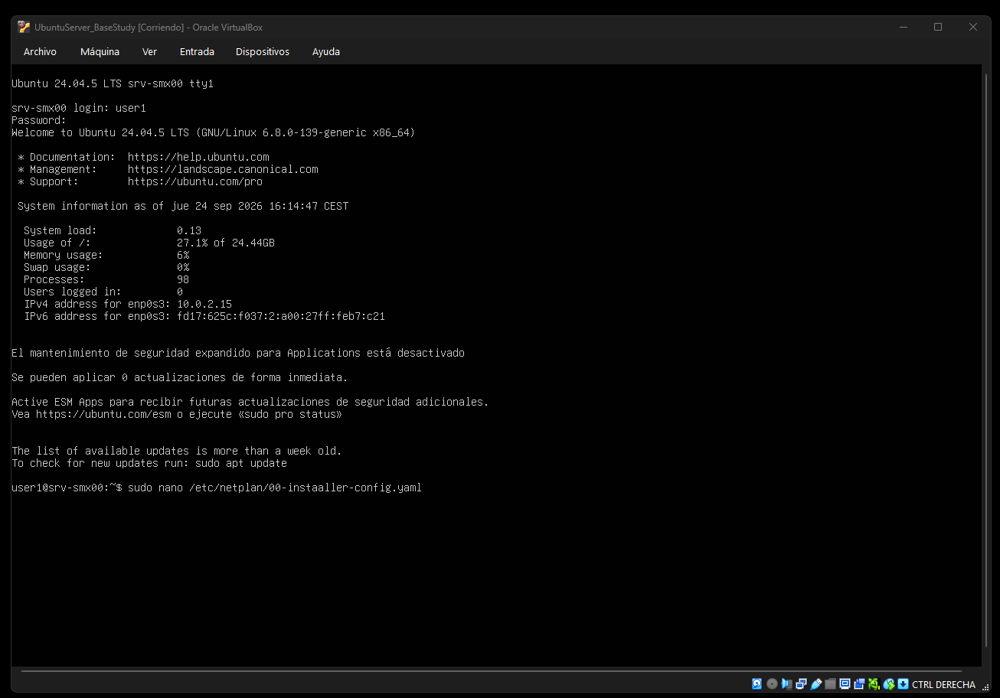
<!-- Captura pròpia de la pràctica (VirtualBox/Ubuntu Server): Terminal amb l'ordre nano escrita amb un nom de fitxer erroni, dins d'un directori que tampoc existeix -->

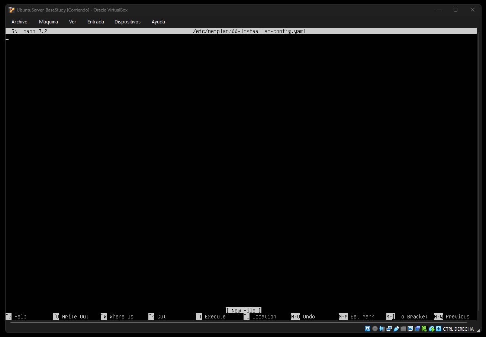
<!-- Captura pròpia de la pràctica (VirtualBox/Ubuntu Server): Nano mostrant l'indicador New File perquè la ruta escrita no existeix -->

> [!WARNING]
> Si Nano mostra `[ New File ]`, la ruta escrita no existeix i l'editor està preparat per crear-ne un de nou. **Això no demostra que Netplan estigui buit.** Desar aquest fitxer nou no modifica la configuració real i pot afegir un YAML conflictiu al directori.

Actuació correcta:

1. Surt sense desar amb `Ctrl + X` i respon `N` si et pregunta si vols desar.
2. Consulta `/etc/netplan` amb `ls -lah` per veure quins fitxers existeixen realment.
3. Obre el nom exacte del fitxer trobat.

```bash
ls -lah /etc/netplan
```

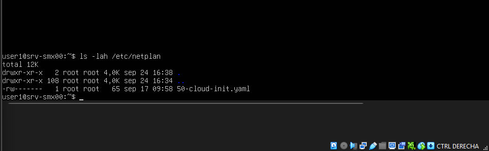
<!-- Captura pròpia de la pràctica (VirtualBox/Ubuntu Server): Resultat de ls -lah /etc/netplan mostrant el fitxer real 50-cloud-init.yaml amb propietari root i permisos 600 -->

```bash
sudo nano /etc/netplan/50-cloud-init.yaml
```

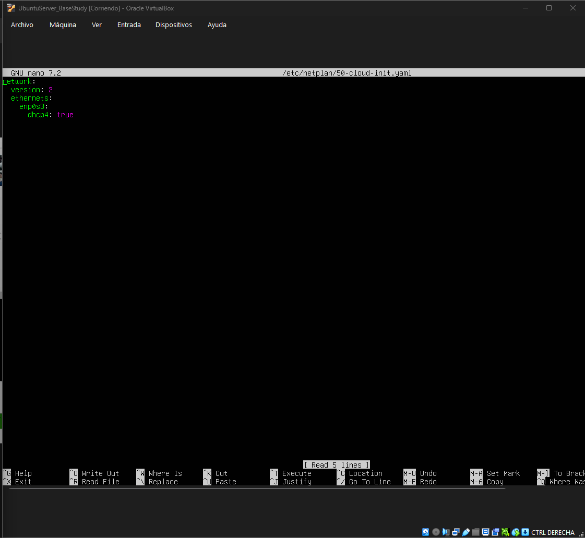
<!-- Captura pròpia de la pràctica (VirtualBox/Ubuntu Server): Fitxer real obert amb Nano, mostrant la configuració DHCP inicial d'enp0s3 -->

### 11.3 Fer una còpia de seguretat

```bash
sudo cp -a /etc/netplan /root/netplan-abans-canvi
```

Comprova els fitxers i permisos:

```bash
ls -l /etc/netplan
```

Habitualment, els fitxers de configuració han de pertànyer a root i tenir permisos restrictius, com ara `600`. En una instal·lació estàndard, el fitxer generat per `cloud-init` ja acostuma a tenir aquests permisos per defecte, tal com es veu a la captura anterior.

Si el fitxer editat té permisos massa oberts, ajusta'ls substituint el nom pel fitxer real:

```bash
sudo chown root:root /etc/netplan/00-installer-config.yaml
sudo chmod 600 /etc/netplan/00-installer-config.yaml
```

### 11.4 Editar el fitxer real

Substitueix el nom de l'exemple pel fitxer que existeixi a la teva màquina:

```bash
sudo nano /etc/netplan/00-installer-config.yaml
```

Exemple de configuració:

```yaml
network:
  version: 2
  renderer: networkd
  ethernets:
    enp0s3:
      dhcp4: true
    enp0s8:
      dhcp4: false
      addresses:
        - 192.168.50.10/24
```

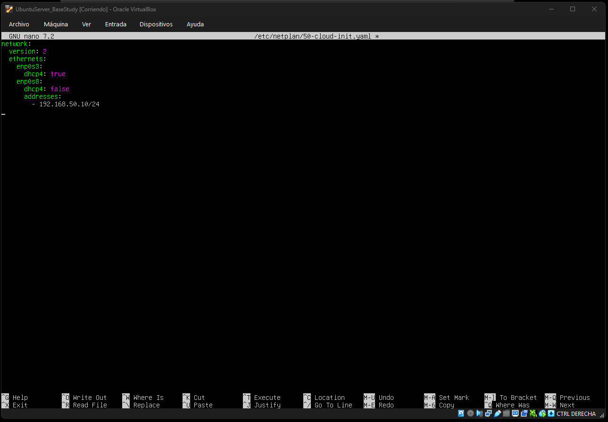
<!-- Captura pròpia de la pràctica (VirtualBox/Ubuntu Server): Fitxer YAML complet obert a l'editor amb les dues interfícies, la indentació visible i els noms reals enp0s3/enp0s8 -->

> [!NOTE]
> La captura mostra el fitxer real `50-cloud-init.yaml` sense la clau `renderer`. Ometre-la és vàlid: Netplan utilitza `systemd-networkd` per defecte a Ubuntu Server. Afegir-la explícitament només documenta la intenció de manera més clara.

Adapta `enp0s3` i `enp0s8` als noms reals.

Aquesta configuració estableix:

- `version: 2`: versió de l'esquema de configuració de Netplan.
- `renderer: networkd`: el sistema delega la xarxa a `systemd-networkd`, habitual a Ubuntu Server.
- Primera interfície per DHCP mitjançant NAT.
- Segona interfície amb IP estàtica `192.168.50.10/24`.
- Una única ruta de sortida, proporcionada pel NAT.
- Cap passarel·la fictícia a la xarxa interna.

No afegeixis una ruta per defecte a la xarxa interna si només ha de comunicar equips del mateix segment.

Utilitza espais i no tabuladors. La indentació forma part de la sintaxi YAML.

> [!NOTE]
> Abans d'utilitzar `192.168.50.0/24`, comprova que no se superposi amb una altra xarxa del teu entorn.

### 11.5 Validar la sintaxi

```bash
sudo netplan generate
```

<!-- IMATGE IMPRESCINDIBLE: validació de Netplan sense errors abans d'aplicar els canvis. Fitxer recomanat: imatges/31-validacio-netplan.png -->

Si no mostra errors, Netplan pot interpretar la sintaxi. Això encara no demostra que les IP, interfícies, rutes o DNS siguin adequats.

Si hi ha un error amb número de línia, revisa:

- La línia indicada i l'anterior.
- Els dos punts.
- La indentació.
- El nom exacte de les propietats.
- L'absència de tabuladors.

### 11.6 Provar la configuració

Des de la consola de VirtualBox:

```bash
sudo netplan try
```

<!-- IMATGE IMPRESCINDIBLE: prova de Netplan pendent de confirmació, mostrant el mecanisme de reversió temporal. Fitxer recomanat: imatges/32-netplan-try.png -->
<!-- CAPTURA PDF (pàgina 31): terminal amb "sudo netplan apply" i "sudo netplan ip leases enp0s3" mostrant ADDRESS, NETMASK, ROUTER i DNS assignats per DHCP -->

Confirma dins del termini només si la configuració funciona.

Si treballes directament des de la consola i tens la còpia disponible, també pots aplicar:

```bash
sudo netplan apply
```

Mantén disponible la consola de VirtualBox. Un canvi incorrecte pot interrompre una sessió SSH.

### 11.7 Comprovar les adreces i l'estat de Netplan

```bash
ip -br a
sudo netplan status --all
```

Hauries de veure:

- Una IP automàtica a la interfície NAT.
- `192.168.50.10/24` a la interfície interna.

<!-- IMATGE IMPRESCINDIBLE: sortida final de ip -br a mostrant la IP DHCP del NAT i la IP estàtica de la xarxa interna. Fitxer recomanat: imatges/33-adreces-finals.png -->

### 11.8 Comprovar les rutes

```bash
ip route
ip route get 1.1.1.1
```

La ruta per defecte i el resultat d'`ip route get 1.1.1.1` han de correspondre a la interfície NAT. La xarxa `192.168.50.0/24` ha d'aparèixer com a xarxa connectada directament a la interfície interna. En aquesta base simplifiquem la configuració a una única sortida principal.

<!-- IMATGE IMPRESCINDIBLE: sortida de ip route amb una única ruta per defecte associada a la interfície NAT. Fitxer recomanat: imatges/34-rutes-finals.png -->

### 11.9 Comprovar el DNS

```bash
resolvectl status
getent hosts ubuntu.com
```

<!-- IMATGE IMPRESCINDIBLE: comprovació funcional del DNS mitjançant resolvectl status i getent hosts. Fitxer recomanat: imatges/35-comprovacio-dns.png -->

### 11.10 Fer proves de connectivitat per capes

1. Comprova la ruta que utilitzarà el sistema:

```bash
ip route get 1.1.1.1
```

2. Prova connectivitat exterior per IP:

```bash
ping -c 4 1.1.1.1
```

3. Prova la resolució de noms:

```bash
getent hosts ubuntu.com
```

4. Prova el nom i la connectivitat exterior conjuntament:

```bash
ping -c 4 ubuntu.com
```

Un ping fallit no demostra per si sol que un servei sigui inaccessible, perquè ICMP pot estar filtrat. Cal provar també el servei concret que es necessita.

Quan existeixi el client Zorin amb IP `192.168.50.20/24`, completa la validació interna amb:

```bash
ip route get 192.168.50.20
ping -c 4 192.168.50.20
ip neigh
```

La ruta cap a `192.168.50.20` ha d'utilitzar directament la interfície de `SMX-LAB`, sense passar per la passarel·la NAT.

### 11.11 Recuperar-se des de la consola

Si una configuració incorrecta talla la connexió SSH, entra per la consola de VirtualBox. Primer identifica el fitxer incorrecte i compara'l amb la còpia feta al pas 11.3. No eliminis tots els YAML a cegues.

Per restaurar el fitxer concret utilitzat en aquesta màquina:

```bash
sudo cp /root/netplan-abans-canvi/50-cloud-init.yaml /etc/netplan/50-cloud-init.yaml
sudo chmod 600 /etc/netplan/50-cloud-init.yaml
sudo netplan generate
sudo netplan apply
```

Substitueix `50-cloud-init.yaml` pel nom real del fitxer de la teva màquina.

Si existeixen altres fitxers creats després de la còpia, inspecciona'ls abans de prendre cap decisió. Restaurar un fitxer no elimina automàticament altres YAML que puguin entrar en conflicte.

### Errors habituals de Netplan

| Símptoma | Causa probable | Actuació |
|---|---|---|
| Nano mostra `[ New File ]` | Ruta o nom de fitxer inexistents | Surt sense desar i executa `ls -lah /etc/netplan` |
| El YAML només mostra `enp0s3` | L'adaptador nou no s'afegeix automàticament al fitxer | Identifica la segona interfície amb `ip -br link` i afegeix-la manualment |
| Només es detecta una interfície | L'Adaptador 2 està desactivat o el cable desconnectat | Revisa la configuració de VirtualBox i reinicia la VM |
| `netplan generate` marca una línia | Indentació, tabulador o propietat incorrectes | Revisa la línia indicada i l'anterior |
| La IP no s'aplica a la interfície esperada | El nom d'interfície del YAML no és el real | Compara `ip -br link` amb les MAC anotades |
| Avís de permisos | El YAML és massa accessible | Aplica propietari `root:root` i permisos `600` |
| Es perd Internet | La ruta per defecte o el NAT no són correctes | Revisa `ip route` i la configuració de l'Adaptador 1 |
| Hi ha Internet per IP però no per nom | Problema de resolució DNS | Revisa `resolvectl status` i `getent hosts` |
| No es veu el client de `SMX-LAB` | Nom de xarxa interna, IP, prefix, cable o MAC incorrectes | Revisa `ip neigh` i la configuració dels dos adaptadors |
| El canvi desapareix després d'aplicar-lo | Hi ha diversos YAML o `cloud-init` regenera el fitxer | Revisa `sudo netplan get` i inspecciona tots els fitxers de `/etc/netplan` |
| La xarxa és intermitent | Adreces IP o MAC duplicades entre VM | Assigna identificadors únics a cada màquina |
| Es perd SSH en aplicar el canvi | El YAML nou talla la connexió activa | Entra per la consola de VirtualBox, revisa el YAML i restaura la còpia |
| Restaures una còpia però el problema continua | Han quedat altres YAML que entren en conflicte | Inspecciona tots els fitxers abans de prendre cap decisió |

---

## 12. Validar la màquina base

Una instal·lació no es considera acabada simplement perquè arribi a la pantalla d'inici de sessió. Cal demostrar que la configuració funciona i persisteix.

### 12.1 Identitat i permisos

```bash
whoami
sudo whoami
```

### 12.2 Nom del servidor

```bash
hostname
hostname -f
```

Resultat esperat:

```text
srv-smx01
srv-smx01.aula.test
```

### 12.3 Interfícies i adreces

```bash
ip -br link
ip -br a
ip link show
sudo netplan status --all
```

Compara les MAC amb l'inventari de l'apartat 10 i confirma que cada IP s'ha aplicat a la interfície prevista.

### 12.4 Rutes i DNS

```bash
ip route
resolvectl status
getent hosts ubuntu.com
```

### 12.5 OpenSSH

```bash
systemctl status ssh.service ssh.socket --no-pager
sudo ss -ltnp
```

### 12.6 Espai de disc

```bash
df -h
```

### 12.7 Fus i sincronització

```bash
timedatectl
```

### 12.8 Persistència

Reinicia:

```bash
sudo reboot
```

Després del reinici, repeteix:

```bash
hostname
hostname -f
ip -br link
ip -br a
ip route
resolvectl status
timedatectl
sudo ss -ltnp
```

La base només es dona per acabada si les configuracions pertinents es conserven després del reinici.

<!-- IMATGE IMPRESCINDIBLE: evidència conjunta de les comprovacions finals després del reinici, especialment hostname, adreces, ruta i hora. Fitxer recomanat: imatges/36-validacio-despres-reinici.png -->

### Llista final de validació

- [ ] `whoami` identifica l'usuari correcte.
- [ ] `sudo whoami` retorna `root`.
- [ ] `hostname` retorna `srv-smx01`.
- [ ] `hostname -f` retorna `srv-smx01.aula.test`.
- [ ] La interfície NAT obté una IP per DHCP.
- [ ] La interfície interna conserva `192.168.50.10/24`.
- [ ] Cada adaptador està relacionat amb la interfície correcta mitjançant la seva MAC.
- [ ] Només hi ha una ruta per defecte per a aquesta configuració base.
- [ ] La resolució de noms funciona.
- [ ] SSH escolta al port previst.
- [ ] El fus horari és `Europe/Madrid`.
- [ ] NTP està activat i se n'ha comprovat l'estat.
- [ ] Les dades continuen sent correctes després de reiniciar.

---

## 13. Crear una instantània

### 13.1 Fer una última actualització

```bash
sudo apt update
sudo apt upgrade
```

### 13.2 Apagar correctament

```bash
sudo poweroff
```

### 13.3 Crear la instantània a VirtualBox

Nom recomanat:

```text
00_BASE_UBUNTU_SERVER_24_04
```

Descripció recomanada:

```text
Ubuntu Server 24.04 LTS actualitzat.
Hostname srv-smx01.
OpenSSH instal·lat.
Adaptador 1 NAT amb DHCP.
Adaptador 2 SMX-LAB amb IP 192.168.50.10/24.
Zona horària Europe/Madrid i NTP actiu.
```

<!-- IMATGE IMPRESCINDIBLE: gestor d'instantànies de VirtualBox mostrant 00_BASE_UBUNTU_SERVER_24_04 creada correctament. Fitxer recomanat: imatges/37-instantania-maquina-base.png -->

Una instantània facilita tornar a un estat anterior, però no substitueix una còpia independent perquè depèn dels fitxers de la màquina virtual.

Si es clona la base per desplegar diverses màquines en una mateixa pràctica, cal revisar els elements que han de ser únics:

- Nom del servidor.
- Adreça MAC.
- IP estàtica.
- Identificadors o credencials específics de la màquina.

---

## Protocol general de diagnosi

Quan alguna cosa no funcioni, evita modificar diversos elements alhora. Primer concreta el problema, formula una hipòtesi i fes una prova que no alteri la configuració.

### 1. Definir l'objectiu

- Què intentaves fer?
- Des de quin equip?
- A quin destí?
- Quin resultat esperaves?
- Quin missatge exacte has obtingut?
- Quin ha estat l'últim canvi?

### 2. Revisar la xarxa virtual

Comprova:

- Quin adaptador s'està revisant.
- Mode de xarxa assignat a l'adaptador.
- Adaptador activat i cable virtual connectat.
- Nom exacte de la xarxa interna.
- Adreça MAC anotada per a aquell adaptador.
- Adaptador físic seleccionat si s'utilitza mode pont.

Si dues VM han de comunicar-se per xarxa interna, totes dues han d'estar connectades a una xarxa amb el mateix nom.

### 3. Revisar l'enllaç i la MAC

```bash
ip -br link
ip link show
```

Identifica:

- Quina interfície correspon a cada adaptador.
- Si l'estat administratiu és `UP`.
- Si hi ha enllaç detectat.
- Si la MAC coincideix amb la de VirtualBox.

Una interfície pot existir però continuar sense enllaç si el cable virtual està desconnectat. També pot estar enllaçada però no tenir cap IP; són problemes diferents.

### 4. Revisar les adreces i els prefixos

```bash
ip -br a
sudo netplan status --all
```

Comprova que:

- La IP està assignada a la interfície correcta.
- El prefix és l'esperat; en aquest laboratori, `/24`.
- Servidor i client comparteixen xarxa: `192.168.50.10/24` i `192.168.50.20/24`.
- No hi ha una IP estàtica duplicada en una altra VM.

### 5. Revisar els veïns de capa 2

Després d'intentar contactar amb l'altre equip:

```bash
ip neigh
```

Una entrada `FAILED` o `INCOMPLETE` indica que el sistema no ha pogut descobrir la MAC corresponent a la IP veïna. Revisa especialment el nom de la xarxa interna, el cable virtual, la IP, el prefix, la MAC duplicada i si l'altra VM està encesa.

### 6. Revisar les rutes

```bash
ip route
ip route get 1.1.1.1
ip route get 192.168.50.20
```

Determina si el destí és local o necessita una passarel·la. La sortida cap a Internet ha d'utilitzar el NAT; el client `192.168.50.20` ha de ser accessible directament per la interfície interna.

### 7. Revisar la resolució de noms

```bash
resolvectl status
getent hosts ubuntu.com
```

Si es pot arribar a una IP però no a un nom, el problema probablement es troba en la resolució.

### 8. Provar la connectivitat en ordre

```bash
ping -c 4 192.168.50.20
ping -c 4 1.1.1.1
getent hosts ubuntu.com
```

Interpreta cada prova per separat:

- Falla el client intern: revisa `SMX-LAB`, les IP, els prefixos i les MAC.
- Funciona la xarxa interna però falla `1.1.1.1`: revisa NAT i la ruta per defecte.
- Funciona `1.1.1.1` però falla el nom: revisa DNS.

<!-- IMATGE IMPRESCINDIBLE: diagnosi ordenada amb ip -br link, ip -br a, ip route, ip neigh i una prova de connectivitat; s'han de poder relacionar interfície, MAC, IP i ruta. Fitxer recomanat: imatges/37a-diagnosi-xarxa-per-capes.png -->

### 9. Revisar el servei

```bash
systemctl status NOM_SERVEI --no-pager
```

### 10. Revisar els ports

```bash
sudo ss -ltnp
```

Que la xarxa respongui no garanteix que el servei estigui iniciat ni que escolti a l'adreça o al port correctes.

### 11. Revisar els registres

```bash
journalctl -u NOM_SERVEI -b --no-pager -n 50
```

### 12. Documentar la resolució

Registra:

1. Símptoma observat.
2. Configuració inicial.
3. Hipòtesi plantejada.
4. Prova realitzada.
5. Resultat obtingut.
6. Solució aplicada.
7. Comprovació final.

Després de cada canvi, repeteix exactament la prova que havia fallat. Si canvies alhora VirtualBox, Netplan, el servei i el tallafoc, no podràs saber quin canvi ha resolt o empitjorat el problema.

---

## Errors freqüents

### El sistema torna a mostrar l'instal·lador

La ISO encara està muntada o té prioritat en l'ordre d'arrencada. Desmunta-la i arrenca des del disc virtual.

### No puc iniciar sessió

Comprova:

- Nom d'usuari real, no el nom complet ni el nom de la VM.
- Distribució del teclat.
- Bloq Maj.
- Símbols de la contrasenya.

### `sudo` no pot resoldre el nom del servidor

Revisa la coherència entre:

```bash
hostname
```

i:

```bash
cat /etc/hosts
```

### La interfície interna no rep cap IP

Una xarxa interna no proporciona DHCP automàticament. Configura una IP estàtica o incorpora un servidor DHCP a la xarxa.

### Dues VM amb NAT mostren la mateixa IP

En NAT individual poden tenir la mateixa IP virtual sense conflicte perquè es troben en entorns NAT separats.

### Les VM amb NAT no es veuen entre elles

El NAT individual no crea automàticament una xarxa comuna. Utilitza una mateixa xarxa NAT o una mateixa xarxa interna segons l'objectiu.

### Les dues VM tenen IP del mateix rang però no es veuen

Comprova que:

- Totes dues utilitzen exactament la mateixa xarxa interna, `SMX-LAB`.
- Els cables virtuals estan connectats.
- Les interfícies estan `UP`.
- Les IP són diferents i els prefixos coincideixen.
- No hi ha MAC duplicades.

Després d'un intent de `ping`, consulta `ip neigh` per saber si s'ha pogut descobrir la MAC de l'altre equip.

### No sé quina interfície correspon a cada adaptador

No ho dedueixis només pel nom `enp0s3` o `enp0s8`. Compara la MAC mostrada a **VirtualBox > Configuració > Xarxa > Avançat** amb la sortida de:

```bash
ip link show
```

### Una màquina importada té problemes de xarxa intermitents

Comprova que no comparteixi MAC ni IP estàtica amb la màquina original. En importar l'OVA per crear una VM nova, genera adreces MAC noves i assigna a cada equip un hostname i una IP únics.

### Netplan no aplica el fitxer modificat

Comprova:

```bash
ls -l /etc/netplan
sudo netplan get
```

Pot haver-hi diversos YAML combinats o potser s'ha editat un fitxer que no era l'actiu.

### Hi ha Internet per IP però no per nom

Revisa:

```bash
resolvectl status
getent hosts ubuntu.com
```

### SSH no respon

Comprova per ordre:

```bash
ip -br a
ip route
systemctl status ssh.service ssh.socket --no-pager
sudo ss -ltnp
```

### L'hora és incorrecta

No canviïs el rellotge manualment abans de distingir entre:

- Fus horari incorrecte.
- NTP actiu però encara no sincronitzat.
- Problema de xarxa o DNS.
- Canvi produït després de pausar o reprendre la VM.

---

## 14. Preparar l'escenari servidor-client

Les pràctiques posteriors combinaran habitualment un servidor sense entorn gràfic i un client d'escriptori. Es recomana **Zorin OS** com a client perquè ofereix un entorn gràfic accessible i permet treballar amb eines compatibles amb la família Ubuntu.

### 14.1 Dissenyar la topologia

Les dues VM tindran dos adaptadors, però cada adaptador complirà una funció concreta:

| Màquina | Adaptador 1 | Adaptador 2 | IP a `SMX-LAB` | Funció |
|---|---|---|---|---|
| Ubuntu Server | NAT amb DHCP | Xarxa interna `SMX-LAB` | `192.168.50.10/24` | Oferir els serveis. |
| Zorin OS | NAT amb DHCP | Xarxa interna `SMX-LAB` | `192.168.50.20/24` | Consumir, provar i administrar els serveis. |

En tots dos equips:

- L'Adaptador 1 permet actualitzar i instal·lar paquets.
- L'Adaptador 2 permet la comunicació privada del laboratori.
- La passarel·la per defecte correspon únicament a l'Adaptador 1.
- La interfície interna no necessita passarel·la ni DNS mentre només s'utilitzi per al mateix segment.

<!-- IMATGE IMPRESCINDIBLE: evidència de la topologia servidor-client; han de veure's els dos adaptadors de l'Ubuntu Server i del client Zorin, amb l'Adaptador 2 de totes dues VM connectat exactament a SMX-LAB. Fitxer recomanat: imatges/38-topologia-servidor-client-virtualbox.png -->

### 14.2 Crear el client Zorin

Quan la pràctica requereixi el client:

1. Descarrega la ISO de Zorin OS des del web oficial.
2. Crea una VM nova anomenada, per exemple, `ZorinClient_BASE`.
3. Assigna recursos adequats a l'equip disponible; com a punt de partida, 4 GB de RAM i 25 GB de disc dinàmic.
4. Mantén inicialment un únic adaptador NAT.
5. Instal·la Zorin OS al disc virtual.
6. Reinicia, retira la ISO i instal·la les actualitzacions.
7. Apaga completament el client.
8. Mantén l'Adaptador 1 en NAT.
9. Activa l'Adaptador 2 en mode **Xarxa interna** i selecciona `SMX-LAB`.
10. Anota les MAC de tots dos adaptadors abans d'arrencar.

No connectis el client a una xarxa interna amb un nom diferent, encara que tingui una IP del rang `192.168.50.0/24`.

<!-- IMATGE IMPRESCINDIBLE: configuració de xarxa del client Zorin a VirtualBox amb Adaptador 1 en NAT, Adaptador 2 a SMX-LAB, cables connectats i MAC visibles. Fitxer recomanat: imatges/39-adaptadors-client-zorin.png -->

### 14.3 Identificar les interfícies del client

Obre un terminal a Zorin i executa:

```bash
ip -br link
ip -br a
ip link show
nmcli device status
```

Compara les MAC amb VirtualBox i determina quina interfície correspon a NAT i quina a `SMX-LAB`. No configuris la IP fins que aquesta relació sigui inequívoca.

### 14.4 Configurar la IP interna a Zorin

Des de la configuració gràfica de xarxa de Zorin:

1. Obre **Configuració > Xarxa**.
2. Selecciona la connexió cablejada que correspon a l'Adaptador 2; comprova'n la MAC.
3. Obre les opcions de la connexió.
4. A **IPv4**, canvia el mètode a **Manual**.
5. Escriu l'adreça `192.168.50.20`.
6. Escriu la màscara `255.255.255.0`, equivalent a `/24`.
7. Deixa la passarel·la buida.
8. Deixa el DNS buit per a aquesta connexió interna.
9. Desa els canvis.
10. Desconnecta i torna a connectar la connexió, o reinicia el client.

Els noms exactes dels menús poden variar lleugerament segons la versió de Zorin, però els valors de xarxa han de ser els indicats.

Comprova el resultat:

```bash
ip -br a
ip route
nmcli device status
```

<!-- IMATGE IMPRESCINDIBLE: configuració IPv4 manual de la interfície interna del client Zorin amb 192.168.50.20/24, sense passarel·la i sense DNS. Fitxer recomanat: imatges/40-ip-estatica-client-zorin.png -->

### 14.5 Validar la comunicació servidor-client

Amb les dues VM enceses, des de Zorin:

```bash
ping -c 4 192.168.50.10
ssh NOM_USUARI_SERVIDOR@192.168.50.10
```

Substitueix `NOM_USUARI_SERVIDOR` pel compte real d'Ubuntu Server. La primera connexió SSH pot demanar confirmar l'empremta del servidor; comprova que el destí sigui correcte abans d'acceptar-la.

Des d'Ubuntu Server:

```bash
ping -c 4 192.168.50.20
ip neigh
```

La taula de veïns hauria de relacionar la IP del client amb la MAC de la seva interfície interna. Compara-la amb l'inventari de VirtualBox.

<!-- IMATGE IMPRESCINDIBLE: prova completa des de Zorin amb ping correcte a 192.168.50.10 i inici de sessió SSH al servidor; no mostris cap contrasenya. Fitxer recomanat: imatges/41-prova-zorin-ping-ssh.png -->

<!-- IMATGE IMPRESCINDIBLE: sortida d'ip neigh al servidor mostrant 192.168.50.20 associada a la MAC interna correcta del client Zorin. Fitxer recomanat: imatges/42-veinat-servidor-client.png -->

La topologia queda validada si:

- [ ] Tots dos equips tenen Internet mitjançant els seus adaptadors NAT.
- [ ] El servidor conserva `192.168.50.10/24` a `SMX-LAB`.
- [ ] El client conserva `192.168.50.20/24` a `SMX-LAB`.
- [ ] Només el NAT aporta la ruta per defecte a cada equip.
- [ ] El ping intern funciona en tots dos sentits.
- [ ] Zorin pot iniciar una sessió SSH al servidor per la IP interna.
- [ ] Les IP, les interfícies i les MAC estan documentades.

---

## 15. Crear i validar l'OVA de la màquina base

L'última operació de la preparació és exportar la màquina base com a **OVA**. El fitxer OVA empaqueta la definició de la VM i els seus discos virtuals en un únic arxiu transportable, però només serà fiable si després se'n comprova la importació.

### 15.1 Diferenciar instantània, clon i OVA

| Recurs | On queda | Ús principal | Limitació principal |
|---|---|---|---|
| Instantània | Associada a la VM original | Tornar ràpidament a un estat anterior. | Depèn dels fitxers de la VM original. |
| Clon | Nova VM dins de VirtualBox | Crear una còpia de treball al mateix entorn. | No és el format més pràctic per transportar o arxivar. |
| OVA | Fitxer independent | Distribuir, importar o conservar una màquina virtual. | Pot copiar hostname, IP i altres identificadors que després caldrà personalitzar. |

Una instantània no substitueix una OVA, i una OVA no substitueix les còpies de seguretat de les dades que es generin durant el curs.

### 15.2 Preparar la base abans d'exportar

1. Inicia només la màquina base original.
2. Instal·la les actualitzacions pendents:

   ```bash
   sudo apt update
   sudo apt upgrade
   ```

3. Revisa que no hi hagi cap contrasenya, clau privada, token o fitxer personal que no s'hagi de distribuir.
4. Repeteix la validació de l'apartat 12.
5. Comprova localment l'identificador de la instal·lació per poder detectar còpies duplicades:

   ```bash
   cat /etc/machine-id
   ```

   No publiquis el valor complet de `machine-id` al repositori ni el deixis visible a les captures.

6. Apaga correctament la VM:

   ```bash
   sudo poweroff
   ```

7. A VirtualBox, comprova que la ISO ja no estigui muntada a la unitat òptica.
8. Confirma que l'estat de la VM sigui **Apagada**, no **Desada**.
9. Conserva la instantània `00_BASE_UBUNTU_SERVER_24_04` creada anteriorment.

> [!IMPORTANT]
> L'OVA conserva la configuració del sistema convidat. Si s'importen diverses còpies, el hostname, la IP estàtica i altres identificadors poden quedar duplicats. La política de MAC de la importació i la personalització posterior són obligatòries abans d'executar diverses còpies a la mateixa xarxa.

<!-- IMATGE IMPRESCINDIBLE: màquina base apagada a VirtualBox, amb la instantània creada i sense la ISO d'instal·lació muntada. Fitxer recomanat: imatges/43-base-preparada-exportacio-ova.png -->

### 15.3 Exportar l'aplicació virtual

Amb la VM apagada:

1. Obre l'opció **Fitxer > Exporta una aplicació virtual** de VirtualBox. Segons la versió, també pot aparèixer dins de l'eina **Aplicacions**.
2. Selecciona únicament `UbuntuServer24.04_BASE`.
3. Tria el format **Open Virtualization Format 2.0** si està disponible.
4. Selecciona un fitxer de sortida amb un nom clar, per exemple:

   ```text
   UbuntuServer24.04_BASE.ova
   ```

5. Revisa la llista de discos i confirma que no s'hi inclogui la ISO d'instal·lació.
6. Activa la creació del manifest si VirtualBox ofereix aquesta opció.
7. Completa les metadades útils, com el nom del producte, la versió i una descripció breu.
8. Inicia l'exportació i espera que finalitzi sense tancar VirtualBox.

<!-- IMATGE IMPRESCINDIBLE: assistent d'exportació de VirtualBox amb la VM correcta, format OVF 2.0, nom del fitxer OVA i opcions revisades abans de confirmar. Fitxer recomanat: imatges/44-assistent-exportacio-ova.png -->

<!-- IMATGE IMPRESCINDIBLE: fitxer UbuntuServer24.04_BASE.ova creat correctament, amb el nom, la mida i la data visibles. Fitxer recomanat: imatges/45-fitxer-ova-exportat.png -->

### 15.4 Registrar la integritat de l'OVA

Si l'amfitrió és Linux, genera una suma de verificació al mateix directori que l'OVA:

```bash
sha256sum UbuntuServer24.04_BASE.ova > UbuntuServer24.04_BASE.ova.sha256
sha256sum -c UbuntuServer24.04_BASE.ova.sha256
```

La suma permet comprovar que el fitxer no s'ha corromput després de copiar-lo o descarregar-lo. En altres sistemes operatius es pot utilitzar una eina equivalent de SHA-256.

<!-- IMATGE IMPRESCINDIBLE: comprovació correcta de la suma SHA-256 de l'OVA amb el resultat OK. Fitxer recomanat: imatges/45a-verificacio-sha256-ova.png -->

> [!CAUTION]
> Els fitxers OVA, ISO, VDI i VMDK són binaris molt grans. No els afegeixis al repositori Git tret que el professorat ho demani expressament i s'hagi definit un sistema adequat d'emmagatzematge, com Git LFS. Al repositori n'hi ha prou amb documentar el nom, la versió, la suma SHA-256 i la ubicació autoritzada.

### 15.5 Importar una còpia de prova

No donis l'exportació per bona només perquè existeixi el fitxer. Fes una importació controlada:

1. Mantén apagada la VM original.
2. Obre **Fitxer > Importa una aplicació virtual**.
3. Selecciona `UbuntuServer24.04_BASE.ova`.
4. Assigna a la còpia un nom diferent, per exemple `UbuntuServer24.04_PROVA_OVA`.
5. Revisa la carpeta de destinació i els recursos assignats.
6. A la política d'adreces MAC, selecciona l'opció que **genera MAC noves per a tots els adaptadors de xarxa**.
7. Completa la importació.
8. Abans d'arrencar, revisa els dos adaptadors: Adaptador 1 en NAT i Adaptador 2 a `SMX-LAB`.
9. Anota les MAC noves i confirma que no coincideixen amb les de la VM original.

<!-- IMATGE IMPRESCINDIBLE: assistent d'importació de l'OVA amb el nom PROVA_OVA i la política de generació de MAC noves per a tots els adaptadors. Fitxer recomanat: imatges/46-importacio-ova-mac-noves.png -->

### 15.6 Validar la màquina importada

Amb la VM original encara apagada, inicia la còpia importada i comprova:

```bash
hostname
cat /etc/machine-id
ip -br link
ip -br a
ip route
resolvectl status
timedatectl
systemctl status ssh.service ssh.socket --no-pager
sudo ss -ltnp
```

Verifica també que:

- L'arrencada acaba sense errors.
- L'usuari autoritzat pot iniciar sessió.
- Les MAC coincideixen amb les MAC noves mostrades per VirtualBox.
- L'Adaptador 1 obté xarxa per DHCP i manté la ruta per defecte.
- L'Adaptador 2 conserva la configuració interna prevista.
- La resolució DNS, l'hora i OpenSSH funcionen.

<!-- IMATGE IMPRESCINDIBLE: validació de la VM importada amb hostname, MAC, IP, ruta, DNS, hora i SSH comprovats; oculta machine-id i no mostris contrasenyes ni dades sensibles. Fitxer recomanat: imatges/47-validacio-ova-importada.png -->

### 15.7 Personalitzar cada còpia abans d'utilitzar-la

La importació de prova demostra que l'OVA funciona, però una còpia destinada a una pràctica ha de rebre una identitat pròpia. Abans d'encendre alhora diverses còpies a `SMX-LAB`, revisa:

| Element | Acció requerida |
|---|---|
| Nom a VirtualBox | Assignar un nom únic a cada VM. |
| MAC | Generar MAC noves durant la importació. |
| Hostname | Canviar-lo si les còpies representen servidors diferents. |
| IP interna | Assignar una IP única dins de `192.168.50.0/24`. |
| Credencials i claus | Revisar-les segons la política de la pràctica. |
| `machine-id` | Comprovar-lo si es desplegaran múltiples còpies; aplicar el procediment de generalització indicat pel professorat abans de posar-les en producció. |

No arrenquis simultàniament la base original i una còpia encara configurada amb el mateix hostname i `192.168.50.10/24`. Primer personalitza la còpia amb l'original apagada.

La preparació es considera acabada quan l'OVA s'ha exportat, se n'ha registrat la integritat, s'ha importat amb MAC noves i la còpia ha superat totes les comprovacions.

<!-- IMATGE IMPRESCINDIBLE: evidència final de l'OVA validada, amb la VM original apagada i la còpia importada identificada amb un nom diferent i MAC noves. Fitxer recomanat: imatges/48-ova-final-validada.png -->

---

## Estructura proposada del repositori

El repositori es pot ampliar a mesura que avancin les pràctiques:

```text
ubuntu-server-smx/
├── README.md
├── imatges/
│   ├── 01-virtualbox-configuracio-inicial.png
│   ├── 02-arrencada-instal·lador.png
│   └── ...
├── docs/
│   ├── 01-installacio/
│   ├── 02-xarxa-base/
│   ├── 03-dhcp/
│   ├── 04-dns/
│   ├── 05-ssh/
│   ├── 06-transferencia-fitxers/
│   ├── 07-servidor-web/
│   └── 08-correu/
├── configuracions/
│   └── netplan/
├── scripts/
├── evidencies/
├── artefactes/
│   ├── README-OVA.md
│   └── UbuntuServer24.04_BASE.ova.sha256
└── .gitignore
```

Per evitar pujar accidentalment màquines virtuals, discos i ISO, afegeix al `.gitignore`:

```gitignore
*.ova
*.ovf
*.vdi
*.vmdk
*.iso
```

No publiquis al repositori:

- Contrasenyes.
- Claus privades SSH.
- Tokens.
- Còpies de fitxers que continguin credencials.
- Adreces o dades sensibles de la xarxa real del centre.

## Fonts tècniques de suport

- [Ubuntu Server documentation](https://ubuntu.com/server/docs)
- [Ubuntu Server installation requirements](https://ubuntu.com/server/docs/reference/installation/system-requirements/)
- [Ubuntu Server basic installation](https://ubuntu.com/server/docs/tutorial/basic-installation/)
- [Subiquity screen by screen](https://canonical-subiquity.readthedocs-hosted.com/en/latest/tutorial/screen-by-screen.html)
- [Oracle VirtualBox networking](https://docs.oracle.com/en/virtualization/virtualbox/7.1/user/networkingdetails.html)
- [Oracle VirtualBox: importació i exportació de màquines virtuals](https://docs.oracle.com/en/virtualization/virtualbox/7.1/user/Introduction.html#importing-and-exporting-virtual-machines)
- [Ubuntu network configuration](https://ubuntu.com/server/docs/explanation/networking/configuring-networks/)
- [Netplan YAML](https://netplan.readthedocs.io/en/stable/netplan-yaml/)
- [Netplan try](https://netplan.readthedocs.io/en/stable/netplan-try/)
- [Ubuntu OpenSSH](https://ubuntu.com/server/docs/how-to/security/openssh-server/)
- [Ubuntu user management](https://ubuntu.com/server/docs/how-to/security/user-management/)
- [Zorin OS: instal·lació en una màquina virtual](https://help.zorin.com/docs/getting-started/install-zorin-os-in-a-virtual-machine/)
- [systemd machine ID](https://www.freedesktop.org/software/systemd/man/latest/machine-id.html)

## Autoria i ús docent

Aquesta guia és una adaptació del procediment del procès d'instal·lació i configuració bàsica d'Ubuntu Server 24.04 LTS elaborada originalment per [Carlos Alonso Martínez a GitHub](https://github.com/carlesalonso), supervisat per Blai Redondo i incorpora els aclariments tècnics i didàctics de la guia docent complementària elaborats per [Martí Zamora i Merino a GitHub](https://github.com/martizamorapia).

En qualsevol adaptació o lliurament cal conservar la referència a l'autoria i la llicència del material original, i diferenciar les ampliacions pròpies de les instruccions de partida.
