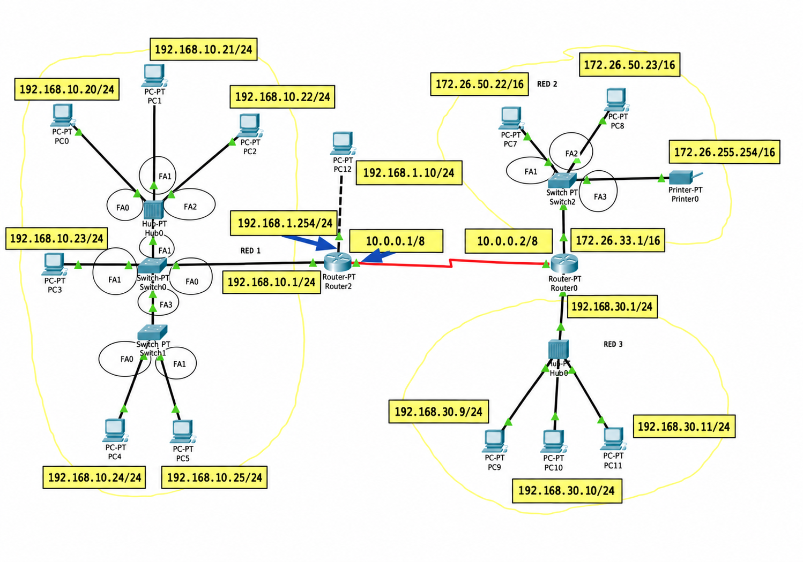

# Repàs de xarxes TCP/IP

> **MP 0227 · Serveis de xarxa · 2n SMX**  
> Guia d'estudi basada en les diapositives *00_XarxesTCP_IP* i el full d'activitats *AA2-RepasXarxes*. El propòsit és entendre què significa una configuració de xarxa, calcular-ne les dades i saber comprovar-la quan falla.

## Objectius

En acabar aquest repàs hauràs de poder:

1. Reconèixer què fan IP, TCP, UDP, les adreces MAC i els ports.
2. Interpretar una adreça IPv4 i una màscara, en format decimal o CIDR.
3. Calcular l'adreça de xarxa, el broadcast i el rang d'adreces assignables.
4. Comprovar si la porta d'enllaç és coherent amb la xarxa de l'equip.
5. Interpretar una taula d'encaminament i el significat d'una ruta per defecte.
6. Explicar el paper de NAT, PAT i CG-NAT i observar connexions amb `netstat`.
7. Configurar i comprovar una petita topologia amb encaminament RIP a Packet Tracer.

---

## 1. Per què necessitem protocols i adreces?

Una **xarxa** interconnecta equips per intercanviar dades. Una **intranet** és una xarxa d'ús intern que pot fer servir els mateixos protocols que Internet. **Internet** interconnecta xarxes diferents a través d'encaminadors o *routers*; els paquets poden travessar diversos routers abans d'arribar a la destinació.

Un protocol és un conjunt de regles que permeten comunicar-se als equips. **TCP/IP** és el nom habitual de la família de protocols emprada en aquestes comunicacions. Les funcions s'organitzen en capes:

| Capa o funció | Exemples | Què resol? |
|---|---|---|
| Aplicació | HTTP(S), DNS, correu | Quina informació o servei intercanviem? |
| Transport | TCP, UDP | Com s'envien les dades entre processos? |
| Internet | IP, ICMP | A quina adreça IP s'envia el paquet i per on s'encamina? |
| Accés a la xarxa | Ethernet, Wi-Fi | Com es transmet dins de l'enllaç local? |

<!-- IMATGE 01: Diagrama de quatre capes de la pila TCP/IP. Mostra un missatge que baixa per les capes de l'emissor i puja per les del receptor; etiqueta HTTP/DNS, TCP/UDP i ports, IP, Ethernet/Wi-Fi i MAC. No afegeixis protocols sense explicar-los. Fitxer suggerit: imatges/pila-tcp-ip.png -->

### Identificadors que no s'han de confondre

- **MAC:** identifica una interfície de xarxa en l'enllaç local. En Ethernet és habitual una adreça de **48 bits**, representada en hexadecimal, per exemple `00:00:0C:52:72:EB`. Sovint els primers bits identifiquen el fabricant. No és una adreça amb què encaminem paquets entre xarxes IP.
- **IP:** és l'adreça lògica emprada per identificar la interfície en una xarxa IP i permetre l'encaminament. Pot canviar en variar la configuració o la xarxa.
- **Port:** número de la capa de transport que ajuda a identificar el servei o procés que envia o rep dades, per exemple el port de destinació `443` en moltes connexions HTTPS. Un port té **16 bits** i pot valer de `0` a `65535`.

> **Exemple:** en una connexió web, la IP identifica el servidor al qual es vol arribar, mentre que el port de destinació ajuda a lliurar les dades al servei web. La MAC s'utilitza per lliurar una trama en cada enllaç local del trajecte.

## 2. Adreces IPv4 i IPv6

### IPv4

Una adreça **IPv4** té **32 bits**, agrupats en quatre octets decimals separats per punts: `172.0.2.15`. Cada octet representa un valor de `0` a `255`. Una IP tota sola no indica quina part identifica la xarxa: també cal conèixer-ne la **màscara** o la longitud de prefix.

### IPv6

Una adreça **IPv6** té **128 bits** i s'escriu en grups hexadecimals separats per dos punts, per exemple `1080:0:0:0:8:800:200C:417A`. Els zeros es poden abreujar seguint les regles d'IPv6. Les comunicacions IPv6 utilitzen adreces *unicast*, *multicast* i *anycast*; IPv6 **no utilitza broadcast**.

El càlcul de subxarxes dels exercicis d'aquesta guia es fa amb **IPv4**.

### Adreces privades, públiques i de bucle local

| Tipus | Rang o exemple | Ús |
|---|---|---|
| IPv4 privada | `10.0.0.0/8` | Xarxes internes; no s'encamina directament per Internet pública. |
| IPv4 privada | `172.16.0.0/12` | De `172.16.0.0` a `172.31.255.255`. **No** tot `172.0.0.0/8` és privat. |
| IPv4 privada | `192.168.0.0/16` | Xarxes internes habituals. |
| Bucle local | `127.0.0.0/8`; habitualment `127.0.0.1` | Permet comunicar-se amb el mateix equip. |
| Pública | Per exemple, una adreça pública assignada a una connexió | Pot ser encaminable per Internet, segons la seva assignació i les polítiques de xarxa. |

Les **classes A, B i C** són una manera històrica de classificar IPv4 segons el primer octet: A (`1–126`, amb excepcions d'ús especial), B (`128–191`) i C (`192–223`). Les màscares històriques eren `/8`, `/16` i `/24`, respectivament. **Avui la classe no determina la mida real de la xarxa:** la determina la màscara explícita. Per això, `192.168.14.3/16` té una IP del rang anomenat classe C, però la xarxa configurada té prefix `/16`.

> **Pregunta de control:** `172.26.50.23` és privada? Sí: el segon octet, `26`, és dins de l'interval privat `16–31`.

## 3. La màscara de subxarxa

La màscara marca amb bits **1** la part de xarxa i amb bits **0** la part disponible per identificar adreces dins d'aquella xarxa. Les màscares IPv4 ordinàries tenen els uns consecutius a l'esquerra; la notació **CIDR** n'indica el nombre després d'una barra.

| Màscara decimal | Prefix | Bits per a adreces del bloc | Adreces totals |
|---|---:|---:|---:|
| `255.0.0.0` | `/8` | 24 | `2^24` |
| `255.224.0.0` | `/11` | 21 | `2^21` |
| `255.255.0.0` | `/16` | 16 | `2^16` |
| `255.255.240.0` | `/20` | 12 | `2^12` |
| `255.255.252.0` | `/22` | 10 | `2^10` |
| `255.255.255.0` | `/24` | 8 | `256` |
| `255.255.255.192` | `/26` | 6 | `64` |

Per exemple, `255.255.255.192` té **26 bits a 1**: els primers 24 corresponen als tres primers octets i l'últim octet, `192`, és `11000000` en binari. Per això s'escriu `/26`.

<!-- IMATGE 02: Esquema horitzontal dels 32 bits d'una IPv4 i d'una màscara /26; ressalta en colors diferents els 26 bits de xarxa i els 6 bits restants. Usa 192.168.22.15/26 i escriu 192 = 11000000. Fitxer suggerit: imatges/mascara-26-bits.png -->

### Com es calcula l'adreça de xarxa?

Es fa una operació **AND bit a bit** entre la IP i la màscara: `1 AND 1 = 1`; qualsevol altra combinació dona `0`. Els bits de l'equip passen a zero i obtenim l'**adreça de xarxa**.

```text
IP:       172.  0.  2. 15
Màscara:  255.255.255.  0   (/24)
Xarxa:    172.  0.  2.  0
```

El **broadcast** s'obté posant tots els bits de la part d'equip a `1`: en aquest exemple, `172.0.2.255`. En una xarxa IPv4 convencional, ni l'adreça de xarxa ni la de broadcast s'assignen a equips. Les adreces assignables van de `172.0.2.1` a `172.0.2.254`.

Per als exercicis de subxarxes habituals, si hi ha `h` bits d'equip: **adreces totals = `2^h`** i **adreces assignables = `2^h − 2`**. Aquesta resta descriu els casos convencionals dels exercicis; hi ha usos especials de prefixes molt curts com `/31` i `/32`.

### Mètode ràpid dels blocs

Quan el valor de la màscara canvia en un octet, calcula **`256 − valor de la màscara`** en aquell octet. El resultat és la mida dels blocs.

**Exemple 1: `192.168.223.153/28`.** La màscara és `255.255.255.240`; els blocs de l'últim octet són de `256 − 240 = 16`: `0–15`, `16–31`, …, `144–159`. El valor `153` cau al bloc `144–159`:

| Xarxa | Primera assignable | Última assignable | Broadcast |
|---|---|---|---|
| `192.168.223.144/28` | `192.168.223.145` | `192.168.223.158` | `192.168.223.159` |

**Exemple 2: `10.254.96.104/22`.** La màscara és `255.255.252.0`. En el **tercer octet**, el bloc és de `256 − 252 = 4`: `… 92–95`, `96–99`, `100–103 …`. El valor `96` cau al bloc `96–99`. Com que el quart octet pertany a l'equip, la xarxa és `10.254.96.0`, el broadcast és `10.254.99.255` i les adreces assignables van de `10.254.96.1` a `10.254.99.254`.

**Exemple 3: `8.45.127.12/20`.** En el tercer octet, `256 − 240 = 16` i `127` cau al bloc `112–127`. La xarxa és `8.45.112.0` i el broadcast `8.45.127.255`. Observa que un bloc pot abraçar diversos valors del tercer octet.

<!-- IMATGE 03: Recta de blocs /22 en el tercer octet. Dibuixa 92–95, 96–99, 100–103; destaca la IP 10.254.96.104 i els extrems 10.254.96.0 i 10.254.99.255. Fitxer suggerit: imatges/blocs-subxarxes-22.png -->

### Procediment que pots repetir sempre

1. Converteix la màscara a prefix, o identifica l'octet en què no és `255` ni `0`.
2. Calcula la mida del bloc (`256 − octet de la màscara`).
3. Busca el múltiple d'aquesta mida immediatament inferior o igual a l'octet de la IP.
4. Escriu la **xarxa** posant a zero els octets restants de l'equip.
5. Escriu el **broadcast** amb l'últim valor del bloc i `255` als octets restants.
6. Suma 1 a la xarxa per trobar la primera IP assignable i resta 1 al broadcast per trobar l'última.

> **Comprovació:** aplica la màscara a dues IP. Si el resultat és la mateixa adreça de xarxa, són dins de la mateixa subxarxa IPv4.

## 4. Configuració d'un equip: IP, màscara, gateway i DNS

Per comunicar-se, un equip acostuma a necessitar:

- **IP:** la seva adreça en aquella xarxa.
- **Màscara:** indica quines destinacions considera locals.
- **Porta d'enllaç predeterminada (*gateway*):** la IP del router a la qual envia paquets destinats a altres xarxes. En una configuració habitual, ha de ser **dins de la mateixa subxarxa** que l'equip.
- **Servidor DNS:** tradueix noms com `www.upc.edu` a adreces IP. **No és necessàriament la porta d'enllaç**.

<!-- IMATGE 04: Pantalla esquemàtica de configuració d'un PC amb 192.168.10.20/24, gateway 192.168.10.1 i DNS 1.1.1.1. Indica que el DNS és només un exemple i que gateway i PC comparteixen la xarxa 192.168.10.0/24. Fitxer suggerit: imatges/configuracio-ip.png -->

**Diagnosi d'una configuració:**

1. Identifica la IP i la màscara de l'equip; calcula'n la xarxa.
2. Aplica la mateixa màscara a la IP del gateway. Obté la mateixa xarxa?
3. Comprova que IP i gateway no siguin ni adreces de xarxa ni de broadcast.
4. Prova d'arribar al gateway. Després prova una IP externa i, finalment, un nom de domini. Si la IP funciona i el nom no, revisa DNS.

> **Exemple d'error:** `170.100.4.10/24` pertany a `170.100.4.0/24`. Un gateway `170.100.5.140` és en una altra subxarxa i no serveix com a porta d'enllaç local en la configuració ordinària plantejada.

## 5. Encaminament entre xarxes

Un equip envia directament a una destinació **de la seva subxarxa**. Si la destinació és fora, lliura el paquet a la **porta d'enllaç**. El router consulta la seva **taula d'encaminament**, que conté xarxes de destinació, màscares i, si cal, el següent salt.

Quan diverses rutes coincideixen amb la IP de destinació, s'escull la **coincidència de prefix més llarg**: la ruta amb més bits de xarxa. `0.0.0.0/0` és la **ruta per defecte** i s'utilitza si no hi ha cap ruta més específica. A la taula de l'activitat, `0.0.0.0` a la columna *següent salt* significa que la xarxa és directament connectada; no s'ha de confondre amb una destinació `0.0.0.0/0`.

| Destinació | Màscara | Següent salt |
|---|---|---|
| `10.10.20.0` | `255.255.255.224` (`/27`) | `10.1.2.2` |
| `10.10.30.0` | `255.255.255.128` (`/25`) | `10.1.3.2` |
| `10.1.2.0` | `255.255.255.0` (`/24`) | `0.0.0.0` (directe) |
| `10.1.3.0` | `255.255.255.0` (`/24`) | `0.0.0.0` (directe) |
| `0.0.0.0` | `0.0.0.0` (`/0`) | `10.1.4.254` |

**Exemple:** `10.10.20.9` és dins de `10.10.20.0/27`, que cobreix del `.0` al `.31`: el router l'envia a `10.1.2.2`. `10.10.20.36` cau fora d'aquest bloc i, si no hi ha cap altra coincidència, segueix la ruta per defecte.

<!-- IMATGE 05: Dues xarxes locals, un router i una petita taula de rutes. Mostra en colors diferents un paquet que segueix la ruta /27 i un altre que segueix la ruta /0. Fitxer suggerit: imatges/rutes-i-seguent-salt.png -->

## 6. TCP, UDP i ports

La capa de transport permet la comunicació entre aplicacions. **TCP** estableix una connexió, numera dades, detecta pèrdues i les retransmet quan cal, i lliura el flux de bytes en ordre. **UDP** envia datagrames sense establir una connexió d'aquest tipus i no proporciona per si mateix aquestes garanties; una aplicació pot afegir els mecanismes que necessiti.

| Característica | TCP | UDP |
|---|---|---|
| Connexió abans d'intercanviar dades | Sí | No, en el sentit de TCP |
| Garantia de lliurament i ordre del protocol de transport | Sí, mentre la connexió funciona | No |
| Exemples habituals | HTTPS sobre TCP, SSH | DNS habitualment, comunicacions en temps real i QUIC/HTTP/3 |

**UDP no significa sempre «més ràpid»**, ni TCP assegura que un servei remot funcioni correctament: l'elecció depèn dels requisits de l'aplicació. Els ports `0–1023` són coneguts o *well-known*; `1024–49151`, registrats; `49152–65535`, dinàmics/privats. Un client sovint utilitza un port d'origen temporal i es connecta al port de destinació del servei.

### Observar les connexions amb `netstat` (Windows)

```powershell
netstat -h
netstat -ano -p TCP
netstat -ano -p UDP
netstat -ano -p TCP | findstr ESTABLISHED
netstat -abno -p TCP
tasklist /FI "PID eq 1234"
```

- `-a` mostra connexions i ports d'escolta; `-n`, adreces i ports numèrics; `-o`, el **PID** del procés; `-b`, l'executable associat (pot requerir permisos d'administrador).
- A TCP pots trobar estats com `LISTENING` o `ESTABLISHED`. A UDP no hi ha un estat `ESTABLISHED` equivalent al de TCP.
- Si obres una web, pots trobar diverses connexions perquè el navegador carrega recursos de diferents dominis. Una web pot fer servir **QUIC/HTTP/3 sobre UDP**; per això no sempre veuràs la connexió que busques com a TCP cap al port `443`.
- `nslookup www.upc.edu` permet comparar la resolució DNS amb les adreces remotes observades, però l'adreça efectiva pot variar. **No identifiquis una pestanya només a partir d'una línia de `netstat`.**

## 7. NAT, PAT i CG-NAT

En una xarxa local, els equips acostumen a tenir adreces **privades**. Perquè puguin iniciar comunicacions cap a Internet, el router pot fer una **traducció d'adreces** (*NAT*): canvia una adreça d'origen privada per una adreça utilitzada a l'exterior i conserva l'associació necessària per fer arribar les respostes a l'equip correcte.

Quan molts equips comparteixen **una IP pública**, el router també diferencia les comunicacions amb els **ports**: això s'anomena habitualment **PAT**, **NAPT** o *masquerade*. Exemple il·lustratiu:

| Origen dins de la LAN | Traducció que surt a Internet |
|---|---|
| `192.168.1.2:2045` | `72.12.1.3:2045` |
| `192.168.1.2:4497` | `72.12.1.3:2834` |
| `192.168.1.3:2299` | `72.12.1.3:9834` |

El router registra aquestes associacions mentre són actives. En el trànsit de tornada, les consulta per lliurar cada resposta al dispositiu corresponent. La **traducció de destinació** (*DNAT*) es pot fer servir, per exemple, per redirigir cap a un servidor intern les peticions que arriben a un port publicat.

<!-- IMATGE 06: Dos clients privats, un router amb una IP pública i un servidor remot. Dibuixa una petita taula amb les parelles IP:port abans i després de PAT i el recorregut de la resposta. Fitxer suggerit: imatges/nat-pat.png -->

Amb **CG-NAT**, també el proveïdor d'Internet fa una traducció i diversos clients poden compartir adreces públiques. Això pot dificultar que una petició iniciada des d'Internet arribi directament a un servidor de casa, encara que es configurin ports al router domèstic. Per investigar-ho, compara l'adreça **WAN del teu router** amb l'adreça pública observada a Internet i consulta el proveïdor; un `tracert` pot aportar pistes, però **per si sol no demostra** que hi hagi CG-NAT.

> **Recorda:** NAT no substitueix un tallafoc. Les regles d'accés i la traducció d'adreces són decisions diferents.

## 8. Pràctica: del càlcul al diagnòstic

Fes primer els exercicis sense consultar una calculadora de subxarxes. Després comprova els resultats i **justifica el procediment**: mida del bloc, xarxa, rang i broadcast. En els exercicis amb equips reals, recull evidències de les ordres i explica què has deduït.

### Activitat 1 · Adreçament IPv4

Per a cada parella, indica la **classe històrica**, si la màscara és la que corresponia per defecte a la classe, la **xarxa**, la **primera i l'última IP assignables** i el **broadcast**.

| Adreça IP | Màscara | Classe | Per defecte? | Xarxa | 1a assignable | Última assignable | Broadcast |
|---|---|---|---|---|---|---|---|
| `192.168.14.3` | `255.255.0.0` | | | | | | |
| `10.23.31.7` | `255.255.255.0` | | | | | | |
| `8.45.127.12` | `255.0.0.0` | | | | | | |
| `8.45.127.12` | `255.255.240.0` | | | | | | |
| `223.145.90.131` | `255.255.255.192` | | | | | | |
| `140.30.23.31` | `255.224.0.0` | | | | | | |

**Pista:** identifica l'octet on canvia el bloc; amb `/11`, fixa't en el **segon** octet.

### Activitat 2 · Justificar una subxarxa

Quina xarxa i quin broadcast corresponen a `10.254.96.104` amb màscara `255.255.252.0`? Escriu els càlculs i tria l'opció. **En les opcions s'escriu primer el broadcast i després la xarxa.**

- a) `10.254.255.255` – `10.254.0.0`
- b) `10.255.255.255` – `10.0.0.0`
- c) `10.254.96.255` – `10.254.96.0`
- d) `10.254.99.255` – `10.254.96.0`

### Activitat 3 · Revisar configuracions

Decideix si aquestes configuracions poden funcionar com s'han plantejat. Calcula la xarxa de l'IP i comprova **la xarxa i el tipus d'adreça del gateway**:

1. IP `170.100.4.10`; màscara `255.255.255.0`; gateway `170.100.5.140`.
2. IP `201.100.4.10`; màscara `255.255.255.0`; gateway `201.100.4.255`.

### Activitat 4 · Llegir rutes

Utilitza la taula de l'apartat 5. Per a cada destinació, indica **quina ruta coincideix**, quin és el **següent salt** i per què:

- a) `10.10.20.36`
- b) `10.10.20.9`
- c) `10.1.2.3`
- d) `10.10.30.16`

### Activitat 5 · Connexions del teu ordinador

1. Obre `www.upc.edu` al navegador i observa les connexions establertes. Pots relacionar-ne alguna amb la pàgina? Indica **quines dades ho suggereixen** i quines limitacions té la comprovació.
2. Mostra els ports UDP i, separadament, les connexions TCP establertes. Quina diferència veus a la columna d'estat? Explica-la.
3. Determina el procés associat a algunes connexions TCP amb el **PID** o amb l'opció `-b`.

**Evidència que has d'entregar:** ordres executades, fragments rellevants de la sortida i una explicació breu. No copiïs una llista extensa de connexions sense interpretar-la.

### Activitat 6 · Topologia a Packet Tracer

Completa les IP i màscares de tots els ordinadors, de la impressora i de les interfícies dels routers en **l'esquema original de l'activitat**. Representa la xarxa a Packet Tracer i comprova la comunicació amb **RIPv2** entre routers.

<!-- IMATGE 07 — NECESSÀRIA PER A L'ACTIVITAT 6: Insereix aquí la figura de la pàgina 3 del PDF AA2-RepasXarxes, o una recreació fidel en alta resolució. Cal que es vegin PC0–PC12, Printer0, Router2, Router0, els enllaços, les tres xarxes RED 1/2/3 i totes les etiquetes grogues amb adreces parcials. Fitxer suggerit: imatges/activitat-6-topologia.png -->

**Dades visibles a l'esquema, per poder preparar la pràctica:**

| Zona | Pistes que proporciona la figura |
|---|---|
| Xarxa 1, esquerra | Els PC0–PC5 acaben en `.20`, `.21`, `.22`, `.23`, `.24` i `.25`; PC1 comença per `192.`; PC3 conté `.168.`; PC5 acaba en `.10.25`; la interfície del router cap a la LAN acaba en `.1`; hi ha màscares `/24` indicades. |
| PC12, connectat directament a Router2 | PC12 té `192.168.1.10` i la interfície corresponent de Router2 acaba en `.254/24`. |
| Entre Router2 i Router0 | El tram conté `10.0.0.1` i `10.0.0.2/8`. |
| Xarxa 2, dalt a la dreta | PC7 acaba en `.50.22`, PC8 en `.50.23`; la impressora és `172.26.255.254`; la interfície de Router0 acaba en `.33.1/16`. |
| Xarxa 3, baix a la dreta | La interfície de Router0 és `192.168.30.1`; els tres PC acaben en `.9`, `.10` i `.11`; PC10 indica `/24`. |

**Ordre de treball recomanat:**

1. Dedueix la **xarxa i la màscara** de cada segment. Justifica com has completat els octets.
2. Assigna una IP i la porta d'enllaç correcta a cada dispositiu. Cada interfície del router ha de tenir una IP del seu segment.
3. Configura les interfícies dels routers i activa-les. Comprova amb `show ip interface brief` que estan operatives.
4. Comprova primer `ping` entre equips de la **mateixa xarxa** i cap al seu gateway.
5. Activa `router rip`, `version 2` i `no auto-summary` als dos routers; anuncia les xarxes connectades a cadascun.
6. Fes `show ip route` i comprova que hi ha rutes remotes indicades amb `R`. Després prova `ping` entre xarxes diferents i desa evidències.

> **Si falla:** comprova, en aquest ordre, IP/màscara, gateway, estat de les interfícies, connexió física, xarxes anunciades a RIP i ruta de retorn. Documenta la hipòtesi, la prova que fas i el resultat.

## 9. Solucionari raonat de les activitats

> **Com utilitzar aquest apartat:** resol primer les activitats 1–6 i consulta les respostes per detectar quin pas del teu raonament ha fallat. En la pràctica amb l'ordinador, compara el **mètode**: les adreces, els PID i les connexions observades canviaran segons l'equip.

### Solució de l'activitat 1 · Adreces de xarxa

| IP i màscara | Classe històrica | Màscara per defecte? | Adreça de xarxa | Primera IP assignable | Última IP assignable | Broadcast |
|---|---|---|---|---|---|---|
| `192.168.14.3` · `255.255.0.0` (`/16`) | C | No: seria `/24` | `192.168.0.0` | `192.168.0.1` | `192.168.255.254` | `192.168.255.255` |
| `10.23.31.7` · `255.255.255.0` (`/24`) | A | No: seria `/8` | `10.23.31.0` | `10.23.31.1` | `10.23.31.254` | `10.23.31.255` |
| `8.45.127.12` · `255.0.0.0` (`/8`) | A | Sí | `8.0.0.0` | `8.0.0.1` | `8.255.255.254` | `8.255.255.255` |
| `8.45.127.12` · `255.255.240.0` (`/20`) | A | No: seria `/8` | `8.45.112.0` | `8.45.112.1` | `8.45.127.254` | `8.45.127.255` |
| `223.145.90.131` · `255.255.255.192` (`/26`) | C | No: seria `/24` | `223.145.90.128` | `223.145.90.129` | `223.145.90.190` | `223.145.90.191` |
| `140.30.23.31` · `255.224.0.0` (`/11`) | B | No: seria `/16` | `140.0.0.0` | `140.0.0.1` | `140.31.255.254` | `140.31.255.255` |

**Justificació dels casos que acostumen a generar dubtes:**

1. `192.168.14.3/16`: `255.255.0.0` fixa els **dos primers octets**. La xarxa és `192.168.0.0`; que l'adreça comenci per `192` no converteix la màscara configurada en `/24`.
2. `10.23.31.7/24`: la màscara fixa els **tres primers octets**. Xarxa `10.23.31.0`, broadcast `10.23.31.255`.
3. `8.45.127.12/8`: només queda fix el primer octet; les IP de la xarxa van des de `8.0.0.0` fins a `8.255.255.255`.
4. `8.45.127.12/20`: al tercer octet, el pas és `256 − 240 = 16`; `127` pertany a `112–127`. Posa el quart octet a `0` per a la xarxa i a `255` per al broadcast.
5. `223.145.90.131/26`: a l'últim octet, el pas és `256 − 192 = 64`; `131` pertany a `128–191`. La xarxa acaba en `.128` i el broadcast en `.191`.
6. `140.30.23.31/11`: al **segon octet**, el pas és `256 − 224 = 32`; `30` pertany a `0–31`. Com que els altres dos octets són de la part d'equip, xarxa `140.0.0.0` i broadcast `140.31.255.255`.

La classe respon només a la pregunta històrica de l'enunciat. **Tots els límits d'aquestes subxarxes provenen de la màscara que acompanya cada IP.**

### Solució de l'activitat 2 · Càlcul `/22`

`255.255.252.0` és `/22`: els dos primers octets aporten **16 bits de xarxa** i `252` en binari és `11111100`, que n'aporta **6 més** al tercer octet (`16 + 6 = 22`). El salt dels blocs en el tercer octet és `256 − 252 = 4`.

```text
Tercer octet de la IP: 96
Bloc que el conté:    96–99
Xarxa:                10.254.96.0
Broadcast:            10.254.99.255
Primera assignable:   10.254.96.1
Última assignable:    10.254.99.254
```

**Resposta correcta: d)** `10.254.99.255 – 10.254.96.0`. L'opció c) tracta erròniament la xarxa com si acabés en `96.255`, cosa que correspondria a un bloc `/24` i ignoraria que el `/22` abraça quatre valors del tercer octet.

### Solució de l'activitat 3 · Validar les portes d'enllaç

| IP de l'equip i màscara | Xarxa de l'equip | Gateway proposat | Conclusió |
|---|---|---|---|
| `170.100.4.10/24` | `170.100.4.0/24` | `170.100.5.140` | **Incorrecte en aquesta configuració:** el gateway és a `170.100.5.0/24`, una altra subxarxa. |
| `201.100.4.10/24` | `201.100.4.0/24` | `201.100.4.255` | **Incorrecte:** aquesta és l'adreça de broadcast de la xarxa, no una IP assignable al router. |

**Raonament:** aplica `255.255.255.0` a l'equip i a la porta d'enllaç. En la configuració ordinària de l'exercici, el router que actua de gateway ha de tenir una IP assignable **dins de la subxarxa local**. Una adreça com `170.100.4.1` o `201.100.4.1` seria coherent *si és la que realment té configurada la interfície del router*; no la inventis en una instal·lació real.

### Solució de l'activitat 4 · Selecció de rutes

| IP de destinació | Ruta utilitzada | Següent salt | Justificació |
|---|---|---|---|
| a) `10.10.20.36` | Ruta per defecte `0.0.0.0/0` | `10.1.4.254` | `10.10.20.0/27` només cobreix de `10.10.20.0` a `10.10.20.31`; `.36` en queda fora. |
| b) `10.10.20.9` | `10.10.20.0/27` | `10.1.2.2` | `.9` és dins del bloc `.0–.31`. |
| c) `10.1.2.3` | `10.1.2.0/24` | Lliurament directe | La xarxa `10.1.2.0/24` és directament connectada; la taula marca `0.0.0.0` com a següent salt. |
| d) `10.10.30.16` | `10.10.30.0/25` | `10.1.3.2` | `/25` cobreix de `10.10.30.0` a `10.10.30.127`. |

**Justificació addicional:** `255.255.255.224` vol dir blocs de `256 − 224 = 32` a l'últim octet. La taula **no** conté una ruta `10.10.20.32/27`; per això `.36` usa la ruta per defecte. No n'hi ha prou que les dues adreces comencin per `10.10.20`.

### Solució orientativa de l'activitat 5 · `netstat`

No hi ha una captura de sortida única correcta: depèn del sistema, les aplicacions obertes, les connexions actives i si el navegador utilitza TCP o QUIC sobre UDP. Una resposta completa ha d'incloure **les ordres, les observacions i la justificació**.

1. **Identificar una connexió web:** obre `www.upc.edu`, executa `netstat -ano -p TCP | findstr ESTABLISHED` i compara les IP remotes amb `nslookup www.upc.edu`. Una IP remota al port `443`, relacionada amb les adreces que resol el domini, **pot ser** una de les connexions del navegador. La relació no és necessàriament unívoca: hi pot haver recursos de tercers, adreces canviants, connexions reutilitzades o QUIC/HTTP/3 via UDP. Comprova també el PID del navegador.
2. **UDP i TCP:** `netstat -ano -p UDP` mostra sockets i ports locals UDP; no mostra un estat `ESTABLISHED` equivalent al de TCP perquè UDP no estableix una connexió TCP entre extrems. `netstat -ano -p TCP` sí que permet distingir sockets `LISTENING`, connexions `ESTABLISHED`, etc. No confonguis «port UDP obert» amb un servei accessible necessàriament des d'Internet.
3. **Procés:** pren el PID de la darrera columna de `netstat -ano -p TCP` i consulta `tasklist /FI "PID eq 1234"`, substituint `1234` pel PID observat. Com a alternativa, obre la terminal com a administrador i executa `netstat -abno -p TCP` per veure executables quan el sistema ho permet.

**Exemple de redacció de conclusions:** «He observat una connexió TCP `ESTABLISHED` amb destinació al port `443`, associada al PID del navegador. La comparació DNS suggereix que correspon a la pàgina visitada, però no puc assegurar-ho només a partir de `netstat` perquè el navegador manté diverses connexions.»

### Solució de l'activitat 6 · Adreçament i RIPv2

La figura dona **parts** de les IP. La solució següent completa tots els camps de manera coherent amb aquestes pistes; qualsevol assignació alternativa només seria vàlida si respectés tots els valors que ja apareixen a l'esquema, les màscares i l'absència de duplicats.



| Xarxa | Dispositiu o interfície | IP/prefix | Porta d'enllaç de l'equip |
|---|---|---|---|
| **RED 1: `192.168.10.0/24`** | Router2, interfície cap a RED 1 | `192.168.10.1/24` | — |
| | PC0 | `192.168.10.20/24` | `192.168.10.1` |
| | PC1 | `192.168.10.21/24` | `192.168.10.1` |
| | PC2 | `192.168.10.22/24` | `192.168.10.1` |
| | PC3 | `192.168.10.23/24` | `192.168.10.1` |
| | PC4 | `192.168.10.24/24` | `192.168.10.1` |
| | PC5 | `192.168.10.25/24` | `192.168.10.1` |
| **Connexió PC12: `192.168.1.0/24`** | Router2, interfície cap a PC12 | `192.168.1.254/24` | — |
| | PC12 | `192.168.1.10/24` | `192.168.1.254` |
| **Enllaç entre routers: `10.0.0.0/8`** | Router2, interfície cap a Router0 | `10.0.0.1/8` | — |
| | Router0, interfície cap a Router2 | `10.0.0.2/8` | — |
| **RED 2: `172.26.0.0/16`** | Router0, interfície cap a RED 2 | `172.26.33.1/16` | — |
| | PC7 | `172.26.50.22/16` | `172.26.33.1` |
| | PC8 | `172.26.50.23/16` | `172.26.33.1` |
| | Printer0 | `172.26.255.254/16` | `172.26.33.1` |
| **RED 3: `192.168.30.0/24`** | Router0, interfície cap a RED 3 | `192.168.30.1/24` | — |
| | PC9 | `192.168.30.9/24` | `192.168.30.1` |
| | PC10 | `192.168.30.10/24` | `192.168.30.1` |
| | PC11 | `192.168.30.11/24` | `192.168.30.1` |

**Per què les IP de RED 2 amb tercers octets diferents es veuen?** Amb `/16` són fixos només `172.26`. Per això `172.26.33.1`, `172.26.50.22` i `172.26.255.254` són a `172.26.0.0/16`. El broadcast és `172.26.255.255`; la IP de la impressora acabada en `.254` continua sent assignable. PC12 és una xarxa **separada** de RED 1 encara que tots dos segments comencin per `192.168`.

**Configuració orientativa de RIP a Cisco IOS:** substitueix els noms de les interfícies pels del model de router que hagis triat a Packet Tracer. Després de configurar la IP/màscara de cada interfície, activa-la amb `no shutdown`.

```text
Router2# configure terminal
Router2(config)# router rip
Router2(config-router)# version 2
Router2(config-router)# no auto-summary
Router2(config-router)# network 192.168.10.0
Router2(config-router)# network 192.168.1.0
Router2(config-router)# network 10.0.0.0

Router0# configure terminal
Router0(config)# router rip
Router0(config-router)# version 2
Router0(config-router)# no auto-summary
Router0(config-router)# network 172.26.0.0
Router0(config-router)# network 192.168.30.0
Router0(config-router)# network 10.0.0.0
```

El comandament `network` de RIP habilita el protocol a les interfícies que pertanyen a les xarxes indicades; **RIPv2** transporta les màscares de les rutes i `no auto-summary` evita que es resumeixin automàticament als límits de les xarxes històriques. Les rutes de les xarxes directament connectades apareixen com a connectades (`C`); les apreses per RIP, com a `R`.

**Comprovació mínima:**

```text
Router2# show ip interface brief
Router2# show ip route
Router0# show ip route
PC0> ping 192.168.30.11
PC12> ping 172.26.255.254
```

Primer prova el gateway local des de cada PC. Si funciona el `ping` local però falla entre xarxes, revisa que cada router anunciï també **l'enllaç `10.0.0.0/8`**, que hagin aparegut rutes `R` i que els PC de destinació tinguin la porta d'enllaç correcta. RIP pot necessitar una estona per intercanviar les rutes.

## 10. Autoavaluació final

Pots explicar, sense mirar els apunts:

- Per què una IP **sense màscara** no és suficient per deduir la mida de la subxarxa?
- En què es diferencien **xarxa**, **primera IP assignable**, **última IP assignable** i **broadcast**?
- Per què una porta d'enllaç que és una adreça de broadcast és incorrecta?
- Quina diferència hi ha entre la **ruta per defecte** i una xarxa **directament connectada**?
- Per què `netstat` mostra estats de connexió en TCP i no en UDP de la mateixa manera?
- Com poden sortir a Internet diversos PC amb IP privades compartint una IP pública?
- Per què una connexió cap al gateway pot funcionar mentre falla l'accés per nom a un web?

Si alguna resposta no és clara, torna a la secció corresponent, construeix un exemple propi i verifica'l amb les eines del sistema o a Packet Tracer.

---

### Fonts del material docent

- Presentació **00_XarxesTCP_IP.pdf**, Escola Pia Santa Anna – Mataró, Carlos Alonso Martínez. El material original hi indica llicència **CC BY-NC-ND 4.0**.
- Full d'activitats **AA2-RepasXarxes.docx(1).pdf**, UD1 Repàs TCP/IP, mòdul 0227 Serveis de xarxa, Escola Pia.

*Aquest document reorganitza i amplia els continguts per facilitar-ne l'estudi. Les dades que només tenen una resposta observable a l'ordinador o a Packet Tracer s'han mantingut com a pràctica.*
