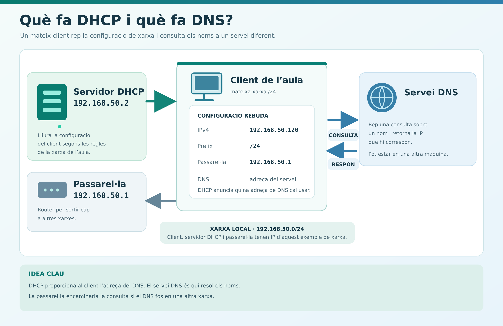
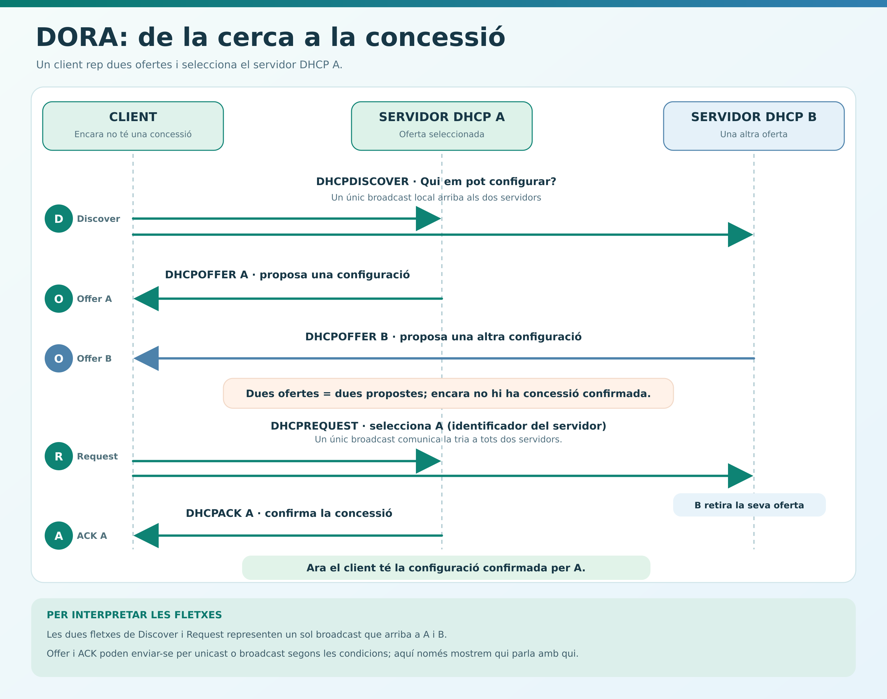
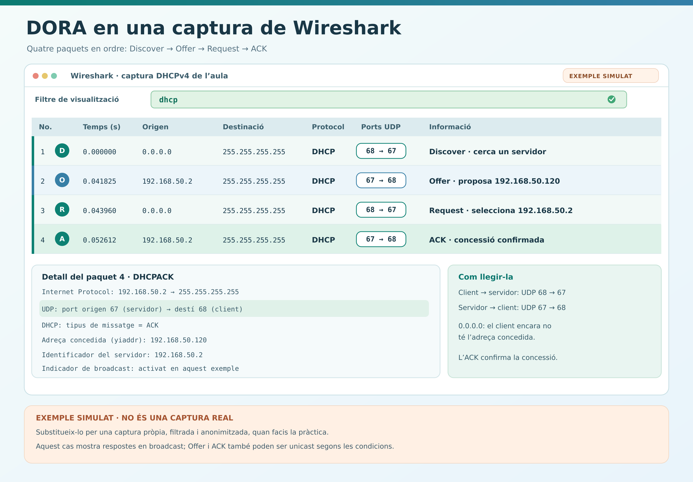
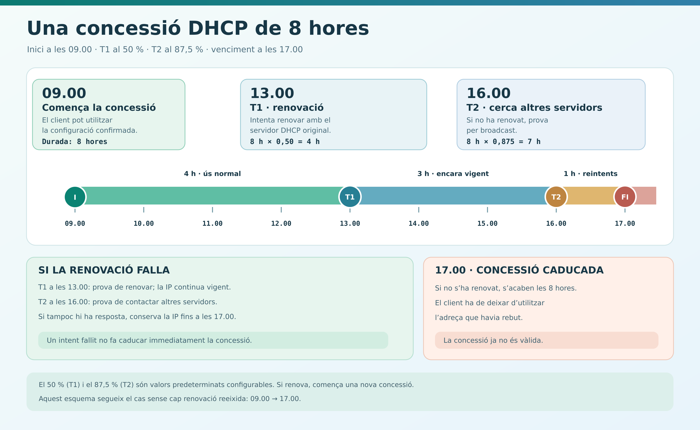
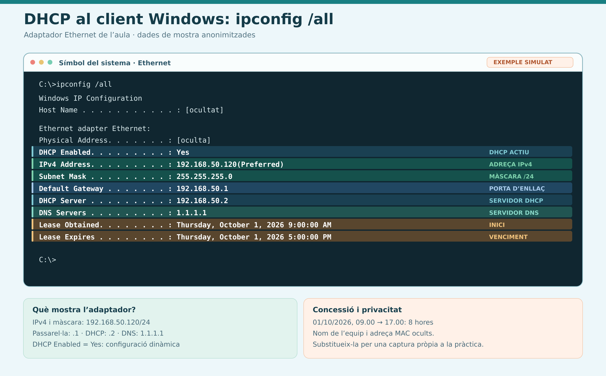
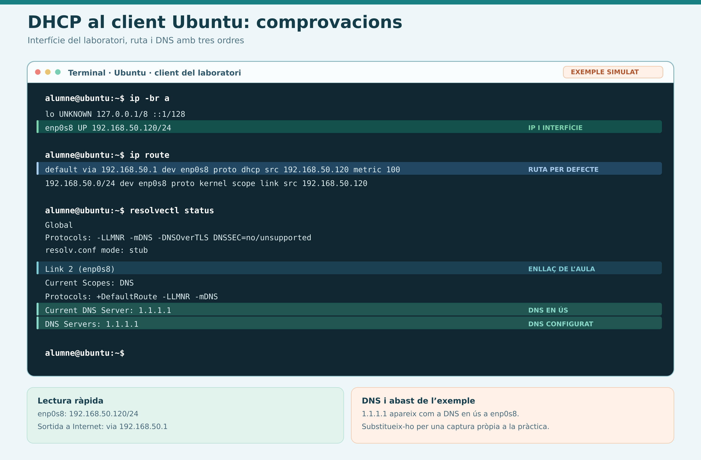

# Introducció al servei DHCP

> **MP 0227 · Serveis de xarxa · 2n SMX**


Guia d'estudi, anàlisi i diagnosi de la primera lliçó de DHCP, basada en la presentació *AA1 Teoria DHCP* i en la guia docent de la sessió.

Quan un ordinador es connecta a una xarxa necessita una configuració coherent per comunicar-se. En una aula amb trenta equips, introduir-la manualment a cada ordinador és lent i facilita els errors. **DHCP permet que un client sol·liciti aquesta configuració i que un servidor la proporcioni segons les regles definides per l'administrador.**

En aquesta guia aprendràs què rep el client, com funciona l'intercanvi DHCP, quant dura una concessió i què pots comprovar quan la configuració no és l'esperada. Al final aplicaràs aquestes idees a diversos casos de diagnosi.

> [!IMPORTANT]
> Les adreces i configuracions dels exemples serveixen per raonar. No les copiïs en una xarxa real sense verificar abans la subxarxa, les interfícies, els serveis existents i el disseny acordat.

## Ruta de treball

| Fase | Apartats | Què aconseguiràs? |
|---|---|---|
| **[Fase 1. Fonaments del protocol](#fase-1)** | 1–4 | Entendre què lliura DHCP, com es negocia i com es renova una concessió. |
| **[Fase 2. Client i disseny del servei](#fase-2)** | 5–8 | Comprovar un client i dissenyar pools, àmbits, interfícies i relay. |
| **[Fase 3. Incidències i protecció](#fase-3)** | 9 | Distingir fallades, configuracions no autoritzades i mesures de protecció. |
| **[Fase 4. Aplicació i consolidació](#fase-4)** | 10–12 | Resoldre casos, contrastar el procediment i autoavaluar-se. |

> [!TIP]
> La primera vegada, segueix els apartats en ordre. Per repassar, llegeix l'**objectiu** i el **resultat esperat** de cada bloc i ves directament al concepte que encara no puguis justificar.

## Índex

- **Preparació:** [Objectius i resultats esperats](#objectius-i-resultats-esperats) · [Convencions](#convencions-de-la-guia)
- **[Fase 1 — Fonaments del protocol](#fase-1):** [1. Dades necessàries](#1-abans-de-dhcp-què-necessita-un-equip) · [2. Què aporta DHCP](#2-què-és-dhcp-i-què-aporta) · [3. Ports i DORA](#3-ports-i-conversa-entre-client-i-servidor) · [4. Concessions](#4-concessions-renovacions-i-altres-missatges)
- **[Fase 2 — Client i disseny del servei](#fase-2):** [5. Comprovar el client](#5-com-comprovar-què-ha-rebut-el-client) · [6. Sense resposta](#6-què-passa-si-ningú-respon) · [7. Preparar el servidor](#7-com-es-prepara-un-servidor-dhcp) · [8. DHCP relay](#8-dhcp-relay-clients-i-servidor-en-xarxes-diferents)
- **[Fase 3 — Incidències i protecció](#fase-3):** [9. Fallades i protecció](#9-què-pot-fallar-i-com-es-protegeix-dhcp)
- **[Fase 4 — Aplicació i consolidació](#fase-4):** [10. Activitats](#10-pràctica-danàlisi-i-diagnosi) · [11. Solucionari](#11-solucionari-raonat) · [12. Autoavaluació](#12-autoavaluació-final)
- **Consulta i ajuda:** [Fonts i autoria](#fonts-i-autoria)

---

## Preparació

### Objectius i resultats esperats

En acabar, hauràs de poder:

1. Distingir la configuració IP manual de la configuració obtinguda per DHCP.
2. Explicar les funcions del client, el servidor, el pool, la reserva i la concessió.
3. Reconstruir l'intercanvi **Discover → Offer → Request → ACK**.
4. Interpretar una renovació, un alliberament i una adreça IPv4 d'enllaç local.
5. Calcular la capacitat d'un pool i comprovar que les opcions lliurades són coherents.
6. Explicar quan cal un *DHCP relay* i per què pot fallar el servei entre subxarxes.
7. Identificar els símptomes d'un servidor no autoritzat, d'un pool esgotat i d'una configuració de protecció incorrecta.

### Convencions de la guia

Llegeix els exemples, intenta resoldre les preguntes sense mirar el solucionari i justifica cada conclusió amb una dada observable. Quan facis una pràctica, anota què esperaves, què has obtingut i quina hipòtesi comprovaràs després.

Els comentaris HTML que comencen per `IMATGE` o `CAPTURA` indiquen on convé incorporar un esquema o una evidència de la pràctica. Es veuen quan s'edita el Markdown, però no en la vista de lectura de GitHub. Els noms de fitxer proposats són orientatius; adapta la ruta a l'estructura del repositori i publica només les captures que hagis revisat.

---

<a id="fase-1"></a>

## Fase 1. Fonaments del protocol

Entén les dades, els actors i el cicle d'una concessió.

### 1. Abans de DHCP: què necessita un equip?

> **Objectiu:** recordar quines dades necessita una interfície i separar les funcions de DHCP, DNS i encaminament.
>
> **Resultat esperat:** expliques la funció d'IP, prefix, porta d'enllaç i DNS i identifiques quines dades pot proporcionar DHCP.

Recuperem quatre dades de la sessió de TCP/IP:

| Dada | Pregunta que resol | Exemple dins de l'aula |
|---|---|---|
| Adreça IPv4 | Quina adreça té aquesta interfície? | `192.168.50.120` |
| Màscara o prefix | Quines adreces considera de la seva subxarxa? | `255.255.255.0` o `/24` |
| Porta d'enllaç | A quin router envia el trànsit destinat a altres xarxes? | `192.168.50.1` |
| DNS | A quin servei demana l'adreça associada a un nom? | La IP del servidor DNS que utilitza l'aula |

En aquest exemple, `192.168.50.120/24` pertany a `192.168.50.0/24`. La porta d'enllaç `192.168.50.1` és del mateix segment. **El servidor DHCP pot comunicar la IP del servidor DNS, però no és, per aquest motiu, qui resol els noms.** Tampoc ha de ser necessàriament el mateix equip que fa de porta d'enllaç.

Una **adreça MAC** identifica una interfície dins de l'enllaç local; una **adreça IP** participa en la comunicació i l'encaminament entre xarxes. Una reserva DHCP pot utilitzar la MAC o un identificador de client per reconèixer a qui ha de lliurar una adreça determinada.

> **Pregunta de control:** si el mòbil mostra que està connectat al Wi-Fi, ja saps que té una IP, una passarel·la i un DNS correctes? No: estar associat a la xarxa sense fil i disposar d'una configuració IP útil són comprovacions diferents.

<!-- IMATGE 01: Esquema original d'un client de l'aula amb IP 192.168.50.120/24, porta d'enllaç 192.168.50.1, servidor DHCP 192.168.50.2 i servidor DNS representat com a servei diferenciat. Mostra amb fletxes què proporciona DHCP i què fa DNS. Fitxer suggerit: source/02_Teoria_DHCP/01-dades-de-xarxa-i-dhcp.png -->


### 2. Què és DHCP i què aporta?

> **Objectiu:** distingir configuració manual, assignació dinàmica, reserva i concessió permanent.
>
> **Resultat esperat:** pots indicar on es configura cada modalitat i si el client continua o no utilitzant DHCP.

**DHCP** (*Dynamic Host Configuration Protocol*) és un protocol de configuració automàtica. El **client DHCP** demana dades per a una interfície i el **servidor DHCP** respon segons els àmbits, els rangs i les opcions que ha configurat l'administrador. Pot lliurar l'adreça, la màscara, la porta d'enllaç, els DNS i altres paràmetres.

*Client* i *servidor* descriuen **funcions**, no tipus invariables de màquina. Per exemple, Ubuntu Server pot actuar com a client DHCP a la interfície NAT per obtenir accés a Internet. Això no vol dir que ja ofereixi el servei DHCP als equips de la xarxa interna.

#### Configuració manual i configuració centralitzada

| Situació | On s'escriu la configuració? | Què cal tenir present? |
|---|---|---|
| IP estàtica configurada al client | A l'ordinador, la impressora o un altre dispositiu | Cal revisar-lo individualment quan canvia una dada. |
| Assignació dinàmica per DHCP | Al servidor; el client demana una adreça disponible | L'adreça es concedeix durant un temps determinat. |
| Reserva DHCP | Al servidor es vincula una adreça a un client identificat | El client **continua configurat per utilitzar DHCP**. |
| Assignació permanent mitjançant DHCP | Al servidor es preveu una assignació sense caducitat | El protocol ho permet, però és menys habitual que una concessió temporal. |

Una reserva és útil, per exemple, per a una impressora que volem trobar sempre a la mateixa IP sense introduir-la manualment al dispositiu. La presentació utilitza l'expressió «assignació estàtica o manual» dins del servei DHCP: fixa't **on es fa l'assignació**, perquè això és diferent de configurar una IP manual al client.

DHCP redueix les tasques repetitives i facilita modificar la configuració en un punt central. També crea una dependència del servei: un client nou pot quedar-se sense configuració si no obté resposta. **Una fallada del servidor no elimina de cop les concessions que els clients encara tenen vigents.** Un error a la configuració central, en canvi, es pot distribuir a molts equips quan renovin o obtinguin la concessió.

> **Pensa-hi:** si canvia el DNS de l'escola, què modificaries en un entorn amb trenta ordinadors configurats manualment? I en un entorn amb DHCP? El segon cas és més fàcil de mantenir, però el canvi arribarà als clients quan tornin a obtenir o renovar les opcions, no necessàriament en el mateix instant.

### 3. Ports i conversa entre client i servidor

> **Objectiu:** reconstruir l'intercanvi DHCPv4 i relacionar cada sentit de la comunicació amb UDP 67 i 68.
>
> **Resultat esperat:** ordenes DORA, identifiques emissor i receptor i expliques per què una oferta encara no és una concessió confirmada.

DHCP per a IPv4 utilitza **UDP**. En l'intercanvi directe habitual, el client envia peticions des del port **68** cap al port **67** del servidor; el servidor respon des del port **67** cap al port **68** del client.

| Sentit de la comunicació | Port UDP d'origen | Port UDP de destinació |
|---|---:|---:|
| Client → servidor | 68 | 67 |
| Servidor → client | 67 | 68 |

Un **port UDP** és un identificador de la capa de transport; no és el connector físic d'un switch. Permetre TCP 67 en un tallafoc, per exemple, no equival a permetre el trànsit DHCPv4 que utilitza UDP.

Quan el client encara no disposa d'una adreça IPv4, pot enviar el primer missatge amb **origen `0.0.0.0`** i fer servir el broadcast local per buscar servidors. El broadcast no travessa ordinàriament un router cap a altres subxarxes. Més endavant veurem com s'atén un client si el servidor és en una altra xarxa.

> **Recordatori:** *broadcast* vol dir enviar un missatge a tots els dispositius del segment que el reben; *unicast* vol dir adreçar-lo a un destí concret. No tots els missatges de totes les situacions DHCP s'envien sempre per broadcast.

#### L'intercanvi inicial DORA

Per memoritzar l'ordre dels quatre missatges principals, utilitzem **DORA**:

| Pas | Missatge | Emissor | Significat |
|---:|---|---|---|
| 1 | `DHCPDISCOVER` | Client | «Hi ha algun servidor que em pugui configurar?» |
| 2 | `DHCPOFFER` | Servidor | «Et proposo aquesta adreça i aquestes opcions.» |
| 3 | `DHCPREQUEST` | Client | «Demano aquesta oferta.» |
| 4 | `DHCPACK` | Servidor | «Confirmo la concessió i les opcions.» |

Si responen dos servidors, el client pot rebre més d'una oferta. Quan demana una oferta, deixa clar quin servidor ha seleccionat. **Una oferta encara no és una concessió confirmada**: cal interpretar també el `REQUEST` i l'`ACK`. L'enviament concret d'`OFFER` i `ACK` pot ser per unicast o broadcast segons l'estat del client i l'intercanvi; el diagrama simplificat de les diapositives serveix per entendre l'ordre, no per fixar un únic tipus d'enviament.

<!-- IMATGE 02: Diagrama original de seqüència DORA amb client, servidor DHCP A i servidor DHCP B. Representa Discover, dues ofertes, Request que selecciona A i ACK d'A; ressalta que l'oferta no és encara una concessió confirmada. No etiquetis tots els Offer i ACK com a broadcast obligatori. Fitxer suggerit: source/02_Teoria_DHCP/02-sequencia-dora.png -->

<!-- CAPTURA RECOMANADA — DORA A WIRESHARK: captura pròpia filtrada amb `dhcp` o `bootp` on apareguin, en ordre, Discover, Offer, Request i ACK. Mostra les columnes origen, destinació, protocol i informació; destaca UDP 68→67 i 67→68 i anonimitza qualsevol dada no necessària. Fitxer suggerit: source/02_Teoria_DHCP/02b-dora-wireshark.png -->


**Exercici breu:** tres companys representen un client i dos servidors. Cada servidor proposa una adreça diferent. Qui pot decidir quina oferta es demana? En quin missatge queda confirmada la concessió?

### 4. Concessions, renovacions i altres missatges

> **Objectiu:** interpretar la durada d'una concessió, els instants T1 i T2 i els missatges `RELEASE`, `NAK` i `DECLINE`.
>
> **Resultat esperat:** calcules els moments de renovació i venciment i no confons una fallada temporal del servidor amb una concessió ja caducada.

Una **concessió** (*lease*) estableix durant quant temps pot fer servir el client l'adreça assignada. Si ja disposa d'una concessió, intenta renovar-la abans que caduqui. **Renovar no implica haver de canviar d'IP.**

#### Exemple d'una concessió de vuit hores

Suposem que una concessió comença a les **09.00** i dura **8 hores**. Si no es renova, acaba a les **17.00**. Els temps T1 i T2 predeterminats es calculen com a percentatges de la durada; poden configurar-se amb altres valors.

| Moment | Càlcul | Què intenta fer el client? |
|---|---|---|
| 09.00 | Inici | Utilitza la configuració confirmada. |
| 13.00 | T1 = 50 % de 8 h = 4 h | Intenta renovar amb el servidor que li va concedir l'adreça. |
| 16.00 | T2 = 87,5 % de 8 h = 7 h | Si no ha pogut renovar, intenta obtenir la renovació mitjançant broadcast. |
| 17.00 | 8 h transcorregudes | Si segueix sense renovar, la concessió expira i ha de deixar d'utilitzar aquella adreça. |

Si el servidor deixa de respondre a les 10.00, el client d'aquest exemple **no perd automàticament la IP a les 10.00**. Cal mirar si la seva concessió continua vigent i si es pot renovar abans del venciment.

<!-- IMATGE 03: Línia temporal d'una concessió de 8 hores iniciada a les 09.00. Situa T1 a les 13.00, T2 a les 16.00 i el venciment a les 17.00. Distingueix les renovacions fallides d'una concessió ja caducada. Fitxer suggerit: source/02_Teoria_DHCP/03-concessio-t1-t2.png -->


#### Missatges per a situacions diferents

| Missatge | Qui l'envia? | Per què? |
|---|---|---|
| `DHCPRELEASE` | Client | Comunica que deixa d'utilitzar la concessió. |
| `DHCPNAK` | Servidor | Rebutja la petició d'una adreça que no és adequada en aquell context. |
| `DHCPDECLINE` | Client | Avisa que ha detectat que l'adreça proposada sembla estar en ús. |

Per exemple, un portàtil es pot connectar en una altra xarxa i intentar recuperar una IP que tenia abans. Un servidor pot respondre amb un `NAK` si aquella petició no és vàlida per a la nova xarxa. **Un pool sense adreces disponibles no es diagnostica simplement perquè aparegui un `NAK`**: en aquest cas, el servidor pot no oferir cap adreça.

---

<a id="fase-2"></a>

## Fase 2. Client i disseny del servei

Observa el client abans de dissenyar o modificar el servidor.

### 5. Com comprovar què ha rebut el client

> **Objectiu:** consultar la configuració efectiva d'un client Windows o Ubuntu a la interfície correcta.
>
> **Resultat esperat:** localitzes IP, prefix, gateway, DNS, servidor DHCP i vigència de la concessió, quan l'eina els mostra.

Configurar una interfície perquè obtingui una adreça automàticament és només el primer pas. **Després cal llegir la configuració real.** Comprova la interfície correcta: un ordinador pot tenir alhora Ethernet, Wi-Fi, VPN i adaptadors virtuals.

#### En un client Windows

```powershell
ipconfig /all
```

Busca almenys l'adreça IPv4, la màscara, la passarel·la predeterminada, els DNS, la indicació que DHCP està habilitat i, quan hi consti, el servidor DHCP i les hores d'inici i venciment de la concessió. Mira totes les dades: es pot tenir la IP automàtica i el DNS establert manualment.

<!-- CAPTURA 04: Sortida pròpia d'ipconfig /all d'un client Windows que hagi obtingut DHCP. Enquadra l'adaptador correcte i destaca IPv4, màscara, porta d'enllaç, DNS, servidor DHCP i vigència de la concessió; oculta identificadors i informació sensible no necessaris. Fitxer suggerit: source/02_Teoria_DHCP/04-client-windows-ipconfig.png -->


#### En un client Ubuntu

```bash
ip -br a
ip route
resolvectl status
```

`ip -br a` resumeix les adreces de les interfícies; `ip route` mostra per on s'enviarà el trànsit cap a altres xarxes; `resolvectl status` ajuda a revisar els DNS configurats. Si la xarxa utilitza Netplan, `dhcp4: true` en una interfície **activa el comportament de client DHCPv4** d'aquella interfície. No instal·la ni activa un servidor DHCP per als altres equips.

<!-- CAPTURA 05: Terminal d'un client Ubuntu del laboratori amb les sortides de ip -br a, ip route i resolvectl status. Assenyala la interfície del laboratori, la IP rebuda, la ruta per defecte si n'hi ha i els DNS efectius. Fitxer suggerit: source/02_Teoria_DHCP/05-client-linux-comprovacions.png -->

> **No copiïs les IP de les captures:** les adreces de l'exemple depenen de com s'hagi configurat la xarxa on fas la pràctica. Justifica les conclusions amb la sortida del teu equip.

### 6. Què passa si ningú respon?

> **Objectiu:** reconèixer l'adreçament IPv4 d'enllaç local i seguir una diagnosi ordenada quan no arriba cap concessió.
>
> **Resultat esperat:** interpretes una adreça `169.254.x.x` com una pista i determines quines comprovacions cal fer abans de modificar la xarxa.

El client pot estar configurat en mode automàtic i, malgrat això, no obtenir cap concessió. Segons el sistema i la seva configuració, pot mostrar una adreça IPv4 d'enllaç local dins de **`169.254.0.0/16`**. A Windows, l'autoconfiguració IPv4 d'aquest tipus s'anomena habitualment **APIPA**. En el mecanisme definit per al protocol, les adreces seleccionades automàticament van de `169.254.1.0` a `169.254.254.255`.

Una adreça `169.254.x.x` és una **pista**: indica que aquell client no mostra la configuració DHCP que esperàvem. Pot facilitar comunicació entre equips del mateix enllaç que tinguin adreces compatibles, però no dona per si sola una sortida normal a Internet. La selecció de l'adreça incorpora comprovacions amb ARP per evitar duplicats. No assumeixis que tots els sistemes Linux activaran automàticament aquest comportament per a IPv4; depèn del gestor de xarxa i de la configuració.

<!-- IMATGE 06: Comparació de dos clients de la mateixa aula: un ha obtingut 192.168.50.120/24, porta d'enllaç i DNS per DHCP; l'altre mostra 169.254.23.8/16 sense la configuració esperada. Mostra l'abast local de l'adreça d'enllaç local i les preguntes que cal investigar, sense afirmar que qualsevol Linux l'assignarà. Fitxer suggerit: source/02_Teoria_DHCP/06-dhcp-versus-ip-enllac-local.png -->


**Seqüència de diagnosi si esperaves DHCP i no ha funcionat:**

1. **Enllaç:** la interfície està activa i el cable o adaptador virtual està connectat?
2. **Xarxa correcta:** en una VM, quin mode té l'adaptador? Es troba al mateix segment que els clients i el servidor previstos?
3. **Client:** està en mode DHCP a la interfície adequada? Hi ha alguna configuració manual que interfereixi?
4. **Configuració obtinguda:** quina IP, màscara, passarel·la i DNS mostra realment?
5. **Servidor i abast:** hi ha un servidor DHCP accessible i un pool amb adreces disponibles?
6. **Si hi ha routers entre xarxes:** hi ha *relay* i un àmbit adequat per al segment del client?
7. **Evidències:** anota la hipòtesi, la prova i el resultat abans de modificar res més.

En **NAT**, VirtualBox pot proporcionar DHCP a la xarxa virtual. En **mode pont**, la VM depèn del que ofereixi la xarxa física. En una **xarxa interna**, cal un servidor DHCP accessible si vols assignació automàtica. Passar de NAT a pont **no implica sempre** perdre DHCP: depèn de la xarxa de destinació.

> **Pregunta de control:** si esperaves `192.168.50.x` i observes `169.254.23.8`, què comprovaries abans de reinstal·lar el sistema? El mode i l'estat de l'adaptador, la configuració del client, la presència del servidor i el recorregut de la petició.

### 7. Com es prepara un servidor DHCP?

> **Objectiu:** definir una subxarxa, un pool, les opcions, la durada i les interfícies que atendrà el servei.
>
> **Resultat esperat:** calcules la capacitat real del pool i no la confons amb la capacitat total de la subxarxa.

Un servei DHCP pot funcionar en un router, en alguns switches amb aquesta funció o en un servidor Windows o Linux. **La funció del dispositiu importa més que el seu nom:** instal·lar Ubuntu Server no significa que ja s'hagi configurat DHCP; oferir DHCP tampoc converteix automàticament aquell equip en el router de la xarxa.

#### Subxarxa, pool i opcions

Suposem aquesta proposta per a l'aula:

| Element | Valor d'exemple | Per a què serveix? |
|---|---|---|
| Subxarxa | `192.168.50.0/24` | Defineix la xarxa de què parlem. |
| Porta d'enllaç | `192.168.50.1` | Destinació dels clients per anar a altres xarxes, si el router hi dona accés. |
| Servidor DHCP | `192.168.50.2` | Equip que ofereix el servei DHCP a la xarxa de l'aula. |
| Pool | `192.168.50.100`–`192.168.50.149` | Adreces que el servidor pot distribuir dinàmicament. |
| Temps de concessió | 8 hores | Durada prevista de cada assignació. |
| DNS | L'adreça del servei DNS real de l'entorn | Resolució de noms segons la xarxa configurada. |

La **subxarxa** `/24` conté 256 adreces; en l'ús IPv4 convencional de l'exercici, hi ha 254 adreces de host possibles. Això **no vol dir que el pool tingui 254 adreces**. El pool proposat conté:

```text
149 − 100 + 1 = 50 adreces
```

El `+1` inclou el primer i l'últim valor. No restem dues adreces més al resultat: `.100` i `.149` són adreces de host vàlides; l'adreça de xarxa `.0` i el broadcast `.255` ja són fora del pool. Les adreces de la passarel·la i del servidor DHCP també són fora del rang i no es repartiran com a adreces dinàmiques d'aquest pool.

<!-- IMATGE 07: Barra de la subxarxa 192.168.50.0/24 amb xarxa .0, passarel·la .1, servidor DHCP .2, pool .100–.149 de 50 adreces i broadcast .255. Distingeix clarament subxarxa, hosts possibles i rang repartible. Fitxer suggerit: source/02_Teoria_DHCP/07-subxarxa-i-pool-dhcp.png -->

#### Llegir una configuració sense confondre capacitats

En la captura de Windows Server de la presentació, el rang va de **`192.168.2.120` a `192.168.2.175`** amb màscara `/24` i passarel·la `192.168.2.1`. Hi ha tres quantitats diferents:

| Què estem comptant? | Càlcul | Resultat |
|---|---:|---:|
| Adreces totals de la subxarxa `/24` | `2^8` | 256 |
| Hosts assignables habituals de la subxarxa | `256 − 2` | 254 |
| Adreces de l'interval `.120`–`.175` | `175 − 120 + 1` | 56 |

Si 60 clients nous necessiten alhora una adreça **només d'aquest pool** i no se n'allibera cap, en falten quatre. Consulta també si hi ha exclusions, reserves o concessions vigents abans de donar per fet que totes les 56 adreces estan lliures.

Les dues captures de routers de la presentació mostren **configuracions diferents**. Si una comença en `.100` i permet 50 clients, l'última adreça del rang serà `.149`. Si una altra va de `.100` a `.199`, conté 100 adreces. Una concessió de `10080` **minuts** equival a `10080 ÷ 60 ÷ 24 = 7 dies`. Mira sempre la unitat que utilitza cada interfície.

<!-- CAPTURA 08: Reproducció pròpia d'una configuració de pool DHCP d'un router o servidor del laboratori. Ressalta inici, final, màscara, porta d'enllaç, DNS i unitat de la concessió; acompanya-la del càlcul de capacitat. No cal copiar captures de la presentació. Fitxer suggerit: source/02_Teoria_DHCP/08-lectura-configuracio-pool.png -->

#### Àmbits i interfícies

Un servidor pot administrar diverses subxarxes, sempre que conegui l'**àmbit** que correspon als clients de cadascuna. En una VM amb interfície NAT i interfície interna, també cal escollir **per quina xarxa oferirà el servei**. En el laboratori de l'exemple, els clients són a la xarxa interna: cal evitar oferir el DHCP de pràctiques per una interfície diferent de la prevista.

> **Recorda:** un àmbit descriu la configuració d'una subxarxa; un pool delimita les adreces que el servidor pot repartir dins d'aquell àmbit. Les reserves i les opcions, com porta d'enllaç i DNS, completen el disseny.

### 8. DHCP relay: clients i servidor en xarxes diferents

> **Objectiu:** entendre per què el broadcast inicial no arriba directament a una altra subxarxa i què aporta un relay.
>
> **Resultat esperat:** identifiques el relay, l'àmbit i el recorregut de retorn que cal comprovar quan falla una xarxa remota.

El `DHCPDISCOVER` inicial pot sortir per **broadcast local**, que un router no reenvia normalment a una altra subxarxa. Si el servidor DHCP és en una xarxa diferent, un **agent *DHCP relay*** rep la petició dels clients i la tramet al servidor. El servidor pot utilitzar la informació sobre la xarxa d'origen, com ara el camp `giaddr`, per escollir l'àmbit adequat i enviar la resposta pel camí corresponent.

**Exemple:** una aula és a `192.168.10.0/24` i una altra a `192.168.20.0/24`. Poden utilitzar un servidor DHCP central, sempre que el relay i els àmbits de totes dues xarxes estiguin ben configurats. **El relay no tria lliurement l'adreça que correspon a cada client:** trasllada la petició i aporta la informació necessària perquè el servidor prengui la decisió.

<!-- IMATGE 09: Dues subxarxes 192.168.10.0/24 i 192.168.20.0/24, un router que actua com a DHCP relay i un servidor central. Mostra el broadcast local del client fins al relay, la petició que el relay envia al servidor i l'àmbit escollit per a la xarxa d'origen. Fitxer suggerit: source/02_Teoria_DHCP/09-dhcp-relay-dues-subxarxes.png -->

Quan un client d'una altra subxarxa no rep configuració, investiga **on s'atura l'intercanvi**: el relay escolta la xarxa correcta? Pot arribar al servidor? El servidor té un àmbit per a la xarxa del client? La resposta pot tornar? Aquesta comprovació és més útil que canviar opcions a l'atzar.

---

<a id="fase-3"></a>

## Fase 3. Incidències i protecció

Diferencia indisponibilitat, configuració incorrecta i activitat no autoritzada.

### 9. Què pot fallar i com es protegeix DHCP?

> **Objectiu:** distingir un pool esgotat, *starvation*, un servidor no autoritzat i una confirmació falsa, i entendre DHCP snooping.
>
> **Resultat esperat:** relaciones cada símptoma amb les dades que cal observar i situes correctament els ports de confiança.

DHCP pressuposa que els clients rebran una configuració útil d'un servidor adequat. Una fallada de disponibilitat i una configuració manipulada provoquen problemes diferents:

| Situació | Què passa? | Quines dades observaries? |
|---|---|---|
| Pool esgotat | No hi ha prou adreces noves per als clients que les demanen. | Capacitat del pool, adreces lliures, concessions actives i venciments. |
| *DHCP starvation* | Moltes peticions que semblen de clients diferents intenten ocupar les adreces del pool. | Peticions anòmales i ocupació sobtada; l'esgotament **per si sol** no demostra un atac. |
| Servidor DHCP no autoritzat (*rogue*) | Un dispositiu distribueix paràmetres inesperats, per error o intencionadament. | Servidor que ha concedit la IP, passarel·la i DNS rebuts per diversos clients. |
| Intent de falsa confirmació (*ACK injection*) | S'intenta introduir una resposta manipulada dins d'un intercanvi. | Coherència dels missatges, del servidor i de la transacció. |

Per exemple, un router connectat per error amb DHCP activat podria repartir una passarel·la o un DNS incorrectes. Que dos ordinadors de la mateixa aula rebin **servidors DHCP diferents** és una dada que cal investigar; compara també IP, màscara, passarel·la i DNS. Una configuració de DNS o passarel·la incorrecta pot impedir la comunicació o dirigir-la on no correspon, però no implica automàticament que es pugui llegir tot el trànsit xifrat.

L'expressió «guanya el primer ACK» simplifica massa el cas d'una confirmació falsa. **El client no ha d'acceptar qualsevol `ACK` només perquè arriba abans:** la resposta ha de correspondre a l'estat i a la transacció que està duent a terme.

#### DHCP snooping

En switches que disposen d'aquesta funció, **DHCP snooping** distingeix entre ports **de confiança**, pels quals poden arribar respostes del servidor legítim, i ports **no fiables**, on connecten habitualment els clients. Així es poden filtrar missatges que intenten fer de servidor des d'un port de client. Alguns equips també permeten limitar la taxa de missatges per reduir l'abús de peticions.

Aquí *port* significa **port físic o lògic del switch**, diferent dels ports **UDP 67 i 68**. Les peticions legítimes dels clients han de poder entrar pels ports no fiables. Si marques com a no fiable el camí pel qual arriba el servidor legítim, pots bloquejar-ne les respostes; si declares de confiança ports de clients sense criteri, debilites la protecció. Les ubicacions correctes depenen de la topologia real.

<!-- IMATGE 10: Esquema original d'un switch amb clients en ports no fiables, servidor DHCP legítim darrere d'un port de confiança i servidor no autoritzat en un port de client. Dibuixa Discover permès des del client, Offer legítim acceptat i Offer del servidor no autoritzat filtrat; distingeix ports del switch i ports UDP. Fitxer suggerit: source/02_Teoria_DHCP/10-dhcp-snooping-ports.png -->

**Monitoritzar** el trànsit ajuda a detectar un problema; **filtrar-lo** al switch és una mesura diferent. En una incidència cal identificar el servidor real que ha respost, revisar les concessions i comprovar que el camí cap al servidor legítim continua operatiu.

---

<a id="fase-4"></a>

## Fase 4. Aplicació i consolidació

Resol els casos, documenta el criteri i consulta després el solucionari.

### 10. Pràctica d'anàlisi i diagnosi

> **Objectiu:** aplicar els conceptes a nou situacions de configuració, càlcul i diagnosi.
>
> **Resultat esperat:** cada resposta inclou la dada observada, el criteri utilitzat i una conclusió verificable.

Respon amb una justificació. Si fas les comprovacions en un equip real o en una VM, conserva una captura curta de l'evidència i explica quina conclusió n'extreus.

#### Què has de lliurar

| Activitats | Evidència mínima |
|---|---|
| 1–4 | Resposta, concepte aplicat i justificació breu. |
| 5 | Càlcul complet de capacitat, inclosos els dos extrems del pool. |
| 6–8 | Hipòtesi, dades que la sustenten i comprovacions en ordre. |
| 9 | Taula de valor esperat, valor observat i conclusió, amb les sortides rellevants. |

> [!WARNING]
> No consultis l'apartat 11 fins que hagis escrit el teu procediment. El solucionari permet detectar el primer pas incorrecte; no substitueix l'evidència d'una pràctica real.

#### Activitat 1 · Les quatre dades

Un ordinador mostra `192.168.50.125/24`, porta d'enllaç `192.168.50.1` i un DNS proporcionat pel centre. Indica quina és la xarxa, quin paper fa la porta d'enllaç i per què el fet de rebre la IP del DNS per DHCP no converteix DHCP en un servei de resolució de noms.

#### Activitat 2 · Concessió o adreça manual?

Una impressora sempre rep `192.168.50.140`, però a les seves opcions de xarxa consta que obté l'adreça automàticament. Proposa una explicació plausible i indica on comprovaries aquesta configuració.

#### Activitat 3 · Ordena la negociació

Ordena `ACK`, `Request`, `Discover` i `Offer`. Després explica per què no és correcte afirmar que el client ja disposa d'una concessió confirmada tan bon punt rep una oferta.

#### Activitat 4 · La concessió no és infinita

Una concessió de 8 hores comença a les 09.00. Si s'utilitzen els valors predeterminats de T1 i T2, indica a quina hora es produeix cada intent i quan venç la concessió si no es pot renovar. Què passa si el servidor deixa de respondre a les 10.00?

#### Activitat 5 · Pool i capacitat

El rang disponible va de `192.168.50.80` a `192.168.50.119`, inclosos. Quantes adreces conté? Si n'hi ha 35 ocupades per concessions vigents i no hi ha altres restriccions, quantes en queden per a clients nous?

#### Activitat 6 · La IP inesperada

Un Windows de l'aula hauria de rebre `192.168.50.x`, però `ipconfig /all` mostra `169.254.23.8`. Anota tres comprovacions concretes, en un ordre raonable. Explica per què aquesta IP no demostra que el servidor DHCP hagi funcionat.

#### Activitat 7 · Una altra subxarxa

Els clients de `192.168.20.0/24` no arriben a un servidor DHCP que funciona per als clients de `192.168.10.0/24`. Podria ser normal sense cap configuració addicional? Quines dues peces revisaries per fer servir un únic servidor per a totes dues xarxes?

#### Activitat 8 · Compara dos clients

Dos ordinadors de la mateixa aula tenen IP de la mateixa subxarxa, però un ha rebut `192.168.50.1` com a porta d'enllaç i l'altre `192.168.50.254`. La navegació del segon falla. Quines dades de les concessions compararàs i quina possible causa investigaràs?

<!-- CAPTURA 11: Dues sortides pròpies i anonimitzades d'ipconfig /all de clients del mateix segment amb diferències en servidor DHCP, porta d'enllaç o DNS. Ressalta els camps que fonamenten la hipòtesi de diagnosi; evita incloure noms personals o identificadors innecessaris. Fitxer suggerit: source/02_Teoria_DHCP/11-comparacio-clients-dhcp.png -->

#### Activitat 9 · Verifica el teu equip

Quan tinguis disponible la xarxa de pràctiques, comprova el client amb `ipconfig /all` o amb `ip -br a`, `ip route` i `resolvectl status`, segons el sistema. Fes una taula amb **valor esperat**, **valor observat** i **conclusió** per a IP, prefix, porta d'enllaç i DNS. Si hi ha una diferència, formula una hipòtesi i escull una prova que la pugui confirmar o descartar.

### 11. Solucionari raonat

> **Objectiu:** contrastar el procediment i corregir el primer concepte o comprovació incorrectes.
>
> **Resultat esperat:** expliques el perquè de cada solució i pots resoldre un cas equivalent sense copiar-ne la resposta.

Consulta'l **després** de justificar les teves respostes. Les sortides de les ordres poden variar segons l'entorn; el que has de comparar és el mètode de comprovació.

#### Solució de l'activitat 1 · Les quatre dades

`192.168.50.125/24` és de `192.168.50.0/24`. La porta d'enllaç és el router previst per arribar a altres xarxes. DHCP comunica una adreça de DNS; el servidor DNS és qui resol els noms.

#### Solució de l'activitat 2 · Concessió o adreça manual

És compatible amb una **reserva DHCP**. Busca la reserva i la identificació del client al servidor, i comprova que la impressora es manté en mode automàtic.

#### Solució de l'activitat 3 · Negociació DORA

Discover → Offer → Request → ACK. L'oferta és una proposta; l'ACK confirma la concessió després de la petició.

#### Solució de l'activitat 4 · Durada de la concessió

T1 és a les 13.00, T2 a les 16.00 i el venciment a les 17.00 si no es renova. Una fallada del servidor a les 10.00 no invalida de cop una concessió que encara és vigent.

#### Solució de l'activitat 5 · Pool i capacitat

`119 − 80 + 1 = 40` adreces; `40 − 35 = 5` potencialment lliures, amb les condicions indicades a l'enunciat.

#### Solució de l'activitat 6 · IP inesperada

Revisa l'enllaç i l'adaptador, el mode DHCP del client i l'accés al servidor o al relay. `169.254.x.x` és una pista d'autoconfiguració d'enllaç local, no una prova d'una concessió DHCP correcta.

#### Solució de l'activitat 7 · Una altra subxarxa

El broadcast inicial no travessa normalment el router. Cal revisar el **relay** per a la xarxa dels clients i l'**àmbit** corresponent al servidor; també s'ha de garantir la comunicació entre relay i servidor.

#### Solució de l'activitat 8 · Comparar dos clients

Compara servidor DHCP, IP, prefix, passarel·la, DNS i període de concessió. Una possibilitat és un servidor DHCP no autoritzat o connectat per error; encara cal comprovar-la abans de concloure-ho.

#### Solució de l'activitat 9 · Verificar l'equip

No hi ha una taula de valors única. Una bona resposta aporta la sortida rellevant, una comparació amb el disseny de la xarxa i una prova concreta de la hipòtesi formulada.

### 12. Autoavaluació final

> **Objectiu:** comprovar si pots recuperar i aplicar els conceptes sense consultar la guia.
>
> **Resultat esperat:** pots explicar els punts següents amb un exemple o una dada observable.

- DHCP proporciona una configuració segons unes regles; **tenir una IP no demostra per si sol que DHCP hagi funcionat bé**.
- Una reserva es prepara al servidor mentre el client continua utilitzant DHCP.
- DORA descriu l'intercanvi inicial; una oferta no és la confirmació final.
- Una concessió es pot renovar. T1, T2 i venciment són moments diferents.
- La mida de la subxarxa i la mida del pool **no són la mateixa dada**.
- Sense resposta DHCP, alguns clients poden utilitzar una adreça IPv4 d'enllaç local; el comportament depèn del sistema i la configuració.
- Per atendre clients d'una altra subxarxa amb un servidor central, es pot utilitzar un relay i un àmbit adequat.
- Davant d'una incidència, comprova la configuració real, identifica d'on prové i documenta la prova que sosté la teva conclusió.

Si algun punt no és clar, torna a l'objectiu de l'apartat corresponent, construeix un exemple propi i comprova'l amb una configuració o una captura del laboratori.

---

## Consulta i ajuda

### Fonts i autoria

Materials docents de partida:

- **AA1_TeoriaDHCP.pdf**, *UD2.AA1 Servei DHCP*, Carlos Alonso Martínez, versió 2025-08-05. La presentació indica una llicència **CC BY-NC-ND 4.0**.
- **Guia_docent_Teoria_DHCP.docx**, orientacions docents, correccions tècniques, exemples i preguntes de comprovació.

Aquesta guia d'estudi és una explicació original basada en els continguts de la sessió i en la guia docent aportada. Els esquemes i les captures indicats als comentaris s'han de preparar per al repositori de l'assignatura.

Fonts tècniques per ampliar i comprovar els matisos del protocol:

- [RFC 2131 — Dynamic Host Configuration Protocol](https://www.rfc-editor.org/rfc/rfc2131): missatges DHCP, concessions, renovació i relay.
- [RFC 3927 — Dynamic Configuration of IPv4 Link-Local Addresses](https://www.rfc-editor.org/rfc/rfc3927): adreces `169.254.x.x`, comprovació de conflictes i abast local.
- [Documentació de Netplan — configuració YAML](https://netplan.readthedocs.io/en/latest/netplan-yaml/): `dhcp4` i configuració d'enllaç local.
- [Cisco — DHCP snooping en switches Catalyst](https://www.cisco.com/c/en/us/support/docs/ip/dynamic-host-configuration-protocol-dhcp-dhcpv6/217055-operate-and-troubleshoot-dhcp-snooping.html): ports de confiança, filtratge i comprovacions.
