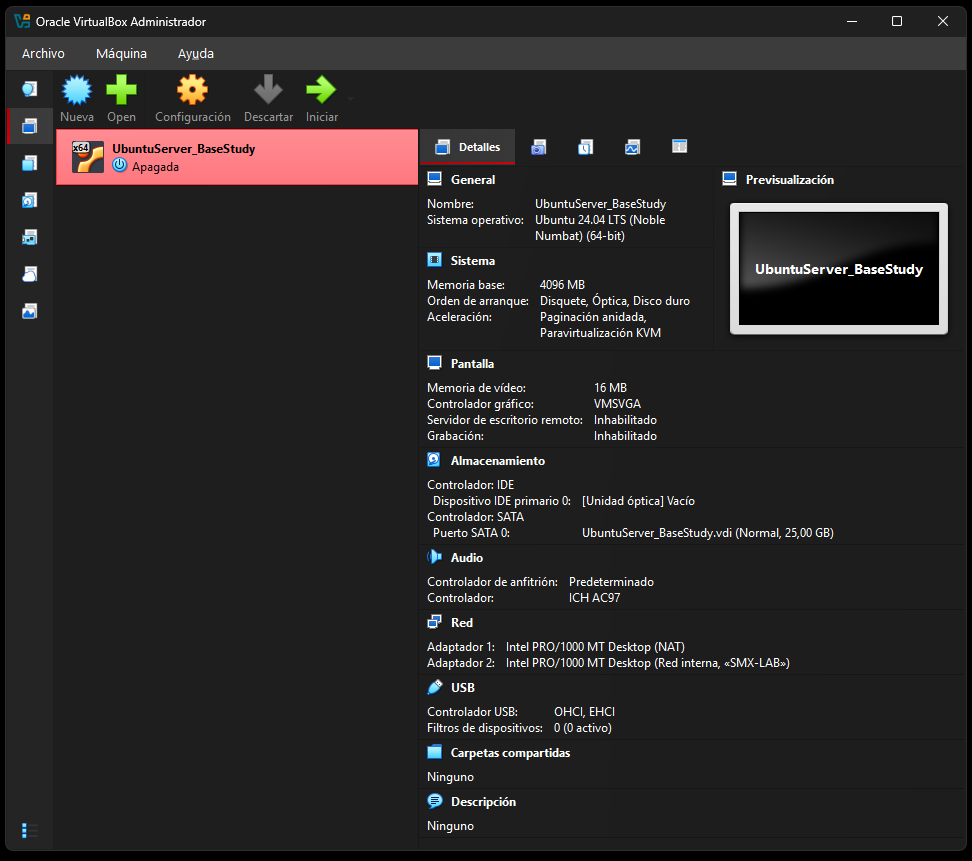
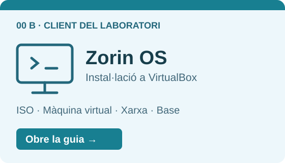
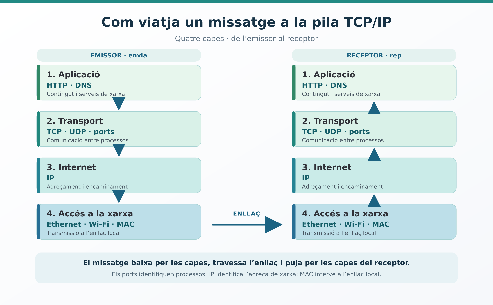
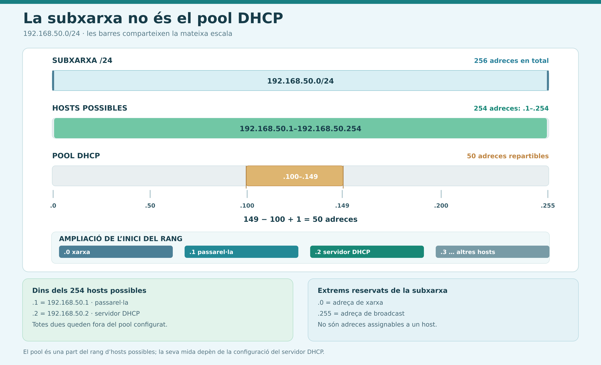

# MP 0227 Serveis en Xarxa

Aquest repositori recull els materials, guies i pràctiques del mòdul professional **MP 0227 Serveis en Xarxa** de 2n del cicle formatiu de Sistemes Microinformàtics i Xarxes (SMX).

Al llarg del mòdul configurarem i administrarem serveis de xarxa en entorns Linux: preparació de servidors, configuració de xarxa, accés remot, resolució de noms, serveis web, compartició de recursos i altres serveis necessaris en una infraestructura informàtica.

## Lliçons disponibles

Fes clic a la **imatge** o al **títol** per obrir cada lliçó. Hi trobaràs les sis guies i activitats disponibles, ordenades segons la numeració dels fitxers. Els documents **00 A** i **00 B** preparen el servidor i el client del laboratori.

| Accés visual | Lliçó i continguts |
|---|---|
|  | **[00 A · Ubuntu Server 24.04 LTS](00_A_UbuntuServer.md)**  Prepara la màquina virtual que utilitzaràs com a servidor al laboratori: instal·lació, configuració bàsica, SSH i xarxa amb Netplan.  **5 fases · 15 apartats** Inclou validació, instantània, connexió amb un client i exportació d'una OVA. |
|  | **[00 B · Instal·lació de Zorin OS](00_B_Installacio_Zorin_OS.md)**  Prepara una VM independent amb Zorin OS Core com a client gràfic de les pràctiques: descàrrega i verificació de la ISO, creació de la VM i instal·lació.  **5 fases · 12 apartats** Inclou actualitzacions, identificació de la xarxa NAT i conservació d'una base reutilitzable. |
|  | **[01 · Repàs de xarxes TCP/IP](01_Repas_TCP_IP_Guide_Activity.md)**  Repassa les capes, l'adreçament IP, el càlcul de subxarxes, l'encaminament, els ports i NAT.  **3 fases · 10 apartats** Inclou 8 activitats, pràctica amb Packet Tracer, solucionari raonat i autoavaluació. |
|  | **[02 · Introducció al servei DHCP](02_Teoria_DHCP_Guide.md)**  Entén la configuració automàtica de xarxa: DORA, concessions, pools, reserves, relay i diagnosi del client.  **4 fases · 12 apartats** Inclou incidències i protecció, 9 activitats, solucionari raonat i autoavaluació. |
|  | **[03 · Configuració de DHCP amb Kea](03_DHCP_Kea_Guia.md)**  Relaciona la teoria amb la configuració d'un servidor DHCPv4 a Ubuntu: interfícies, serveis, JSON, pools, opcions i temps de concessió.  **5 fases · 13 apartats** Inclou validació del servei, comprovació del client, reserves, diagnosi i autoavaluació. |
|  | **[04 · Activitat guiada de DHCP amb Kea i Zorin](04_DHCP_Kea_Activitat.md)**  Desplega Kea amb les teves adreces de laboratori i comprova l'assignació des de Zorin. Captura i interpreta la negociació amb Wireshark.  **6 fases · 14 apartats** Inclou consulta de concessions, prova d'una reserva, persistència i lliurament d'evidències. |

## Com seguir les guies

Comença per les guies **00 A** i **00 B** per disposar de les dues VM. Repassa TCP/IP i la teoria DHCP amb els documents **01** i **02**; després utilitza la guia **03** com a suport per resoldre l'activitat **04**.

Per treballar amb les guies:

1. **Ruta o itinerari de treball i índex:** localitza les fases i accedeix directament a cada apartat.
2. **Preparació:** revisa els objectius, les convencions i els requisits que s'hi indiquen.
3. **Treball per fases:** segueix els apartats i comprova l'objectiu i el resultat esperat de cadascun.
4. **Consulta i ajuda:** recupera les fonts i, quan n'hi hagi, els procediments de diagnosi i els errors freqüents.

En les activitats pràctiques, documenta el **valor esperat**, el **valor observat** i la **conclusió**. Consulta els solucionaris després d'haver intentat resoldre els exercicis.

Aquest índex s'ampliarà a mesura que s'incorporin noves lliçons.
